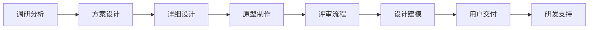

<div align="center">

# 🚀 Agile Team

### Development Teams Based Agile Thinking

[](https://opensource.org/licenses/MIT)
[](https://github.com/your-username/agile-team)
[](https://github.com/your-username/agile-team)
[](http://makeapullrequest.com)

**拥抱开放，拥抱变化 — 构建新一代团队协作生态**

[🌐 在线体验](https://www.tzagileteam.com/) • [📚 完整文档](https://www.tzagileteam.com/po/standard/introduction) • [🎯 快速开始](#-快速开始) • [🤝 参与贡献](#-参与贡献)

</div>

---

## ✨ 项目愿景

> **"以不同的角色，不同的视野，借助社区和伙伴的力量，持续集成优化完善，基于项目实践沉淀技术栈和管理思想，同步拓展 π 型综合能力"**

Agile Team 不仅仅是一个项目管理工具，更是一个**综合化交付管理解决方案**，专注于为现代开发团队提供：

- 🎯 **端到端产品生命周期管理** - 从需求调研到用户交付的全链路覆盖
- 💻 **现代化技术栈实践** - Vue3 + TypeScript + 微服务架构的完整方案
- 🧪 **精益质量控制体系** - Case 卡控 + 自动化 CI/CD + 质量保障
- 👥 **高效团队协作模式** - 多角色协同 + 标准化模板 + 敏捷实践

## 🌟 核心亮点

### 💡 全方位产品生命周期管理



- **📊 需求全链路**: 调研 → 分析 → 方案 → 详设 → 原型 → 评审 → 交付
- **🔄 持续迭代**: 基于用户反馈的快速响应和产品优化
- **📈 质量保证**: 全生命周期质量卡控，确保交付标准

### 🛠 现代化技术栈

<table>
<tr>
<td width="50%">

**前端技术栈**

- 🔥 **Vue 3** - 组合式 API + 响应式系统
- 📘 **TypeScript** - 类型安全 + 开发效率
- ⚡ **Vite** - 极速构建 + 热重载
- 🎨 **组件化设计** - 可复用 + 可维护

</td>
<td width="50%">

**工程化体系**

- 📦 **Bun** - 超快包管理器
- 🔧 **微服务架构** - 可扩展 + 高可用
- 🚀 **自动化部署** - CI/CD + Vercel
- 📖 **VitePress** - 现代化文档系统

</td>
</tr>
</table>

### 🎯 精益测试与质量控制

| 维度         | 策略                         | 工具               |
| ------------ | ---------------------------- | ------------------ |
| **代码质量** | ESLint + Prettier + 类型检查 | TypeScript, Oxlint |
| **测试覆盖** | 单元测试 + 集成测试 + E2E    | Vitest, Cypress    |
| **构建部署** | 自动化 CI/CD + 多环境管理    | GitHub Actions     |
| **监控预警** | 性能监控 + 错误追踪          | 自定义监控体系     |

### 👥 多角色协作体系

```
🏢 Agile Team 组织架构
├── 👨‍💼 项目经理 (PM) - 项目推进 + 团队协调
├── 🎯 产品负责人 (PO) - 需求分析 + 产品设计
├── 👨‍💻 开发工程师 (RD) - 技术实现 + 代码质量
├── 🧪 质量控制 (QC) - 测试验证 + 质量保障
├── ⚙️ 运维工程师 (OP) - 部署运维 + 系统稳定
└── 🎨 UI设计师 (UI) - 用户体验 + 界面设计
```

## 📋 标准化管理体系

### 🗂 模板库矩阵 (27+ 种专业模板)

<details>
<summary><b>📊 项目管理模板</b></summary>

- 📋 立项申请单 - 项目启动标准化
- 📅 计划拆解表 - WBS 工作分解
- 🎯 项目启动会 - 团队对齐
- 📝 评审纪要 - 决策记录
- 💰 奖金分配 - 激励机制

</details>

<details>
<summary><b>📐 技术管理模板</b></summary>

- 📋 技术协议 - 技术标准约定
- 🏗 架构方案 - 系统设计文档
- 📖 需求设计方案 - PRD 模板
- 🐛 Bug 管理 - 缺陷跟踪流程
- ⚠️ 风险管理 - 风险识别与应对

</details>

<details>
<summary><b>🤝 商务合作模板</b></summary>

- 📄 商务合同 - 合同模板库
- 👥 干系人管理 - 沟通矩阵
- 📊 商务评估 - ROI 分析
- ⏰ 里程碑管理 - 关键节点控制

</details>

## 🚀 快速开始

### 📋 环境要求

| 工具        | 版本要求 | 推荐理由                 |
| ----------- | -------- | ------------------------ |
| **Node.js** | ≥18.0.0  | 现代 JavaScript 运行时   |
| **Bun**     | ≥1.0.0   | 🔥 **推荐** - 极速包管理 |
| **Git**     | 最新版   | 版本控制                 |

### ⚡ 30 秒快速启动

```bash
# 1️⃣ 克隆项目
git clone https://github.com/ChenyCHENYU/AgileTeam_Doc.git
cd AgileTeam_Doc

# 2️⃣ 安装依赖（推荐使用 Bun）
bun install

# 3️⃣ 启动开发服务器
bun run docs:dev

# 🎉 访问 http://localhost:5173 开始体验！
```

### 🔧 开发命令

```bash
# 📖 启动文档服务
bun run docs:dev

# 🏗 构建生产版本
bun run docs:build

# 👀 预览构建结果
bun run docs:preview

# 🎨 代码格式化
bun run docs:format

# ✅ 代码检查
bun run docs:lint
```

## 🏗 技术架构

### 🔧 核心技术栈

```
🏗 Agile Team 技术架构
├── 📱 前端层
│   ├── Vue 3 + Composition API
│   ├── TypeScript + 类型安全
│   └── Vite + 极速构建
├── 📖 文档层
│   ├── VitePress + 现代化文档
│   ├── Markdown + 丰富扩展
│   └── 自定义组件 + 交互体验
├── 🚀 部署层
│   ├── Vercel + 边缘计算
│   ├── 自动化CI/CD
│   └── 多环境管理
└── 🛠 工具链
    ├── Bun + 包管理
    ├── ESLint + 代码检查
    └── Prettier + 格式化
```

### 📊 项目结构

```
AgileTeam_Doc/
├── 📖 docs/                    # 文档源码
│   ├── .vitepress/             # VitePress 配置
│   │   ├── components/         # 自定义组件
│   │   ├── theme/              # 主题定制
│   │   └── config.js           # 站点配置
│   └── document/               # 文档内容
│       ├── manage/             # 项目管理
│       ├── robot/              # 自动化工具
│       ├── team/               # 团队协作
│       └── web/                # 前端技术
├── 📦 package.json             # 依赖管理
└── 🔧 vercel.json              # 部署配置
```

## 🌟 团队生态

### 👥 核心团队

<table>
<tr>
<td align="center" width="150px">

<br /><b>Cheny</b><br />
<sub>项目发起人 & 架构师</sub>
</td>
<td align="center" width="150px">

<br /><b>张东</b><br />
<sub>前端技术专家</sub>
</td>
<td align="center" width="150px">

<br /><b>赵成刚</b><br />
<sub>后端架构师</sub>
</td>
<td align="center" width="150px">

<br /><b>Asher</b><br />
<sub>产品设计师</sub>
</td>
<td align="center" width="150px">

<br /><b>Kevin</b><br />
<sub>DevOps工程师</sub>
</td>
</tr>
</table>

### 🤝 社区伙伴

- 🏢 **西安前端社群** - 技术交流与分享
- 🏗 **广联达** - 企业级实践经验
- 🚀 **一线大厂** - 先进技术理念
- 👥 **开源社区** - 持续贡献与支持

## 📈 成果展示

### 📊 项目成果

<div align="center">

| 🎯 维度         | 📝 描述                                  |
| --------------- | ---------------------------------------- |
| **🔧 管理模板** | 27+ 种标准化项目管理模板                 |
| **👥 团队规模** | 11 位核心开发者参与                      |
| **📖 知识沉淀** | 涵盖全栈开发到项目管理的完整文档体系     |
| **🚀 技术栈**   | Vue3 + TypeScript + VitePress 现代化方案 |
| **🎯 应用场景** | 团队协作、项目管理、技术沉淀多领域覆盖   |

</div>

### 🏆 核心价值

> **💡 不仅仅是工具，更是方法论的实践**

- ✅ **标准化** 团队协作流程和项目管理模板
- ✅ **系统化** 技术栈沉淀和最佳实践总结
- ✅ **体系化** 从需求到交付的全生命周期管理
- ✅ **实用化** 基于真实项目经验的管理方法论
- ✅ **开放化** 拥抱社区力量的协作生态建设

## 🤝 参与贡献

我们相信开源的力量，欢迎所有形式的贡献！

### 🌟 贡献方式

<div align="center">

| 💻 代码贡献 | 📝 文档完善 | 🐛 问题反馈 | 💡 需求建议 |
| ----------- | ----------- | ----------- | ----------- |
| 提交 PR     | 改进文档    | 提交 Issue  | 功能建议    |
| 修复 Bug    | 翻译文档    | 测试反馈    | 用例分享    |

</div>

### 📝 贡献流程

```bash
# 1️⃣ Fork 本项目
# 2️⃣ 创建特性分支
git checkout -b feature/amazing-feature

# 3️⃣ 提交更改
git commit -m 'feat: 添加某个很棒的功能'

# 4️⃣ 推送分支
git push origin feature/amazing-feature

# 5️⃣ 提交 Pull Request
```

## 📄 许可证

本项目基于 [MIT 许可证](LICENSE) 开源，意味着：

- ✅ **自由使用** - 个人和商业项目均可使用
- ✅ **自由修改** - 可根据需求自定义开发
- ✅ **自由分发** - 可重新分发和销售
- ⚠️ **保留版权** - 需保留原始版权声明

## 🎯 未来规划

### 🗓 Roadmap 2025

<details>
<summary><b>Q1 2025 - 基础完善</b></summary>

- [ ] 🔧 完善自动化工具链
- [ ] 📖 优化文档用户体验
- [ ] 🎨 设计系统组件库
- [ ] 🧪 单元测试覆盖率 80%+

</details>

<details>
<summary><b>Q2 2025 - 功能扩展</b></summary>

- [ ] 🤖 AI 辅助项目管理
- [ ] 📊 数据可视化看板
- [ ] 🔗 第三方工具集成
- [ ] 📱 移动端适配

</details>

---

<div align="center">

## 💫 立即体验

<p>
<a href="https://www.tzagileteam.com/" target="_blank">

</a>
&nbsp;&nbsp;
<a href="https://github.com/ChenyCHENYU/AgileTeam_Doc" target="_blank">

</a>
</p>

### 🔗 相关链接

**📈 项目预览**: https://www.tzagileteam.com/  
**📚 完整文档**: https://www.tzagileteam.com/po/standard/introduction
**💻 源码仓库**: https://github.com/ChenyCHENYU/AgileTeam_Doc

---

<h3>🎉 感谢所有贡献者的支持！</h3>

<p><i>"不忘初心，方得始终"</i></p>
<p><b>— Agile Team 核心理念</b></p>

</div>
