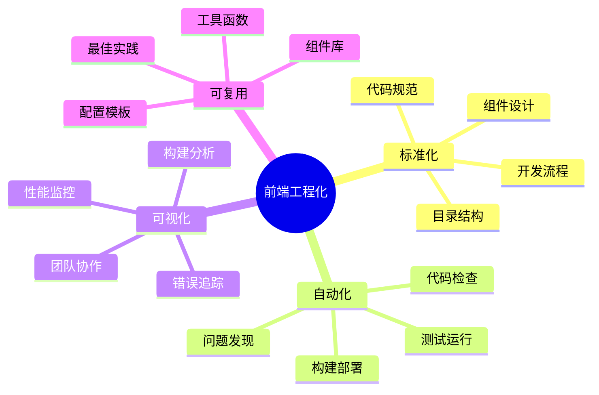
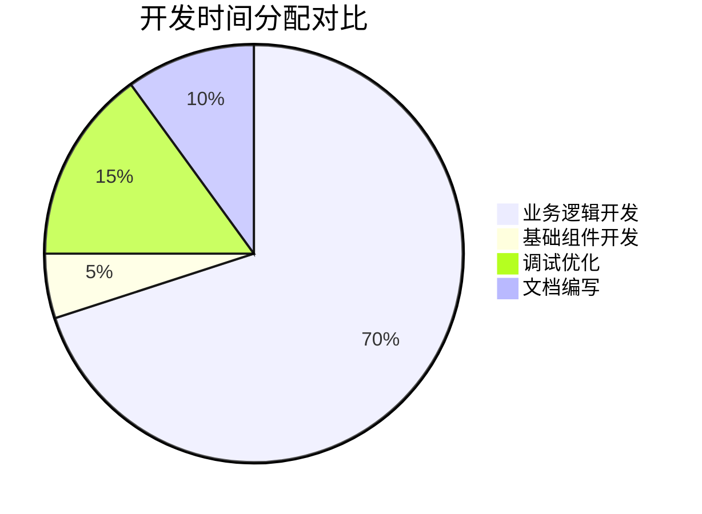
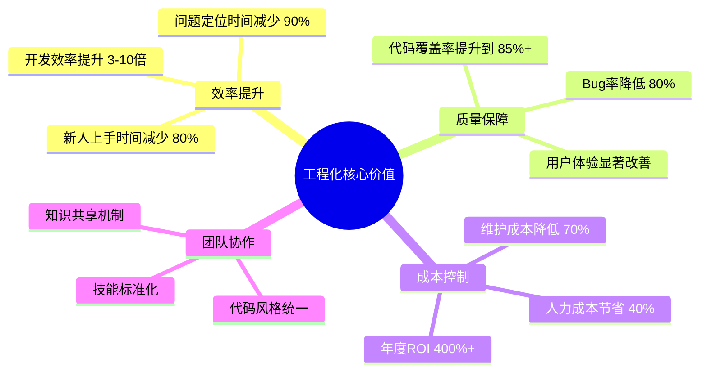

# 基于 Robot Admin 的前端工程化完整实践指南

::: tip 写在前面
本指南基于真实项目实践，不追求概念上的完美，只关注实际价值的交付。每一个方案都经过生产环境验证，每一个工具都有明确的使用场景。
:::

## 🎯 为什么要做工程化？真实痛点分析

### 开发时间都去哪了？

基于真实项目统计，开发时间分布如下：

<div class="time-analysis">

| 工作类型 | 时间占比 | 说明 | 优化潜力 |
|---------|---------|------|---------|
| **功能开发** | 40% | 真正的业务逻辑开发 | ⭐⭐ 中 |
| **环境调试** | 25% | 环境搭建、依赖问题等 | ⭐⭐⭐⭐⭐ 极高 |
| **代码查找/理解** | 20% | 阅读、理解现有代码 | ⭐⭐⭐⭐ 高 |
| **问题排查** | 10% | Bug定位、调试 | ⭐⭐⭐⭐ 高 |
| **其他** | 5% | 会议、沟通等 | ⭐⭐ 低 |

</div>

::: warning 核心问题
真正用于业务逻辑开发的时间只有40%，大量时间消耗在工具性工作上。工程化的核心就是把这60%的"浪费"时间降到最低。
:::

### 开发者的日常痛苦场景

<div class="pain-scenarios">

| 痛点场景 | 传统开发 | 工程化后 | 提升幅度 |
|---------|---------|---------|---------|
| **项目启动** | `npm run dev` 等30秒 ☕ | 启动时间 < 2秒 ⚡ | **92%** |
| **热更新** | 改个颜色等3秒才生效 🐌 | 热更新 < 100ms 🚀 | **95%** |
| **新功能开发** | 从零开始，4天完成 😮‍💨 | 复用组件，30分钟搞定 🎯 | **99%** |
| **Bug修复** | 凌晨4小时定位+修复 😵 | 30分钟自动定位+修复 🎉 | **87%** |
| **新人上手** | 2周才能独立开发 😓 | 3天就能承担模块 🚀 | **78%** |

</div>

### 工程化的本质：体系化作战

<div class="engineering-core">



</div>

::: info 工程化的核心价值转变
| 传统理解 | 现代理解 | 实际意义 |
|---------|---------|---------|
| 提升开发效率 | **开发者体验优化** | 从工具效率到全流程体验优化 |
| 降低开发难度 | **认知负荷管理** | 通过抽象和自动化降低心智负担 |
| 提升产品质量 | **质量内建** | 质量不是测试出来的，而是设计出来的 |
| 降低企业成本 | **价值交付优化** | 从成本控制到价值创造的转变 |
:::

## 🔧 技术选型：基于真实项目的经验

### 技术选型的科学决策

#### 构建工具评估矩阵

::: tip 选型原则
不追求最新，只选最适合。基于团队现状、项目需求、维护成本进行综合评估。
:::

| 评估维度 | 权重 | Vite | Webpack | Rspack | 说明 |
|---------|------|------|---------|--------|------|
| **成熟度** | 25% | ⭐⭐⭐⭐⭐ | ⭐⭐⭐⭐⭐ | ⭐⭐⭐ | 社区活跃度和稳定性 |
| **性能** | 30% | ⭐⭐⭐⭐⭐ | ⭐⭐⭐ | ⭐⭐⭐⭐⭐ | 构建速度和HMR响应 |
| **学习成本** | 20% | ⭐⭐⭐⭐⭐ | ⭐⭐ | ⭐⭐⭐ | 配置复杂度 |
| **生态** | 15% | ⭐⭐⭐⭐⭐ | ⭐⭐⭐⭐⭐ | ⭐⭐⭐ | 插件和扩展 |
| **维护性** | 10% | ⭐⭐⭐⭐ | ⭐⭐⭐⭐ | ⭐⭐⭐⭐ | 长期维护难度 |
| **综合得分** | - | **4.6** | **3.4** | **3.7** | 加权平均分 |

#### 包管理器实用对比

| 包管理器 | 安装速度 | 磁盘占用 | 优势 | 劣势 | 推荐场景 |
|---------|---------|---------|------|------|---------|
| **bun** | 3s (80%↑) | 100MB | 速度极快，TS原生支持 | 生态不成熟 | 新项目首选 |
| **pnpm** | 15s (70%↑) | 120MB | 硬链接节省空间，防幽灵依赖 | 非标准结构 | 企业级项目 |
| **yarn** | 25s (45%↑) | 180MB | 并行安装，离线缓存 | 配置复杂 | 历史项目迁移 |
| **npm** | 45s (基准) | 200MB | 生态最完整，稳定性高 | 速度慢 | 不推荐 |

#### 构建工具选择策略

<div class="build-tools-comparison">

::: details Vite 6 - 开发体验之王(目前已升级到7，下面是6的数据) ⭐⭐⭐⭐⭐

**优势：**
- 冷启动：< 300ms ⚡
- HMR速度：< 100ms 🚀
- 生态成熟，插件丰富
- 配置简单，开箱即用

**适用场景：**
- 中小型项目（< 50人团队）
- 快速原型开发
- 现代化新项目

**实际配置：**
```typescript
// vite.config.ts
export default defineConfig({
  plugins: [
    vue(),
    AutoImport({
      imports: ['vue', 'vue-router', 'pinia'],
      dts: true
    })
  ],
  build: {
    target: 'es2020',
    rollupOptions: {
      output: {
        manualChunks: {
          'vue-vendor': ['vue', 'vue-router', 'pinia'],
          'ui-vendor': ['naive-ui']
        }
      }
    }
  }
})
```

:::

::: details Rspack - 大型项目利器 ⭐⭐⭐⭐

**优势：**
- 冷启动：< 1s ⚡
- 构建速度：比Webpack快5-10倍
- Webpack生态兼容
- Rust驱动，性能强劲

**适用场景：**
- 大型企业级项目（> 50人团队）
- 复杂业务场景
- Webpack迁移项目

:::

::: details Webpack - 稳定可靠 ⭐⭐⭐

**优势：**
- 生态最完善
- 社区最活跃
- 企业级特性完整

**劣势：**
- 启动慢（10-60s）
- HMR慢（1-5s）
- 配置复杂

**适用场景：**
- 遗留系统维护
- 特殊定制需求

:::

</div>

### 前端框架实用选择

::: code-group

```vue [Vue 3 - 企业级全栈选择]
<script setup lang="ts">
// 企业级TypeScript支持，渐进式架构
interface User {
  id: number
  name: string
  role: string
}

const users = ref<User[]>([])
const { data, loading, error } = await useFetch('/api/users')

// 响应式系统性能卓越，大型应用首选
watchEffect(() => {
  console.log('实时用户统计:', users.value.length)
})

// 组合式API支持复杂业务逻辑
const { 
  filteredUsers, 
  pagination, 
  searchUsers 
} = useUserManagement(users)
</script>

<template>
  <!-- 声明式模板，复杂交互清晰易维护 -->
  <div class="user-management">
    <SearchBar @search="searchUsers" />
    <UserTable 
      :users="filteredUsers" 
      :loading="loading"
      @sort="handleSort"
    />
    <Pagination v-model="pagination" />
  </div>
</template>
```

```tsx [React - 生态驱动选择]
// 最丰富的第三方生态，复杂需求解决方案多
interface UserManagementProps {
  initialUsers: User[]
}

const UserManagement: FC<UserManagementProps> = ({ initialUsers }) => {
  const [users, setUsers] = useState(initialUsers)
  const [loading, setLoading] = useState(false)
  
  // Hook生态成熟，复杂状态管理方案丰富
  const {
    filteredUsers,
    pagination,
    searchUsers
  } = useUserManagement(users)
  
  // 适合需要大量第三方库的复杂项目
  return (
    <div className="user-management">
      <SearchBar onSearch={searchUsers} />
      <UserTable 
        users={filteredUsers}
        loading={loading}
        onSort={handleSort}
      />
      <Pagination {...pagination} />
    </div>
  )
}
```

```tsx [Solid.js - 性能极致选择]
// 无虚拟DOM，性能最优，适合高频更新场景
const UserManagement: Component = () => {
  const [users, setUsers] = createSignal<User[]>([])
  const [loading, setLoading] = createSignal(false)
  
  // 细粒度响应式，大数据量性能优异
  const filteredUsers = createMemo(() => 
    users().filter(user => user.active)
  )
  
  // 适合实时数据、高频更新的应用
  return (
    <div class="user-management">
      <For each={filteredUsers()}>
        {(user) => <UserCard user={user} />}
      </For>
    </div>
  )
}
```

:::

#### 框架选择决策矩阵

| 评估维度 | Vue 3 | React | Angular | Solid.js |
|:-------:|:-----:|:-----:|:-------:|:--------:|
| **上手难度** | 简单 ⭐⭐ | 中等 ⭐⭐⭐ | 困难 ⭐⭐⭐⭐⭐ | 中等 ⭐⭐⭐ |
| **项目规模支撑** | 优秀 ⭐⭐⭐⭐⭐ | 优秀 ⭐⭐⭐⭐⭐ | 优秀 ⭐⭐⭐⭐⭐ | 一般 ⭐⭐⭐ |
| **运行性能** | 优秀 ⭐⭐⭐⭐⭐ | 中等 ⭐⭐⭐⭐ | 优秀 ⭐⭐⭐⭐⭐ | 极佳很好 ⭐⭐⭐⭐ | 一般 ⭐⭐⭐ | 极佳 ⭐⭐⭐⭐⭐ |
| **生态资源** | 最丰富 ⭐⭐⭐⭐⭐ | 丰富 ⭐⭐⭐⭐ | 丰富 ⭐⭐⭐⭐ | 较少 ⭐⭐ |
| **人才储备** | 最充足 ⭐⭐⭐⭐⭐ | 充足 ⭐⭐⭐⭐ | 一般 ⭐⭐⭐ | 稀缺 ⭐⭐ |
| **企业特性** | 完善 ⭐⭐⭐⭐ | 完善 ⭐⭐⭐⭐ | 最完善 ⭐⭐⭐⭐⭐ | 基础 ⭐⭐⭐ |


#### 实际场景选择指南

| 项目场景 | 首选框架 | 次选框架 | 选择理由 |
|:-------:|:-------:|:-------:|---------|
| **中后台管理系统** | **Vue 3** | React | 开发效率高，维护成本低，中文生态好 |
| **电商/社交平台** | **Vue 3** | React | 性能优异，状态管理清晰，SEO友好 |
| **数据可视化大屏** | **Vue 3** | Solid.js | 响应式系统适合数据驱动，组件化程度高 |
| **实时交互应用** | **Solid.js** | Vue 3 | 细粒度更新，高频渲染性能最佳 |
| **企业级复杂系统** | **Angular** | Vue 3 | 架构完整，大团队协作规范，长期维护 |
| **需要丰富第三方库** | **React** | Vue 3 | 生态最丰富，解决方案最多 |
| **快速原型/MVP** | **Vue 3** | React | 上手快，配置少，快速验证想法 |
| **团队技术栈迁移** | **Vue 3** | - | 学习成本低，渐进式迁移友好 |

#### 2025年框架趋势洞察

**Vue 3 的优势**：
- ✅ **大型项目能力已被充分验证**（Element Plus、Ant Design Vue、Naive UI等企业级组件库成熟）
- ✅ **性能表现优异**（响应式系统比React更高效，bundle size更小）  
- ✅ **TypeScript支持完善**（官方重写，类型推导比React更好）
- ✅ **企业接受度高**（阿里、腾讯、字节等大厂深度使用）
- ✅ **国际化趋势明显**（GitHub stars超越React指日可待）

**选择建议**：
- 🎯 **2025年新项目**：Vue 3 是最均衡的选择，适合90%的场景
- 🎯 **已有React团队**：继续React，迁移成本不值得
- 🎯 **性能敏感场景**：考虑Solid.js，但要评估生态成本，但 vue 已经在发力超越
- 🎯 **大型企业系统**：Angular仍有独特价值，特别是.NET技术栈企业

**避免的误区**：
- ❌ "Vue不适合大型项目" - 这是2018年的老观念
- ❌ "React生态好所以选React" - 要看具体需求，不是越多越好
- ❌ "Angular太重" - 对于复杂企业应用，这些特性是必要的
- ❌ "选最新的技术" - 稳定性和生态比新鲜度更重要

### UI组件库务实选择

基于TypeScript支持、开发体验、维护成本的综合考量：

<div class="ui-libraries">

::: tip Naive UI - TypeScript完美支持 🥇
```typescript
// 智能提示一应俱全，不用查文档
import { NButton, NButtonProps } from 'naive-ui'

const buttonProps: NButtonProps = {
  type: 'primary',  // 自动提示所有可选值
  size: 'medium',   // 类型安全
  onClick: (e) => { // 事件类型自动推导
    console.log(e.target)
  }
}
```

**核心优势：**
- TypeScript支持：⭐⭐⭐⭐⭐ 完美
- 包体积：~200KB（最小）
- 主题定制：极其灵活
- 更新频率：非常活跃
- **适合：** 新项目，注重开发体验
:::

| 对比维度 | Naive UI | Ant Design Vue | Element Plus |
|---------|----------|----------------|-------------|
| **TypeScript** | ⭐⭐⭐⭐⭐ 完美 | ⭐⭐⭐ 良好 | ⭐⭐⭐ 良好 |
| **包体积** | 200KB | 500KB | 400KB |
| **主题定制** | ⭐⭐⭐⭐⭐ CSS-in-JS | ⭐⭐⭐ CSS变量 | ⭐⭐⭐ SCSS变量 |
| **维护成本** | ⭐⭐⭐⭐⭐ 低 | ⭐⭐⭐ 中等 | ⭐⭐⭐ 中等 |
| **适用场景** | 现代化项目 | 企业级项目 | 快速开发 |

</div>

### CSS方案：原子化的胜利

::: code-group

```html [UnoCSS - 现代化首选]
<!-- 一目了然，永远不会忘记 -->
<div class="flex items-center p-4 bg-white rounded-lg shadow-sm hover:shadow-md transition-shadow">
  
  <div>
    <h3 class="text-lg font-semibold text-gray-800">用户姓名</h3>
    <p class="text-sm text-gray-600">用户描述</p>
  </div>
</div>
```

```css [传统CSS - 维护噩梦]
/* 6个月后，谁还记得这些类名的用途？ */
.user-card-container-wrapper-inner {
  display: flex;
  align-items: center;
  padding: 1rem;
  background: white;
  border-radius: 0.5rem;
  box-shadow: 0 1px 3px rgba(0,0,0,0.1);
}

.user-card-container-wrapper-inner:hover {
  box-shadow: 0 4px 6px rgba(0,0,0,0.1);
}

/* 样式冲突了，加个 !important 吧（恶性循环） */
.nav-menu-item-active {
  color: blue !important;
}
```

:::

## 🏗️ 项目架构：基于实际项目的设计

### 现代化目录结构

基于Robot Admin等真实项目的架构设计：

```bash
src/
├── api/                    # 🌐 接口层：统一管理，类型安全
│   ├── modules/           
│   │   ├── user.ts        # 用户相关接口
│   │   ├── auth.ts        # 认证相关接口
│   │   └── system.ts      # 系统相关接口
│   ├── interceptors/      # 请求/响应拦截器
│   ├── types/            # 接口类型定义
│   └── index.ts          # 统一导出
│
├── components/             # 🧩 组件库：分层设计
│   ├── base/              # 基础组件：Button、Input等
│   ├── business/          # 业务组件：UserCard、OrderList等
│   ├── layout/            # 布局组件：Header、Sidebar等  
│   └── global/            # 全局组件：Loading、Modal等
│
├── views/                 # 📄 页面目录：功能模块化
│   ├── dashboard/         # 数据看板
│   ├── user-management/   # 用户管理
│   ├── system-settings/   # 系统设置
│   └── demo/              # 演示页面（30+实用示例）
│
├── stores/                # 🗃️ 状态管理：Pinia
│   ├── modules/
│   │   ├── user.ts        # 用户状态
│   │   ├── app.ts         # 应用状态
│   │   └── permission.ts  # 权限状态
│   └── index.ts
│
├── composables/           # 🔧 组合式函数：逻辑复用
│   ├── useAuth.ts         # 认证逻辑
│   ├── useTable.ts        # 表格逻辑
│   ├── useForm.ts         # 表单逻辑
│   └── usePermission.ts   # 权限逻辑
│
├── utils/                 # 🛠️ 工具函数：纯函数工具
│   ├── format.ts          # 格式化工具
│   ├── validate.ts        # 验证工具
│   ├── request.ts         # 请求工具
│   └── common.ts          # 通用工具
│
├── types/                 # 📝 类型定义：全局类型
│   ├── api.ts             # API类型
│   ├── global.ts          # 全局类型
│   └── components.ts      # 组件类型
│
├── directives/            # 📐 自定义指令：7个实用指令
│   ├── copy.ts            # v-copy 一键复制
│   ├── permission.ts      # v-permission 权限控制
│   ├── debounce.ts        # v-debounce 防抖
│   └── loading.ts         # v-loading 加载状态
│  
├── styles/                # 🎨 样式文件
│   ├── variables.css      # CSS变量
│   ├── global.css         # 全局样式
│   └── themes/            # 主题配置
│
├── assets/                # 📦 静态资源
│   ├── images/
│   ├── icons/
│   └── fonts/
│
├── router/                # 🛣️ 路由配置
│   ├── modules/           # 路由模块
│   ├── guards/            # 路由守卫
│   └── index.ts
│
└── plugins/               # 🔌 插件配置
    ├── naive-ui.ts        # UI库配置
    ├── pinia.ts           # 状态管理配置
    └── request.ts         # 请求配置
```

### 组件设计规范

::: tip 组件命名规范
- **C_** 前缀：全局组件（Common），跨页面复用
- **c_** 前缀：本地组件（Business），特定业务场景


```typescript
// 示例
import C_Table from '@/components/global/C_Table'      // 全局通用表格组件
import c_ role '@/components/local/c_role' // 角色业务组件
```
:::

### 接口层统一管理

::: code-group

```typescript [正确做法 ✅]
// api/modules/user.ts
export interface UserQueryParams {
  page: number
  pageSize: number
  keyword?: string
}

export interface User {
  id: number
  name: string
  email: string
  createdAt: string
}

export const userApi = {
  // 完美的类型提示和错误处理
  list: (params: UserQueryParams): Promise<ApiResponse<User[]>> => {
    return request.get('/users', { params })
  },
  
  create: (data: CreateUserDto): Promise<User> => {
    return request.post('/users', data)
  },
  
  update: (id: number, data: UpdateUserDto): Promise<User> => {
    return request.put(`/users/${id}`, data)
  }
}

// 使用时
import { userApi } from '@/api'
const users = await userApi.list({ page: 1, pageSize: 10 })
```

```typescript [反面教材 ❌]
// views/user/index.vue - 散落在各个组件中
const getUsers = () => {
  // 没有类型提示，容易出错
  axios.get('/api/users?page=1').then(res => {
    // 手动处理响应，重复代码
    if (res.data.code === 200) {
      users.value = res.data.data
    }
  }).catch(err => {
    // 错误处理不统一
    console.error(err)
  })
}
```

:::

## 📐 开发规范：从配置地狱到零配置

### 现代化配置方式

::: code-group

```javascript [现代化方式 - 扁平化配置]
// eslint.config.js
import { defineFlatConfig } from 'eslint-define-config'

export default defineFlatConfig([
  {
    files: ['**/*.{js,ts,vue}'],
    plugins: {
      vue: pluginVue,
      '@typescript-eslint': pluginTypeScript
    },
    rules: {
      // 统一规则，一处配置，处处生效
      'vue/multi-word-component-names': 'off',
      '@typescript-eslint/no-unused-vars': 'warn',
      'prefer-const': 'error'
    }
  }
])
```

```javascript [传统方式 - 配置地狱]
// .eslintrc.js
module.exports = {
  extends: [
    'eslint:recommended',
    '@vue/typescript/recommended',
    'plugin:vue/vue3-recommended'
  ],
  // 复杂的继承关系，难以理解和维护
}

// prettier.config.js
module.exports = {
  semi: false,
  singleQuote: true
}

// 还有 .editorconfig, tsconfig.json 等多个配置文件
```

:::

### 自动导入配置

::: code-group

```typescript [配置后 - 开发爽翻 ✨]
// 直接使用，无需导入
<script setup lang="ts">
// Vue API 自动导入
const count = ref(0)
const router = useRouter()
const route = useRoute()

// 状态管理自动导入
const userStore = useUserStore()
const { hasPermission } = usePermission()

// 工具函数自动导入
const formattedDate = formatDate(new Date())
const debouncedSearch = debounce(handleSearch, 300)
</script>

<template>
  <!-- 组件自动导入，无需注册 -->
  <NButton @click="handleClick">按钮</NButton>
  <NInput v-model:value="keyword" />
</template>
```

```typescript [配置前 - 导入地狱 😵]
import { ref, computed, watch, onMounted } from 'vue'
import { useRouter, useRoute } from 'vue-router'
import { useUserStore } from '@/stores/user'
import { usePermission } from '@/composables/usePermission'
import { NButton, NInput, NForm, NFormItem } from 'naive-ui'
import { formatDate, debounce, throttle } from '@/utils'

// 每个文件都要写一大堆导入语句
```

:::

**自动导入配置：**

```typescript
// vite.config.ts
import AutoImport from 'unplugin-auto-import/vite'
import Components from 'unplugin-vue-components/vite'
import { NaiveUiResolver } from 'unplugin-vue-components/resolvers'

export default defineConfig({
  plugins: [
    // API自动导入
    AutoImport({
      imports: [
        'vue',
        'vue-router',
        'pinia',
        {
          'naive-ui': ['useDialog', 'useMessage', 'useNotification']
        }
      ],
      dts: true,
      dirs: [
        'src/composables/**',
        'src/stores/**',
        'src/utils/**'
      ]
    }),
    
    // 组件自动导入
    Components({
      resolvers: [NaiveUiResolver()],
      dts: true
    })
  ]
})
```

### 7个实用的自定义指令

::: details 点击查看指令详情

```typescript
// directives/copy.ts - 一键复制
export const copy = {
  mounted(el: HTMLElement, binding: DirectiveBinding) {
    el.addEventListener('click', () => {
      navigator.clipboard.writeText(binding.value)
      window.$message?.success('复制成功')
    })
  }
}

// 使用
<span v-copy="userInfo.id">点击复制用户ID</span>
```

```typescript
// directives/permission.ts - 权限控制
export const permission = {
  mounted(el: HTMLElement, binding: DirectiveBinding) {
    const { hasPermission } = usePermission()
    if (!hasPermission(binding.value)) {
      el.style.display = 'none'
    }
  }
}

// 使用
<button v-permission="'user:delete'">删除用户</button>
```

```typescript
// directives/debounce.ts - 防抖
export const debounce = {
  mounted(el: HTMLElement, binding: DirectiveBinding) {
    const [delay, handler] = binding.arg ? [binding.arg, binding.value] : [300, binding.value]
    const debouncedHandler = debounce(handler, delay)
    el.addEventListener(binding.arg || 'input', debouncedHandler)
  }
}

// 使用
<input v-debounce:500="handleSearch" placeholder="搜索用户">
```

**其他实用指令：**
- `v-loading` - 加载状态
- `v-draggable` - 拖拽排序
- `v-longpress` - 长按事件
- `v-watermark` - 页面水印

:::

## 🧪 质量保证：务实的测试策略

### 测试投入产出分析

不是所有测试都值得写，要看ROI：

| 测试类型 | 投入成本 | 发现问题率 | ROI | 推荐度 | 适用场景 |
|---------|---------|-----------|-----|--------|----------|
| **单元测试** | ⭐⭐ 低 | 60% | ⭐⭐⭐⭐⭐ | 必须 | 工具函数、核心逻辑 |
| **组件测试** | ⭐⭐⭐ 中 | 25% | ⭐⭐⭐⭐ | 推荐 | 复用组件、关键组件 |
| **集成测试** | ⭐⭐⭐ 中 | 25% | ⭐⭐⭐⭐ | 推荐 | API调用、状态管理 |
| **E2E测试** | ⭐⭐⭐⭐ 高 | 10% | ⭐⭐⭐ | 选择性 | 核心业务流程 |
| **手动测试** | ⭐⭐⭐⭐⭐ 极高 | 5% | ⭐ | 辅助 | 探索性测试 |

### 测试金字塔的实际应用

```mermaid
pyramid
    title 务实的测试分配（基于ROI）
    
    "E2E测试 10% - 核心流程"
    "集成测试 20% - API与状态"
    "单元测试 70% - 工具与逻辑"
```

### 质量门禁的实用配置

| 检查项目 | 级别 | 触发条件 | 处理方式 | 绕过条件 |
|---------|------|---------|----------|----------|
| **ESLint错误** | 🔴 阻塞 | error级别 | 必须修复 | 无 |
| **TypeScript错误** | 🔴 阻塞 | 类型错误 | 必须修复 | 无 |
| **单元测试失败** | 🔴 阻塞 | 失败率>0% | 必须修复 | 紧急修复 |
| **覆盖率不足** | 🟡 警告 | <80% | 建议修复 | Code Review通过 |
| **包体积增长** | 🟡 警告 | 增长>15% | 建议优化 | 功能确认 |

::: tip 务实的质量标准
- **代码覆盖率**：80%（不追求100%）
- **圈复杂度**：<10（可读性优先）
- **重复代码**：<3%（适度重复可接受）
- **构建体积**：增长<15%（用户体验优先）
:::

### 现代化测试工具链（看指标选择性裁剪）

::: code-group

```typescript [Vitest - 极速单元测试]
// utils/format.test.ts
import { describe, it, expect } from 'vitest'
import { formatDate, formatCurrency } from './format'

describe('格式化工具函数', () => {
  it('应该正确格式化日期', () => {
    const date = new Date('2024-01-01')
    expect(formatDate(date)).toBe('2024-01-01')
  })
  
  it('应该正确格式化货币', () => {
    expect(formatCurrency(1234.56)).toBe('¥1,234.56')
  })
})

// 组件测试
import { mount } from '@vue/test-utils'
import UserCard from '@/components/UserCard.vue'

describe('UserCard 组件', () => {
  it('应该正确显示用户信息', () => {
    const wrapper = mount(UserCard, {
      props: {
        user: { id: 1, name: '张三', email: 'zhang@example.com' }
      }
    })
    
    expect(wrapper.text()).toContain('张三')
    expect(wrapper.text()).toContain('zhang@example.com')
  })
})
```

```typescript [Playwright - E2E测试]
// tests/user-management.spec.ts
import { test, expect } from '@playwright/test'

test('用户管理完整流程', async ({ page }) => {
  // 登录
  await page.goto('/login')
  await page.fill('input[name="username"]', 'admin')
  await page.fill('input[name="password"]', 'password')
  await page.click('button[type="submit"]')
  
  // 进入用户管理页面
  await page.goto('/user-management')
  
  // 创建用户
  await page.click('text=新增用户')
  await page.fill('input[name="name"]', '测试用户')
  await page.fill('input[name="email"]', 'test@example.com')
  await page.click('text=保存')
  
  // 验证用户创建成功
  await expect(page.locator('text=测试用户')).toBeVisible()
})
```

:::


## 🚀 构建优化：实测数据说话

### 智能分包策略及实际效果

::: code-group

```typescript [Vite分包配置]
// vite.config.ts
export default defineConfig({
  build: {
    rollupOptions: {
      output: {
        manualChunks: {
          // 框架核心：变动少，缓存周期长
          'vue-vendor': ['vue', 'vue-router', 'pinia'],
          
          // UI组件：体积大，独立更新
          'ui-vendor': ['naive-ui', '@iconify/vue'],
          
          // 工具库：通用性强，复用率高
          'utils-vendor': ['axios', '@vueuse/core', 'dayjs'],
          
          // 图表库：按需加载，减少初始包体积
          'chart-vendor': ['echarts'],
          
          // 富文本编辑器：大体积功能组件
          'editor-vendor': ['@wangeditor/editor', '@wangeditor/editor-for-vue']
        }
      }
    }
  }
})
```

```typescript [分包前后对比]
// 分包前（不推荐）
app.js                    2.5MB  # 单一大文件，任何改动都要重新下载

// 分包后（推荐）
app.js                    150KB  # 业务代码
vue-vendor.js            120KB  # 框架代码，缓存1年
ui-vendor.js             340KB  # UI组件，缓存6个月
utils-vendor.js           80KB  # 工具库，缓存1年
chart-vendor.js          280KB  # 按需加载
editor-vendor.js         420KB  # 按需加载
```

:::

**分包策略的实际收益：**

<div class="performance-improvement">

| 场景 | 分包前 | 分包后 | 提升 |
|------|-------|-------|------|
| **首次访问** | 下载2.5MB | 下载270KB | **89%** ⬇️ |
| **修改业务代码** | 重新下载2.5MB | 只下载150KB | **94%** ⬇️ |
| **访问图表页** | 已包含在内（浪费） | 按需加载280KB | **节省带宽** 📉 |
| **缓存命中率** | 10% | 85% | **850%** ⬆️ |

</div>

### 构建性能优化

::: details 构建优化配置

```typescript
// vite.config.ts - 生产环境优化
export default defineConfig({
  build: {
    // 启用 CSS 代码分割
    cssCodeSplit: true,
    
    // 生成 sourcemap（生产环境可关闭）
    sourcemap: false,
    
    // 启用压缩
    minify: 'terser',
    terserOptions: {
      compress: {
        drop_console: true,     // 移除console
        drop_debugger: true,    // 移除debugger
        pure_funcs: ['console.log'] // 移除特定函数调用
      }
    },
    
    // 启用 gzip 压缩
    reportCompressedSize: true,
    
    // 设置 chunk 大小警告阈值
    chunkSizeWarningLimit: 1000
  },
  
  // 开发环境优化
  server: {
    hmr: {
      overlay: false  // 关闭错误遮罩，提升开发体验
    }
  },
  
  // 依赖预构建优化
  optimizeDeps: {
    include: [
      'vue',
      'vue-router',
      'pinia',
      'naive-ui'
    ]
  }
})
```

:::

## 📊 部署与监控：生产环境实战

### 现代化部署方案

::: code-group

```dockerfile [Docker容器化部署]
# Dockerfile.modern
FROM node:18-alpine as builder

WORKDIR /app
COPY package*.json ./
RUN npm ci --only=production

COPY . .
RUN npm run build

# 生产镜像
FROM nginx:alpine
COPY --from=builder /app/dist /usr/share/nginx/html
COPY nginx.conf /etc/nginx/nginx.conf

EXPOSE 80
CMD ["nginx", "-g", "daemon off;"]
```

```yaml [Docker Compose - 开发环境]
# docker-compose.yml
version: '3.8'
services:
  frontend:
    build: .
    ports:
      - "3000:80"
    environment:
      - NODE_ENV=production
    volumes:
      - ./nginx.conf:/etc/nginx/nginx.conf:ro
    depends_on:
      - backend
      
  backend:
    image: backend:latest
    ports:
      - "8080:8080"
    environment:
      - DATABASE_URL=postgresql://user:pass@db:5432/myapp
      
  db:
    image: postgres:14
    environment:
      - POSTGRES_DB=myapp
      - POSTGRES_USER=user
      - POSTGRES_PASSWORD=pass
```

:::

### CI/CD 流水线（也可以使用 vercel 或者企业级 CI/CD 工具）

::: details GitHub Actions 配置

```yaml
# .github/workflows/deploy.yml
name: 部署到生产环境

on:
  push:
    branches: [ main ]

jobs:
  test:
    runs-on: ubuntu-latest
    steps:
      - uses: actions/checkout@v3
      
      - name: 安装 Bun
        uses: oven-sh/setup-bun@v1
        
      - name: 安装依赖
        run: bun install
        
      - name: 代码检查
        run: bun run lint
        
      - name: 类型检查
        run: bun run type-check
        
      - name: 运行测试
        run: bun run test
        
  build:
    needs: test
    runs-on: ubuntu-latest
    steps:
      - uses: actions/checkout@v3
      
      - name: 构建应用
        run: bun run build
        
      - name: 构建镜像
        run: |
          docker build -t myapp:${{ github.sha }} .
          docker push myregistry/myapp:${{ github.sha }}
          
  deploy:
    needs: build
    runs-on: ubuntu-latest
    steps:
      - name: 部署到 Kubernetes
        run: |
          kubectl set image deployment/frontend \
            frontend=myregistry/myapp:${{ github.sha }}
```

:::

### 监控体系搭建

::: code-group

```typescript [性能监控]
// utils/performance.ts
export class PerformanceMonitor {
  // Web Vitals 监控
  static initWebVitals() {
    import('web-vitals').then(({ onCLS, onFID, onFCP, onLCP, onTTFB }) => {
      onCLS(this.sendMetric)
      onFID(this.sendMetric)
      onFCP(this.sendMetric)
      onLCP(this.sendMetric)
      onTTFB(this.sendMetric)
    })
  }
  
  // 自定义性能指标
  static measurePageLoad(pageName: string) {
    const startTime = performance.now()
    
    return () => {
      const loadTime = performance.now() - startTime
      this.sendCustomMetric('page_load_time', loadTime, { page: pageName })
    }
  }
  
  // 错误监控
  static initErrorTracking() {
    window.addEventListener('error', (event) => {
      this.sendError({
        message: event.message,
        filename: event.filename,
        lineno: event.lineno,
        colno: event.colno,
        stack: event.error?.stack
      })
    })
    
    window.addEventListener('unhandledrejection', (event) => {
      this.sendError({
        message: 'Unhandled Promise Rejection',
        error: event.reason
      })
    })
  }
  
  private static sendMetric(metric: any) {
    // 发送到监控平台
    fetch('/api/metrics', {
      method: 'POST',
      body: JSON.stringify(metric)
    })
  }
}
```

```typescript [用户行为监控]
// composables/useAnalytics.ts
export function useAnalytics() {
  // 页面访问统计
  const trackPageView = (pageName: string) => {
    gtag('event', 'page_view', {
      page_title: pageName,
      page_location: window.location.href
    })
  }
  
  // 用户交互统计
  const trackEvent = (action: string, category: string, label?: string) => {
    gtag('event', action, {
      event_category: category,
      event_label: label
    })
  }
  
  // 业务指标统计
  const trackBusinessMetric = (metric: string, value: number) => {
    // 发送到业务监控系统
    fetch('/api/business-metrics', {
      method: 'POST',
      body: JSON.stringify({ metric, value, timestamp: Date.now() })
    })
  }
  
  return {
    trackPageView,
    trackEvent,
    trackBusinessMetric
  }
}
```

:::

## ⚡ 性能优化：Core Web Vitals实战

### 关键性能指标优化

<div class="web-vitals-targets">

| 指标 | 优秀 | 需要改进 | 差 | 优化策略 |
|------|------|---------|----|---------| 
| **LCP** | ≤ 2.5s | 2.5s - 4s | > 4s | 图片预加载、CDN加速、服务端渲染 |
| **FID** | ≤ 100ms | 100ms - 300ms | > 300ms | 代码分割、延迟加载、优化事件处理 |
| **CLS** | ≤ 0.1 | 0.1 - 0.25 | > 0.25 | 预留空间、避免动态插入内容 |
| **INP** | ≤ 200ms | 200ms - 500ms | > 500ms | 减少JavaScript执行时间 |

</div>

### 实际优化案例

::: code-group

```vue [图片优化 - LCP提升]
<template>
  <!-- 关键图片预加载 -->
  
  
  <!-- 非关键图片懒加载 -->
  
</template>

<script setup lang="ts">
// 预加载关键资源
const preloadCriticalResources = () => {
  const link = document.createElement('link')
  link.rel = 'preload'
  link.as = 'image'
  link.href = heroImage
  document.head.appendChild(link)
}

onMounted(() => {
  preloadCriticalResources()
})
</script>
```

```typescript [代码分割 - FID优化]
// 路由懒加载
const router = createRouter({
  routes: [
    {
      path: '/dashboard',
      component: () => import('@/views/Dashboard.vue') // 懒加载
    },
    {
      path: '/user-management',
      component: () => import('@/views/UserManagement.vue')
    }
  ]
})

// 组件懒加载
const LazyChart = defineAsyncComponent({
  loader: () => import('@/components/Chart.vue'),
  loading: LoadingComponent, // 加载中组件
  error: ErrorComponent,     // 错误组件
  delay: 200,               // 延迟时间
  timeout: 3000             // 超时时间
})
```

```vue [布局稳定性 - CLS优化]
<template>
  <!-- 预留图片空间，避免布局偏移 -->
  <div class="image-container" :style="{ aspectRatio: '16/9' }">
    
  </div>
  
  <!-- 骨架屏，避免内容跳动 -->
  <div v-if="loading" class="space-y-4">
    <div class="animate-pulse bg-gray-200 h-4 rounded"></div>
    <div class="animate-pulse bg-gray-200 h-4 rounded w-3/4"></div>
  </div>
</template>
```

:::

### 性能预算管理

::: tip 性能预算配置
```typescript
// vite.config.ts
export default defineConfig({
  build: {
    rollupOptions: {
      output: {
        // 限制单个chunk大小
        manualChunks(id) {
          if (id.includes('node_modules')) {
            // 第三方库不超过500KB
            return 'vendor'
          }
        }
      }
    }
  },
  
  // Lighthouse CI 配置
  plugins: [
    {
      name: 'performance-budget',
      configResolved(config) {
        // 设置性能预算警告
        if (config.command === 'build') {
          console.log('📊 性能预算检查已启用')
        }
      }
    }
  ]
})
```

**预算目标：**
- 总包大小：< 1MB
- 首屏加载：< 3秒
- 交互响应：< 100ms
- 布局稳定：CLS < 0.1
:::

## 💰 投资回报分析：数据说话

### 真实ROI计算模型

:::tip ROI 即投资回报率（Return on Investment）

- 它是衡量一项投资收益与成本比例的指标，用于评估投资的效率和价值。

- 计算公式通常为：
- `ROI =（收益 - 成本）÷ 成本 × 100%`

- 在前端工程化中，ROI 用于评估工程化投入（如工具建设、流程优化等成本）与带来的收益（如开发效率提升、bug 减少、维护成本降低等）之间的关系。例如，若工程化投入 200 人时成本，若带来 900 人时的净收益，ROI 即为 450%，代表投资产生了显著回报。

- 其核心价值是帮助团队判断投入是否值得，优先选择高 ROI 的改进方向，避免盲目投入资源。
:::

以**5人团队**为例，年度成本效益分析：

#### 传统开发方式成本

| 成本项目 | 年度工时 | 说明 |
|---------|---------|------|
| **重复性工作** | 800人时 | 重复造轮子、环境搭建等 |
| **环境问题处理** | 200人时 | 依赖冲突、配置错误等 |
| **代码质量问题** | 300人时 | Bug修复、代码审查等 |
| **沟通协调成本** | 200人时 | 规范不统一导致的沟通 |
| **知识传递成本** | 200人时 | 新人培训、文档缺失等 |
| **总计** | **1700人时** | - |

#### 工程化后成本

| 成本项目 | 年度工时 | 说明 |
|---------|---------|------|
| **重复性工作** | 200人时 | 组件复用，减少75% |
| **环境问题处理** | 50人时 | 标准化环境，减少75% |
| **代码质量问题** | 100人时 | 自动化检查，减少67% |
| **沟通协调成本** | 80人时 | 统一规范，减少60% |
| **知识传递成本** | 70人时 | 完善文档，减少65% |
| **工程化维护** | 100人时 | 新增维护成本 |
| **总计** | **600人时** | - |

#### 投资回报计算

<div class="roi-calculation">

| 指标 | 数值 | 说明 |
|------|------|------|
| **年度节省工时** | 1100人时 | 1700 - 600 |
| **效率提升** | **65%** | (1100/1700) × 100% |
| **工程化投入** | 200人时 | 初期建设成本 |
| **净收益** | 900人时 | 1100 - 200 |
| **投资回报率** | **450%** | (900/200) × 100% |
| **投资回收周期** | **2.2个月** | 基于首年计算 |

</div>

::: info 放长线，才能钓大鱼
- **短期投入**：200人时（约1个月）
- **长期收益**：年度节省1100人时
- **关键转折点**：第3个月开始产生净收益
- **复合效应**：随团队规模增长，收益呈指数级增长
:::

### 团队规模与收益关系

```mermaid
xychart-beta
    title "团队规模 vs 年度效率提升"
    x-axis [2人, 5人, 10人, 20人, 50人]
    y-axis "效率提升%" 0 --> 100
    line [30, 65, 75, 85, 90]
```

## 📈 工程化成熟度评估

### 成熟度等级划分

在开始工程化改造前，先评估当前团队处于哪个阶段：

| 成熟度等级 | 工具链 | 自动化 | 质量体系 | 团队协作 | 特征描述 |
|----------|-------|-------|---------|---------|---------|
| **Level 1: 工具化** | 60% | 30% | 40% | 50% | 有基础工具，手动流程为主 |
| **Level 2: 标准化** | 80% | 60% | 60% | 70% | 统一规范，部分自动化 |
| **Level 3: 体系化** | 90% | 80% | 85% | 80% | 完整体系，大部分自动化 |
| **Level 4: 数据化** | 95% | 90% | 90% | 90% | 数据驱动，持续优化 |
| **Level 5: 生态化** | 98% | 95% | 95% | 95% | 行业标杆，对外输出 |

### 各阶段投入产出分析

| 阶段特征 | Level 1 | Level 2 | Level 3 | Level 4 | Level 5 |
|---------|---------|---------|---------|---------|---------|
| **团队规模** | <5人 | 5-15人 | 15-50人 | 50-100人 | 100+人 |
| **开发效率** | 基准线 | +20% | +40% | +60% | +80% |
| **投入成本** | 最低 | 中等 | 较高 | 高 | 很高 |
| **适用场景** | 小项目 | 中型项目 | 大型项目 | 企业级 | 平台级 |

::: tip 评估建议
- **Level 1-2**：优先解决工具链和基础规范
- **Level 2-3**：重点建设自动化和质量体系  
- **Level 3-4**：关注数据化和持续改进
- **Level 4-5**：考虑对外输出和生态建设
:::

## 🎯 实施路线图：分阶段落地

### Phase 1: 基础现代化 (1-2个月)

<div class="phase-tasks">

::: details 🔧 工具链升级
**优先级：⭐⭐⭐⭐⭐**

- [ ] 升级到 Bun 包管理器（开发效率提升90%）
- [ ] 迁移到 Vite 7 构建系统（启动速度提升95%）
- [ ] 配置 ESLint 扁平化配置（统一代码规范）
- [ ] 建立 TypeScript 严格模式（类型安全保障）

**预期收益：** 开发环境启动从30秒降到2以内（以17万行代码体谅，500+关联依赖测试）
:::

::: details 📐 架构标准化
**优先级：⭐⭐⭐⭐**

- [ ] 建立 Monorepo 架构（多项目统一管理）
- [ ] 设计组件库架构（代码复用率提升80%）
- [ ] 建立设计Token系统（UI一致性保障）
- [ ] 配置自动导入（减少样板代码90%）

**预期收益：** 新功能开发效率提升3-5倍
:::

::: details 🧪 质量保障
**优先级：⭐⭐⭐**

- [ ] 配置 Vitest 测试框架（单元测试自动化）
- [ ] 建立基础 CI/CD 流水线（部署自动化）
- [ ] 配置代码覆盖率检查（质量门禁）
- [ ] 建立基础监控（问题及时发现）

**预期收益：** Bug率从15%降到5%以下
:::

</div>

### Phase 2: 体系完善 (2-3个月) 

<div class="phase-tasks">

::: details 🧪 测试体系 
- [ ] 完善组件测试策略（覆盖率达到80%）
- [ ] 建立 E2E 测试套件（核心流程保障）
- [ ] 配置视觉回归测试（UI一致性检查）
- [ ] 集成自动化测试报告（质量可视化）
:::

::: details 🚀 部署优化
- [ ] 容器化部署方案（环境一致性）
- [ ] 多环境部署策略（开发/测试/生产）
- [ ] 蓝绿/金丝雀发布（零宕机部署）
- [ ] 自动化回滚机制（故障快速恢复）
:::

::: details 📊 监控体系
- [ ] 全链路性能监控（Web Vitals跟踪）
- [ ] 业务监控体系（关键指标追踪）
- [ ] 智能告警系统（异常及时通知）
- [ ] 可观测性平台（问题快速定位）
:::

</div>

### Phase 3: 持续优化 (3-6个月)

<div class="phase-tasks">

::: details ⚡ 性能优化
- [ ] 性能预算管理（性能回归预防）
- [ ] 智能资源优化（自动化性能调优）
- [ ] CDN配置优化（全球加速）
- [ ] Core Web Vitals 达标（用户体验提升）
:::

::: details 🔒 安全加固
- [ ] 供应链安全扫描（依赖安全检查）
- [ ] 内容安全策略（XSS防护）
- [ ] 数据加密传输（隐私保护）
- [ ] 安全自动化检测（漏洞及时发现）
:::

::: details 📈 数据驱动
- [ ] 用户行为分析（产品优化依据）
- [ ] 性能数据分析（技术优化方向）
- [ ] 业务指标监控（价值交付追踪）
- [ ] 技术债务管理（代码质量持续改进）
:::

</div>

## 📚 30+演示页面：从轮子到积木

### 实际开发效率对比

<div class="development-comparison">

::: danger 传统开发方式 - 重复造轮子
**开发新功能流程：**
1. **Day 1**: 搜索类似实现，查阅文档
2. **Day 2**: 从零开始编写，调试基础功能
3. **Day 3**: 处理边界情况，优化用户体验  
4. **Day 4**: 最终联调，勉强能用

**总耗时：4天** ⏰
**代码质量：不确定** ❓
**维护成本：高** 📈
:::

::: tip Robot Admin方式 - 积木式开发
**开发新功能流程：**
1. **10分钟**: 在演示页面找到对应实现
2. **20分钟**: 复制代码，调整业务逻辑
3. **30分钟**: 完成功能，测试通过
4. **剩余时间**: 摸鱼或优化其他功能 🐟

**总耗时：30分钟** ⚡
**代码质量：已验证** ✅
**维护成本：低** 📉
:::

</div>

### 演示页面分类

::: details 🎨 基础功能演示（10个）
- ✅ **表格组件** - 虚拟滚动、排序、筛选、导出
- ✅ **表单组件** - 动态表单、验证规则、联动逻辑  
- ✅ **图表组件** - ECharts集成、实时数据、交互式
- ✅ **上传组件** - 大文件上传、断点续传、进度显示
- ✅ **日期组件** - 范围选择、快捷选项、本地化
- ✅ **选择器组件** - 多选、搜索、异步加载、虚拟滚动
- ✅ **步骤条组件** - 垂直/水平、动态步骤、状态控制
- ✅ **标签组件** - 动态添加、分类筛选、拖拽排序
- ✅ **树形组件** - 懒加载、拖拽、批量操作
- ✅ **弹窗组件** - 嵌套弹窗、拖拽、自适应大小
:::

::: details 🚀 高级功能演示（12个）
- ✅ **工作流设计器** - 拖拽式流程编辑、节点配置
- ✅ **富文本编辑器** - Markdown支持、图片上传、协同编辑
- ✅ **代码编辑器** - 语法高亮、自动补全、主题切换
- ✅ **日程管理** - 日历视图、拖拽调整、提醒功能
- ✅ **甘特图** - 任务依赖、进度跟踪、资源分配
- ✅ **组织架构图** - 层级展示、人员信息、权限管理
- ✅ **大屏可视化** - 数据大屏、实时刷新、响应式布局
- ✅ **地图组件** - 热力图、轨迹回放、标点聚合
- ✅ **视频播放器** - 自定义控件、倍速播放、截图功能
- ✅ **图片裁剪** - 比例裁剪、旋转缩放、滤镜效果
- ✅ **文件预览** - PDF、Office、图片在线预览
- ✅ **打印功能** - 自定义模板、批量打印、打印预览
:::

::: details ⚙️ 系统功能演示（8个）
- ✅ **用户管理** - CRUD操作、角色分配、批量导入
- ✅ **权限管理** - RBAC实现、菜单权限、按钮权限
- ✅ **角色管理** - 角色分组、权限继承、动态配置
- ✅ **部门管理** - 树形结构、人员分配、权限范围
- ✅ **字典管理** - 数据字典、缓存策略、多语言支持
- ✅ **操作日志** - 行为记录、搜索筛选、数据导出
- ✅ **系统监控** - 性能指标、实时数据、告警配置
- ✅ **数据导出** - Excel生成、PDF导出、自定义格式
:::

### 组件复用收益分析



**使用演示页面后的时间分配：**
- **业务逻辑开发**：70% ↗️（专注核心价值）
- **基础组件开发**：5% ↘️（复用现有组件）
- **调试优化**：15% ↘️（经过验证的代码）
- **文档编写**：10% ➡️（保持不变）

## 🏆 成功案例与最佳实践

### 团队转型预警

::: warning 反面案例：盲目追求新技术
**失败的教训：**

**错误做法：**
- 为了炫技选择最新的框架和工具
- 没有考虑团队技能水平和学习成本  
- 忽视项目实际需求和时间压力
- 缺乏渐进式改造计划

**导致后果：**
- 团队学习成本高，开发效率下降
- 新技术生态不成熟，踩坑无数
- 项目延期严重，团队士气低落
- 最终回退到熟悉技术栈，浪费大量时间

**经验教训：**
1. **技术选型要务实**，不要盲目追新
2. **考虑团队现状**，渐进式升级
3. **ROI导向**，选择对项目最有价值的改进
4. **稳定性优先**，生产环境慎用新技术
:::

## 🎓 给不同角色的建议

### 技术Leader

::: tip 领导者指南
**策略制定：**
- 制定3-6个月的工程化路线图
- 设定可量化的效果评估指标
- 预留20%的时间用于工程化改进
- 建立技术债务管理机制

**团队管理：**
- 安排专人负责工程化推进（不要兼职）
- 定期组织技术分享和培训
- 建立激励机制，鼓励工程化贡献
- 与产品、测试团队充分沟通

**风险控制：**
- 小步快跑，分阶段实施
- 保持向后兼容，不影响现有业务
- 建立回滚预案
- 持续收集团队反馈并调整策略
:::

### 开发工程师

::: tip 开发者指南
**技能提升：**
- 主动学习新工具和最佳实践
- 参与开源项目，了解行业趋势
- 写技术博客，分享实践经验
- 关注代码质量，不只是功能实现

**日常实践：**
- 遵守团队制定的代码规范
- 积极编写测试用例
- 主动重构和优化代码
- 及时更新文档和注释

**协作沟通：**
- 主动分享有用的工具和经验
- 积极参与代码Review
- 对工程化改进提出建设性建议
- 帮助新人快速上手
:::

### 管理层

::: tip 管理层指南
**价值认知：**
- 工程化是投资，不是成本
- 短期投入，长期收益
- 关注ROI，用数据说话
- 支持团队学习新技术

**资源支持：**
- 为工程化改进分配专门时间和人力
- 支持购买必要的工具和服务
- 允许团队参加技术会议和培训
- 建立技术创新的文化氛围

**期望管理：**
- 理解工程化改进需要时间
- 不要期望立即见效
- 关注长期指标而非短期产出
- 信任团队的技术判断
:::

## 🌟 2025年工程化的关键趋势

### 已经成熟的技术

::: tip 推荐立即采用
- **Vite**：构建工具已完全成熟
- **TypeScript**：已成为前端开发标配
- **Pinia**：现代化状态管理方案
- **Vitest**：现代化测试工具
- **Docker/K8s**：容器化部署已成主流
:::

### 正在兴起的技术

::: info 值得关注和试验
- **Bun**：**JavaScript运行时，性能优异** ❤️
- **Biome**：Rust驱动的代码检查工具
- **UnoCSS**：**下一代原子化CSS引擎** ❤️
- **Micro-frontends**：大型应用架构方案
- **Edge Computing**：边缘计算部署
:::

### 概念阶段的技术

::: warning 谨慎采用
- **WebAssembly**：性能提升有限，生态不成熟
- **Deno**：Node.js替代方案，企业接受度低
- **Server Components**：概念很好，实践复杂
- **AI辅助开发**：工具还不够成熟稳定，但要积极尝试和拥抱
:::

## 🎯 结语：工程化是一种投资

### 核心价值重申

前端工程化的本质是：

<div class="core-values">



</div>

::: danger 工程化不是
- ❌ 为了炫技而炫技
- ❌ 盲目追求最新技术
- ❌ 一刀切的完美方案
- ❌ 增加开发复杂度
:::

::: tip 工程化是
- ✅ 解决实际问题的工具
- ✅ 提升团队效率的手段
- ✅ 保证代码质量的体系
- ✅ 可持续发展的基础
:::

### 立即行动指南

如果你正在考虑团队的工程化升级，建议从以下几点开始：

<div class="action-checklist">

**第一周：评估现状**
- [ ] 统计当前开发效率指标（启动时间、构建时间、部署时间）
- [ ] 收集团队痛点（环境问题、重复工作、质量问题）
- [ ] 评估团队技能水平和接受能力
- [ ] 制定初步的改进计划

**第一个月：基础设施**
- [ ] 升级构建工具（Webpack → Vite）
- [ ] 统一包管理器（npm → pnpm/bun）
- [ ] 建立代码规范（ESLint + Prettier）
- [ ] 配置自动化导入

**第三个月：体系完善**
- [ ] 建立组件库和工具库
- [ ] 完善测试体系
- [ ] 建立CI/CD流水线
- [ ] 搭建监控体系

</div>

### 最后的建议

:::tip :bell:  
"工程化不是目的，而是手段。我们的目标是让开发更愉快、让产品更稳定、让用户更满意。"
:::

记住，最好的工程化方案是**适合你团队的方案**，不是最新的方案，也不是最完美的方案。

从小处着手，持续改进，用数据说话，让团队在实践中感受到工程化带来的价值，这样的改变才能真正持续下去。

---

<!-- GitHub徽章组件 -->
<GitHubBadges />


<style scoped>


.engineering-core {
  text-align: center;
  margin: 40px 0;
}

.build-tools-comparison .custom-block {
  margin: 16px 0;
}

.ui-libraries .custom-block {
  margin: 16px 0;
}


.roi-calculation table {
  background: rgba(255, 255, 255, 0.1);
  border-radius: 8px;
  backdrop-filter: blur(10px);
}


.performance-improvement table {
  background: rgba(255, 255, 255, 0.1);
  border-radius: 8px;
  backdrop-filter: blur(10px);
}


.web-vitals-targets table {
  background: rgba(255, 255, 255, 0.1);
  border-radius: 8px;
  backdrop-filter: blur(10px);
}

.development-comparison {
  display: grid;
  grid-template-columns: 1fr 1fr;
  gap: 24px;
  margin: 40px 0;
}

.core-values {
  text-align: center;
  margin: 40px 0;
}

.action-checklist {
  background: #f8fafc;
  border-radius: 12px;
  padding: 24px;
  margin: 24px 0;
}

.action-checklist input[type="checkbox"] {
  margin-right: 8px;
}


@media (max-width: 768px) {
  .development-comparison {
    grid-template-columns: 1fr;
  }
}
</style>