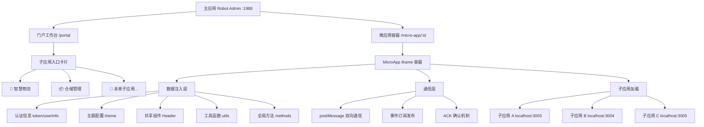
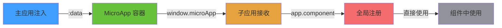
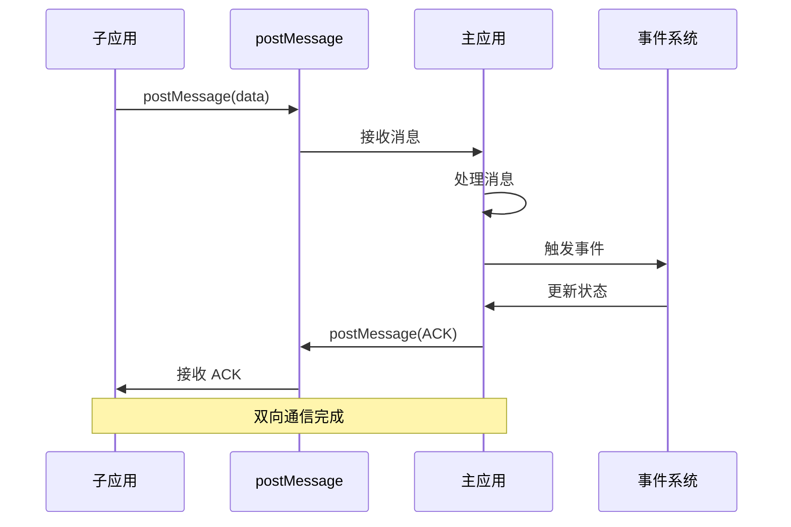
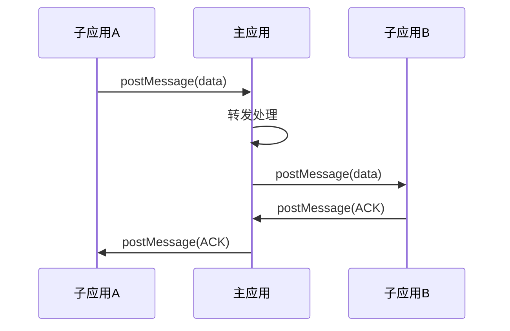

# Robot Admin MicroApp 微前端架构指南

::: tip 写在前面
本文档详细介绍 Robot Admin 项目的微前端架构方案，基于 **@micro-zoe/micro-app (iframe 模式)** 实现生产级微前端系统。通过本指南，你将了解如何构建**完全隔离**、**零配置通信**、**独立部署**的微前端应用。
:::

## 🎯 为什么选择 MicroApp？

### 主流微前端方案对比

<div class="comparison-table">

| 方案 | 隔离能力 | 通信成本 | 学习曲线 | 性能表现 | 推荐度 |
|------|---------|---------|---------|---------|--------|
| **MicroApp (iframe)** | ⭐⭐⭐⭐⭐ | ⭐⭐⭐⭐ | ⭐⭐⭐⭐⭐ | ⭐⭐⭐⭐ | ⭐⭐⭐⭐⭐ |
| qiankun | ⭐⭐⭐ | ⭐⭐⭐⭐ | ⭐⭐⭐ | ⭐⭐⭐⭐ | ⭐⭐⭐⭐ |
| single-spa | ⭐⭐ | ⭐⭐⭐ | ⭐⭐ | ⭐⭐⭐⭐ | ⭐⭐⭐ |
| Module Federation | ⭐⭐⭐ | ⭐⭐⭐⭐⭐ | ⭐⭐ | ⭐⭐⭐⭐⭐ | ⭐⭐⭐⭐ |
| 原生 iframe | ⭐⭐⭐⭐⭐ | ⭐⭐ | ⭐⭐⭐⭐⭐ | ⭐⭐⭐ | ⭐⭐⭐ |

</div>

### MicroApp 的核心优势

::: code-group

```typescript [强隔离 ✅]
// iframe 模式提供天然的样式、JS、DOM 完全隔离
// 无需担心：
// - CSS 样式冲突
// - 全局变量污染
// - DOM 选择器冲突
// - 第三方库版本冲突

// 主应用和子应用可以：
✅ 使用不同版本的 Vue (Vue 2/3)
✅ 使用不同的 UI 库 (Element/Ant Design/Naive UI)
✅ 使用不同的状态管理 (Vuex/Pinia)
✅ 独立的路由系统
```

```typescript [零配置通信 ✅]
// 使用原生 postMessage，无需第三方库
// 主应用 → 子应用
window.microApp?.setData({ token, userInfo, theme })

// 子应用 → 主应用
window.parent.postMessage({ 
  type: 'DATA_UPDATE', 
  payload: data 
}, '*')

// 特点：
✅ 零依赖，浏览器原生支持
✅ 双向通信，支持 ACK 确认
✅ 类型安全，TypeScript 友好
✅ 支持跨域通信
```

```typescript [独立部署 ✅]
// 子应用完全独立，可以：
✅ 独立开发 (npm run dev)
✅ 独立测试 (npm run test)
✅ 独立构建 (npm run build)
✅ 独立部署 (不影响主应用)
✅ 版本回滚 (互不影响)
✅ 灰度发布 (按子应用维度)

// 主应用只需配置子应用 URL
const MICRO_APPS = {
  logistics: {
    dev: 'http://localhost:3003',
    prod: 'https://logistics.example.com'
  }
}
```

:::

### 收益分析

<div class="roi-comparison">

| 对比维度 | 传统单体应用 | MicroApp 方案 | 提升幅度 |
|---------|-------------|--------------|---------|
| **开发效率** | 3天/功能模块 | 1天/独立子应用 | **67%** ⬆️ |
| **部署效率** | 1小时/整体发布 | 10分钟/子应用发布 | **83%** ⬆️ |
| **团队协作** | 代码冲突频繁 | 完全独立开发 | **90%** ⬇️ |
| **技术栈灵活性** | 统一技术栈 | 每个子应用独立 | **100%** ⬆️ |
| **故障隔离** | 全局崩溃 | 子应用隔离 | **95%** ⬆️ |

</div>

## 🏗️ 架构设计

### 整体架构图



### 技术栈矩阵

<div class="tech-stack-table">

| 层级 | 技术选型 | 版本 | 用途 | 优势 |
|------|---------|------|------|------|
| **主应用** | Vue 3 + TS + Vite | 3.5.13 / 5.8 / 7.0 | 容器框架 | 现代化、高性能 |
| **微前端** | @micro-zoe/micro-app | 1.0.0-rc.8 | iframe 隔离 | 强隔离、零侵入 |
| **通信** | postMessage | 浏览器原生 | 零依赖通信 | 原生支持、稳定可靠 |
| **路由** | Vue Router | 4.5.0 | 动态路由 | 独立路由系统 |
| **状态** | Pinia | 2.3.0 | 状态管理 | 轻量级、类型安全 |
| **子应用** | 独立 npm 项目 | - | 完全解耦 | 技术栈自由选择 |

</div>

### 核心特性清单

::: tip 核心特性
- ✅ **强隔离** - iframe 模式，样式/JS/DOM 完全隔离，杜绝污染
- ✅ **零配置通信** - 原生 postMessage，无需第三方库，开箱即用
- ✅ **组件共享** - :data 注入，头部组件统一维护，降级保障
- ✅ **独立部署** - 子应用可独立开发、测试、部署，互不影响
- ✅ **多环境** - dev/test/staging/prod 自动切换，配置化管理
- ✅ **类型安全** - 全栈 TypeScript 支持，编译时错误检查
- ✅ **权限隔离** - 子应用权限独立管理，安全可控
- ✅ **性能优化** - 懒加载、预加载、缓存策略，极致性能
:::

### 目录结构

::: code-group

```bash [主应用结构]
Robot_Admin/
├── 📁 src/
│   ├── 📁 views/
│   │   ├── 📁 portal/              # 门户工作台
│   │   │   └── index.vue          # 子应用入口卡片
│   │   └── 📁 micro-app/          # 微应用容器
│   │       └── index.vue          # 容器 + 数据注入
│   ├── 📁 config/
│   │   ├── microApps.ts           # 子应用配置表
│   │   └── systemTitles.ts        # 动态标题配置
│   ├── 📁 components/
│   │   └── 📁 global/
│   │       └── 📁 C_Header/       # 共享头部组件
│   └── 📁 types/
│       └── 📁 modules/
│           └── microApp.d.ts      # 微前端类型定义
└── 📁 sys-mock/                   # 子应用目录
    ├── 📁 logistics/              # 智慧物流子应用
    │   ├── src/
    │   │   ├── main.ts           # 全局注册共享组件
    │   │   ├── App.vue           # 使用共享头部
    │   │   ├── microApp.ts       # 通信层封装
    │   │   └── stores/
    │   │       └── app.ts        # 主题/用户状态
    │   └── package.json
    └── 📁 warehouse/              # 仓储管理子应用（示例）
        └── ...
```

```typescript [核心文件说明]
// 主应用核心文件
src/views/micro-app/index.vue      // 🎯 微应用容器 + 数据注入核心
src/config/microApps.ts            // 📝 子应用配置表（URL、环境等）
src/config/systemTitles.ts         // 📋 动态标题配置
src/views/portal/index.vue         // 🏠 门户入口页面

// 子应用核心文件
src/main.ts                        // 🔧 全局注册共享组件
src/App.vue                        // 🎨 使用共享头部组件
src/microApp.ts                    // 📡 通信层封装
src/stores/app.ts                  // 💾 应用状态管理

// 类型定义文件
src/types/modules/microApp.d.ts   // 📘 微前端类型定义
```

:::

## 🚀 快速上手

### 环境准备

::: code-group

```bash [系统要求]
# Node.js 版本要求
node >= 18.0.0

# 包管理器（推荐 bun）
bun >= 1.0.0
# 或
npm >= 9.0.0

# Git
git >= 2.30.0
```

```bash [克隆项目]
# 克隆主应用仓库
git clone https://github.com/your-org/robot-admin.git
cd robot-admin

# 安装主应用依赖
bun install

# 克隆子应用（如果子应用独立仓库）
cd sys-mock
git clone https://github.com/your-org/logistics-app.git logistics
cd logistics
bun install
```

:::

### 启动项目

::: code-group

```bash [1️⃣ 启动主应用]
# 在项目根目录
bun install
bun run dev

# 输出信息
  VITE v7.0.6  ready in 523 ms

  ➜  Local:   http://localhost:1988/
  ➜  Network: http://192.168.1.100:1988/
  ➜  press h + enter to show help
```

```bash [2️⃣ 启动子应用（智慧物流）]
# 在 sys-mock/logistics 目录
cd sys-mock/logistics
bun install
bun run dev

# 输出信息
  VITE v7.0.6  ready in 412 ms

  ➜  Local:   http://localhost:3003/
  ➜  Network: http://192.168.1.100:3003/
  
  🚚 智慧物流管理系统启动成功
```

```bash [3️⃣ 访问微前端]
# 打开浏览器访问
http://localhost:1988/#/portal

# 点击"智慧物流管理系统"卡片
# 自动跳转到微应用容器
http://localhost:1988/#/micro-app/logistics

# 子应用加载成功后，你会看到：
# ✅ 已注册主应用共享头部组件
# ✅ 已注入全局工具函数
# ✅ 已注入主应用全局方法
# 📦 物流应用已挂载，微前端环境: true
# 🎯 使用共享头部组件: true
```

:::

### 验证清单

打开浏览器控制台（F12），应该看到以下信息：

::: tip 启动成功标志
```javascript
// 主应用日志
✅ 主应用已启动
📦 MicroApp 容器已初始化
🔧 子应用配置已加载

// 子应用日志
✅ 已注册主应用共享头部组件
✅ 已注入全局工具函数
✅ 已注入主应用全局方法
📦 物流应用已挂载，微前端环境: true
🎯 使用共享头部组件: true
🔗 通信层已就绪
```
:::

## 📝 应用管理

### 应用配置表

::: code-group

```typescript [microApps.ts - 完整配置]
// src/config/microApps.ts
export interface MicroAppConfig {
  id: string                  // 应用唯一标识
  name: string                // 应用显示名称
  dev: string                 // 开发环境地址
  test?: string               // 测试环境地址
  staging?: string            // 预发布环境地址
  prod: string                // 生产环境地址
  icon: string                // 应用图标（emoji 或 URL）
  description: string         // 应用描述
  order?: number              // 排序权重
  category?: string           // 应用分类
  permissions?: string[]      // 访问权限
  meta?: Record<string, any>  // 元数据
}

export const MICRO_APPS: Record<string, MicroAppConfig> = {
  // 智慧物流管理系统
  logistics: {
    id: 'logistics',
    name: '智慧物流管理系统',
    dev: 'http://localhost:3003',
    test: 'https://logistics-test.example.com',
    staging: 'https://logistics-staging.example.com',
    prod: 'https://logistics.example.com',
    icon: '🚚',
    description: '物流订单、车辆调度、仓库管理',
    order: 1,
    category: '业务系统',
    permissions: ['logistics:view'],
    meta: {
      version: '1.0.0',
      maintainer: '物流团队',
      lastUpdate: '2025-12-25',
    },
  },

  // 仓储管理系统
  warehouse: {
    id: 'warehouse',
    name: '仓储管理系统',
    dev: 'http://localhost:3004',
    prod: 'https://warehouse.example.com',
    icon: '📦',
    description: '库存管理、入库出库、盘点统计',
    order: 2,
    category: '业务系统',
    permissions: ['warehouse:view'],
  },

  // 数据分析平台
  analytics: {
    id: 'analytics',
    name: '数据分析平台',
    dev: 'http://localhost:3005',
    prod: 'https://analytics.example.com',
    icon: '📊',
    description: '数据可视化、报表分析、KPI 监控',
    order: 3,
    category: '数据平台',
    permissions: ['analytics:view'],
  },
}

// 环境检测
const getEnv = (): 'dev' | 'test' | 'staging' | 'prod' => {
  const hostname = window.location.hostname
  
  if (hostname === 'localhost' || hostname === '127.0.0.1') {
    return 'dev'
  }
  if (hostname.includes('-test.')) {
    return 'test'
  }
  if (hostname.includes('-staging.')) {
    return 'staging'
  }
  return 'prod'
}

// 获取子应用 URL
export const getMicroAppUrl = (appId: string): string => {
  const app = MICRO_APPS[appId]
  if (!app) {
    throw new Error(`子应用 ${appId} 不存在`)
  }

  const env = getEnv()
  const url = app[env] || app.dev

  if (!url) {
    throw new Error(`子应用 ${appId} 在 ${env} 环境未配置 URL`)
  }

  return url
}

// 获取所有子应用（按分类）
export const getMicroAppsByCategory = (): Record<string, MicroAppConfig[]> => {
  const result: Record<string, MicroAppConfig[]> = {}

  Object.values(MICRO_APPS).forEach(app => {
    const category = app.category || '其他'
    if (!result[category]) {
      result[category] = []
    }
    result[category].push(app)
  })

  // 按 order 排序
  Object.keys(result).forEach(category => {
    result[category].sort((a, b) => (a.order || 999) - (b.order || 999))
  })

  return result
}

// 检查用户权限
export const hasAppPermission = (appId: string, userPermissions: string[]): boolean => {
  const app = MICRO_APPS[appId]
  if (!app || !app.permissions) {
    return true // 无权限要求，默认可访问
  }

  return app.permissions.some(permission => 
    userPermissions.includes(permission)
  )
}
```

```typescript [使用示例]
// 在组件中使用
import { getMicroAppUrl, getMicroAppsByCategory, hasAppPermission } from '@/config/microApps'

// 获取子应用 URL
const logisticsUrl = getMicroAppUrl('logistics')
// dev: http://localhost:3003
// prod: https://logistics.example.com

// 获取分类应用
const appsByCategory = getMicroAppsByCategory()
// {
//   '业务系统': [logistics, warehouse],
//   '数据平台': [analytics]
// }

// 权限检查
const userPermissions = ['logistics:view', 'warehouse:view']
const canAccessLogistics = hasAppPermission('logistics', userPermissions)
// true
```

:::

### 标题配置

::: code-group

```typescript [systemTitles.ts - 动态标题]
// src/config/systemTitles.ts
export interface SystemTitle {
  main: string       // 主标题
  subtitle: string   // 副标题
  icon?: string      // 图标
  color?: string     // 主题色
}

export const systemTitleMap: Record<string, SystemTitle> = {
  // 微应用路由标题
  '/micro-app/logistics': {
    main: '智慧物流',
    subtitle: '物流管理系统',
    icon: '🚚',
    color: '#409eff',
  },

  '/micro-app/warehouse': {
    main: '仓储管理',
    subtitle: '仓储管理系统',
    icon: '📦',
    color: '#67c23a',
  },

  '/micro-app/analytics': {
    main: '数据分析',
    subtitle: '数据分析平台',
    icon: '📊',
    color: '#e6a23c',
  },

  // 主应用路由标题
  '/portal': {
    main: '工作台',
    subtitle: '门户首页',
    icon: '🏠',
  },

  '/user-management': {
    main: '用户管理',
    subtitle: '系统管理',
    icon: '👥',
  },

  '/system-settings': {
    main: '系统设置',
    subtitle: '系统配置',
    icon: '⚙️',
  },

  // 默认标题
  default: {
    main: 'Robot Admin',
    subtitle: '工业互联网平台',
    icon: '🤖',
  },
}

// 获取当前路由标题
export const getCurrentTitle = (path: string): SystemTitle => {
  return systemTitleMap[path] || systemTitleMap.default
}

// 设置页面标题
export const setPageTitle = (path: string): void => {
  const title = getCurrentTitle(path)
  document.title = `${title.main} - ${title.subtitle}`
}
```

```vue [使用示例 - 路由守卫]
<!-- 在路由守卫中自动设置标题 -->
<script setup lang="ts">
import { watch } from 'vue'
import { useRoute } from 'vue-router'
import { setPageTitle, getCurrentTitle } from '@/config/systemTitles'

const route = useRoute()

// 监听路由变化，自动设置标题
watch(
  () => route.path,
  (path) => {
    setPageTitle(path)
    
    // 同时更新头部组件显示
    const title = getCurrentTitle(path)
    console.log('当前页面:', title)
  },
  { immediate: true }
)
</script>
```

:::

### 门户入口

::: code-group

```vue [portal/index.vue - 门户页面]
<!-- src/views/portal/index.vue -->
<template>
  <div class="portal-container">
    <!-- 页面头部 -->
    <div class="portal-header">
      <h1>{{ greeting }}</h1>
      <p>{{ currentDate }}</p>
    </div>

    <!-- 快捷入口 -->
    <div class="quick-actions">
      <NSpace>
        <NButton type="primary" @click="navigateToMicroApp('logistics')">
          <template #icon>
            <span class="text-xl">🚚</span>
          </template>
          快速进入物流系统
        </NButton>
        <NButton @click="navigateToMicroApp('warehouse')">
          <template #icon>
            <span class="text-xl">📦</span>
          </template>
          仓储管理
        </NButton>
      </NSpace>
    </div>

    <!-- 应用卡片（按分类） -->
    <div v-for="(apps, category) in appsByCategory" :key="category" class="app-category">
      <h2 class="category-title">
        <span>{{ category }}</span>
        <NBadge :value="apps.length" />
      </h2>

      <div class="app-grid">
        <div
          v-for="app in apps"
          :key="app.id"
          class="app-card"
          :class="{ 'app-card--disabled': !canAccess(app.id) }"
          @click="handleAppClick(app.id)"
        >
          <!-- 应用图标 -->
          <div class="app-icon" :style="{ color: app.meta?.color }">
            {{ app.icon }}
          </div>

          <!-- 应用信息 -->
          <div class="app-info">
            <div class="app-name">{{ app.name }}</div>
            <div class="app-description">{{ app.description }}</div>
          </div>

          <!-- 应用标签 -->
          <div class="app-tags">
            <NTag v-if="app.meta?.version" size="small" type="info">
              {{ app.meta.version }}
            </NTag>
            <NTag v-if="!canAccess(app.id)" size="small" type="warning">
              无权限
            </NTag>
          </div>

          <!-- 悬浮操作 -->
          <div class="app-actions">
            <NButton text type="primary" @click.stop="preloadApp(app.id)">
              <template #icon>
                <i class="i-mdi:download" />
              </template>
            </NButton>
            <NButton text @click.stop="openInNewTab(app.id)">
              <template #icon>
                <i class="i-mdi:open-in-new" />
              </template>
            </NButton>
          </div>
        </div>
      </div>
    </div>

    <!-- 最近访问 -->
    <div v-if="recentApps.length > 0" class="recent-apps">
      <h2>最近访问</h2>
      <div class="recent-list">
        <div
          v-for="appId in recentApps"
          :key="appId"
          class="recent-item"
          @click="navigateToMicroApp(appId)"
        >
          <span class="recent-icon">{{ MICRO_APPS[appId]?.icon }}</span>
          <span class="recent-name">{{ MICRO_APPS[appId]?.name }}</span>
        </div>
      </div>
    </div>
  </div>
</template>

<script setup lang="ts">
  import { ref, computed, onMounted } from 'vue'
  import { useRouter } from 'vue-router'
  import { MICRO_APPS, getMicroAppsByCategory, hasAppPermission } from '@/config/microApps'
  import { useUserStore } from '@/stores/user'

  const router = useRouter()
  const userStore = useUserStore()

  // 响应式数据
  const recentApps = ref<string[]>([])

  // 计算属性
  const greeting = computed(() => {
    const hour = new Date().getHours()
    if (hour < 12) return '上午好'
    if (hour < 18) return '下午好'
    return '晚上好'
  })

  const currentDate = computed(() => {
    return new Date().toLocaleDateString('zh-CN', {
      year: 'numeric',
      month: 'long',
      day: 'numeric',
      weekday: 'long',
    })
  })

  const appsByCategory = computed(() => {
    return getMicroAppsByCategory()
  })

  // 权限检查
  const canAccess = (appId: string): boolean => {
    const permissions = userStore.permissions || []
    return hasAppPermission(appId, permissions)
  }

  // 导航到微应用
  const navigateToMicroApp = (appId: string) => {
    if (!canAccess(appId)) {
      window.$message?.warning('您没有权限访问此应用')
      return
    }

    // 记录最近访问
    addToRecent(appId)

    // 导航
    router.push(`/micro-app/${appId}`)
  }

  // 处理应用点击
  const handleAppClick = (appId: string) => {
    navigateToMicroApp(appId)
  }

  // 在新标签页打开
  const openInNewTab = (appId: string) => {
    if (!canAccess(appId)) {
      window.$message?.warning('您没有权限访问此应用')
      return
    }

    const url = getMicroAppUrl(appId)
    window.open(url, '_blank')
  }

  // 预加载应用
  const preloadApp = async (appId: string) => {
    try {
      window.$message?.loading(`预加载 ${MICRO_APPS[appId]?.name} ...`)
      
      const url = getMicroAppUrl(appId)
      const link = document.createElement('link')
      link.rel = 'prefetch'
      link.href = url
      document.head.appendChild(link)

      setTimeout(() => {
        window.$message?.success('预加载完成')
      }, 1000)
    } catch (error) {
      window.$message?.error('预加载失败')
    }
  }

  // 添加到最近访问
  const addToRecent = (appId: string) => {
    const recent = [...recentApps.value]
    const index = recent.indexOf(appId)
    
    if (index > -1) {
      recent.splice(index, 1)
    }
    
    recent.unshift(appId)
    recentApps.value = recent.slice(0, 5) // 保留最近 5 个
    
    // 持久化
    localStorage.setItem('recent_apps', JSON.stringify(recentApps.value))
  }

  // 初始化
  onMounted(() => {
    // 加载最近访问
    const stored = localStorage.getItem('recent_apps')
    if (stored) {
      try {
        recentApps.value = JSON.parse(stored)
      } catch (error) {
        console.error('加载最近访问失败:', error)
      }
    }
  })
</script>

<style lang="scss" scoped>
  .portal-container {
    padding: 24px;
    min-height: 100vh;
    background: linear-gradient(135deg, #667eea 0%, #764ba2 100%);
  }

  .portal-header {
    text-align: center;
    margin-bottom: 32px;
    color: white;

    h1 {
      font-size: 48px;
      font-weight: 700;
      margin: 0;
      margin-bottom: 8px;
    }

    p {
      font-size: 18px;
      opacity: 0.9;
    }
  }

  .quick-actions {
    display: flex;
    justify-content: center;
    margin-bottom: 48px;
  }

  .app-category {
    margin-bottom: 48px;

    .category-title {
      display: flex;
      align-items: center;
      gap: 12px;
      font-size: 24px;
      font-weight: 600;
      color: white;
      margin-bottom: 20px;
    }
  }

  .app-grid {
    display: grid;
    grid-template-columns: repeat(auto-fill, minmax(280px, 1fr));
    gap: 20px;
  }

  .app-card {
    position: relative;
    padding: 24px;
    background: white;
    border-radius: 12px;
    box-shadow: 0 4px 12px rgba(0, 0, 0, 0.1);
    cursor: pointer;
    transition: all 0.3s ease;
    overflow: hidden;

    &:hover {
      transform: translateY(-4px);
      box-shadow: 0 8px 24px rgba(0, 0, 0, 0.15);

      .app-actions {
        opacity: 1;
        transform: translateY(0);
      }
    }

    &--disabled {
      opacity: 0.6;
      cursor: not-allowed;

      &:hover {
        transform: none;
        box-shadow: 0 4px 12px rgba(0, 0, 0, 0.1);
      }
    }
  }

  .app-icon {
    font-size: 48px;
    margin-bottom: 16px;
  }

  .app-info {
    .app-name {
      font-size: 18px;
      font-weight: 600;
      color: #333;
      margin-bottom: 8px;
    }

    .app-description {
      font-size: 14px;
      color: #666;
      line-height: 1.5;
    }
  }

  .app-tags {
    margin-top: 12px;
    display: flex;
    gap: 8px;
  }

  .app-actions {
    position: absolute;
    top: 16px;
    right: 16px;
    display: flex;
    gap: 8px;
    opacity: 0;
    transform: translateY(-8px);
    transition: all 0.3s ease;
  }

  .recent-apps {
    margin-top: 48px;
    padding: 24px;
    background: rgba(255, 255, 255, 0.1);
    border-radius: 12px;
    backdrop-filter: blur(10px);

    h2 {
      color: white;
      font-size: 20px;
      font-weight: 600;
      margin-bottom: 16px;
    }
  }

  .recent-list {
    display: flex;
    gap: 12px;
    flex-wrap: wrap;
  }

  .recent-item {
    display: flex;
    align-items: center;
    gap: 8px;
    padding: 8px 16px;
    background: rgba(255, 255, 255, 0.2);
    border-radius: 8px;
    color: white;
    cursor: pointer;
    transition: all 0.3s ease;

    &:hover {
      background: rgba(255, 255, 255, 0.3);
      transform: translateY(-2px);
    }

    .recent-icon {
      font-size: 20px;
    }

    .recent-name {
      font-size: 14px;
    }
  }
</style>
```

:::

## 📦 数据共享

### 共享策略

当前项目采用 **:data 注入** 方案，实现组件和工具的高效共享：



### 主应用数据注入

::: code-group

```vue [micro-app/index.vue - 容器组件]
<!-- src/views/micro-app/index.vue -->
<template>
  <div class="micro-app-container">
    <!-- Loading 状态 -->
    <div v-if="loading" class="micro-app-loading">
      <NSpin size="large" />
      <p>正在加载 {{ currentAppName }} ...</p>
    </div>

    <!-- MicroApp 容器 -->
    <micro-app
      v-show="!loading"
      :name="appId"
      :url="appUrl"
      :data="appData"
      iframe
      @mounted="handleMounted"
      @unmount="handleUnmount"
      @error="handleError"
    />
  </div>
</template>

<script setup lang="ts">
  import { ref, computed, watch, onMounted, onUnmounted } from 'vue'
  import { useRoute } from 'vue-router'
  import { useUserStore } from '@/stores/user'
  import { useThemeStore } from '@/stores/theme'
  import { getMicroAppUrl, MICRO_APPS } from '@/config/microApps'
  import C_Header from '@/components/global/C_Header/index.vue'
  import { formatTime } from '@/utils/formatTime'
  import dayjs from 'dayjs'

  const route = useRoute()
  const userStore = useUserStore()
  const themeStore = useThemeStore()

  // 响应式数据
  const loading = ref(true)
  const appId = computed(() => route.params.id as string)
  const appUrl = computed(() => getMicroAppUrl(appId.value))
  const currentAppName = computed(() => MICRO_APPS[appId.value]?.name || '')

  // 📦 数据注入 - 这是核心配置
  const appData = computed(() => ({
    // 1️⃣ 认证信息
    token: userStore.token,
    userInfo: {
      id: userStore.userInfo?.id,
      username: userStore.userInfo?.username,
      nickname: userStore.userInfo?.nickname,
      email: userStore.userInfo?.email,
      avatar: userStore.userInfo?.avatar,
      role: userStore.userInfo?.role,
      permissions: userStore.permissions || [],
    },

    // 2️⃣ 主题配置
    theme: {
      mode: themeStore.mode,
      isDark: themeStore.isDark,
      primaryColor: themeStore.primaryColor,
      themeVars: themeStore.themeVars,
    },

    // 3️⃣ 共享组件 ⭐ 核心功能
    components: {
      Header: C_Header, // 共享头部组件
      // 可以添加更多共享组件
      // Footer: C_Footer,
      // Sidebar: C_Sidebar,
    },

    // 4️⃣ 组件配置
    headerConfig: {
      showCollapse: false,      // 不显示折叠按钮
      showBreadcrumb: false,    // 不显示面包屑
      showTagsView: false,      // 不显示标签页
      fullWidth: true,          // 全宽显示
      showLogo: true,           // 显示 Logo
      showPortalButton: false,  // 不显示门户按钮
      showPlatformTitle: true,  // 显示平台标题
    },

    // 5️⃣ 工具函数
    utils: {
      formatTime,               // 时间格式化
      dayjs,                    // 日期处理库
      // 可以添加更多工具函数
      // validateEmail,
      // parseQuery,
      // debounce,
    },

    // 6️⃣ 全局方法
    methods: {
      // 消息提示
      showMessage: (content: string, type: 'success' | 'error' | 'warning' | 'info' = 'info') => {
        window.$message?.[type](content)
      },
      
      // 对话框
      showDialog: (options: any) => {
        return window.$dialog?.create(options)
      },
      
      // 通知
      showNotification: (options: any) => {
        return window.$notification?.create(options)
      },
      
      // 导航到主应用
      navigateToMain: (path: string) => {
        router.push(path)
      },
      
      // 退出登录
      logout: async () => {
        await userStore.logout()
        router.push('/login')
      },
    },

    // 7️⃣ 环境信息
    env: {
      mode: import.meta.env.MODE,
      isDev: import.meta.env.DEV,
      isProd: import.meta.env.PROD,
      baseUrl: import.meta.env.VITE_API_BASE_URL,
    },

    // 8️⃣ 应用元数据
    meta: {
      appId: appId.value,
      appName: currentAppName.value,
      version: '1.0.0',
      timestamp: Date.now(),
    },
  }))

  // 生命周期处理
  const handleMounted = () => {
    loading.value = false
    console.log(`✅ 子应用 ${currentAppName.value} 加载成功`)
  }

  const handleUnmount = () => {
    console.log(`📦 子应用 ${currentAppName.value} 已卸载`)
  }

  const handleError = (error: Error) => {
    loading.value = false
    window.$message?.error(`子应用加载失败: ${error.message}`)
    console.error('子应用加载错误:', error)
  }

  // 监听 postMessage 通信
  const handlePostMessage = (event: MessageEvent) => {
    // 安全检查
    if (!event.origin.includes('localhost') && !event.origin.includes('example.com')) {
      return
    }

    const { type, payload } = event.data || {}

    switch (type) {
      case 'DATA_UPDATE':
        // 子应用推送数据到主应用
        sessionStorage.setItem('microAppData', JSON.stringify(payload))
        window.dispatchEvent(new CustomEvent('microAppDataUpdate', { detail: payload }))
        sendAck(event.source, 'DATA_UPDATE_ACK')
        break

      case 'ROUTE_CHANGE':
        // 子应用路由变化通知
        console.log('子应用路由变化:', payload)
        break

      case 'MICRO_APP_NAVIGATE':
        // 子应用请求导航到主应用
        router.push(payload.path)
        break

      case 'MOUNTED':
        // 子应用挂载完成
        console.log('子应用挂载完成:', payload)
        break

      default:
        console.warn('未知消息类型:', type)
    }
  }

  // 发送 ACK 确认
  const sendAck = (source: any, type: string) => {
    if (source && typeof source.postMessage === 'function') {
      source.postMessage({
        type,
        payload: { received: true, timestamp: Date.now() },
      }, '*')
    }
  }

  // 监听 postMessage
  onMounted(() => {
    window.addEventListener('message', handlePostMessage)
  })

  onUnmounted(() => {
    window.removeEventListener('message', handlePostMessage)
  })

  // 监听路由变化，重新加载子应用
  watch(() => route.params.id, () => {
    loading.value = true
  })
</script>

<style lang="scss" scoped>
  .micro-app-container {
    position: relative;
    width: 100%;
    height: 100vh;
    overflow: hidden;
  }

  .micro-app-loading {
    display: flex;
    flex-direction: column;
    align-items: center;
    justify-content: center;
    height: 100vh;
    gap: 16px;

    p {
      font-size: 16px;
      color: var(--app-text-secondary);
    }
  }

  micro-app {
    display: block;
    width: 100%;
    height: 100%;
  }
</style>
```

```typescript [类型定义]
// src/types/modules/microApp.d.ts
declare global {
  interface Window {
    microApp?: {
      getData: () => MicroAppData
      setData: (data: Partial<MicroAppData>) => void
      dispatch: (event: CustomEvent) => void
      addDataListener: (callback: (data: MicroAppData) => void) => void
      removeDataListener: (callback: (data: MicroAppData) => void) => void
      clearDataListener: () => void
    }
    __MICRO_APP_ENVIRONMENT__?: boolean
    __MICRO_APP_NAME__?: string
    __MICRO_APP_BASE_ROUTE__?: string
  }

  interface MicroAppData {
    // 认证信息
    token: string | null
    userInfo: {
      id?: string
      username?: string
      nickname?: string
      email?: string
      avatar?: string
      role?: string
      permissions?: string[]
    }

    // 主题配置
    theme: {
      mode: 'light' | 'dark' | 'auto'
      isDark: boolean
      primaryColor?: string
      themeVars?: Record<string, any>
    }

    // 共享组件
    components: {
      Header?: any
      Footer?: any
      Sidebar?: any
      [key: string]: any
    }

    // 组件配置
    headerConfig?: {
      showCollapse?: boolean
      showBreadcrumb?: boolean
      showTagsView?: boolean
      fullWidth?: boolean
      showLogo?: boolean
      showPortalButton?: boolean
      showPlatformTitle?: boolean
    }

    // 工具函数
    utils: {
      formatTime?: (time: number | string | Date) => string
      dayjs?: any
      [key: string]: any
    }

    // 全局方法
    methods: {
      showMessage?: (content: string, type?: 'success' | 'error' | 'warning' | 'info') => void
      showDialog?: (options: any) => any
      showNotification?: (options: any) => any
      navigateToMain?: (path: string) => void
      logout?: () => Promise<void>
      [key: string]: any
    }

    // 环境信息
    env?: {
      mode: string
      isDev: boolean
      isProd: boolean
      baseUrl?: string
    }

    // 应用元数据
    meta?: {
      appId: string
      appName: string
      version: string
      timestamp: number
    }
  }
}

export {}
```

:::

### 子应用接收注册

::: code-group

```typescript [main.ts - 全局注册]
// sys-mock/logistics/src/main.ts
import { createApp } from 'vue'
import { createPinia } from 'pinia'
import App from './App.vue'
import router from './router'

// 创建应用实例
const app = createApp(App)
const pinia = createPinia()

app.use(pinia)
app.use(router)

// 🔧 微前端环境检测和数据注册
if (window.__MICRO_APP_ENVIRONMENT__) {
  console.log('🎯 运行在微前端环境中')

  // 获取主应用注入的数据
  const mainAppData = window.microApp?.getData() || {} as MicroAppData

  // 1️⃣ 注册共享组件
  if (mainAppData.components) {
    // 注册头部组件
    if (mainAppData.components.Header) {
      app.component('SharedHeader', mainAppData.components.Header)
      console.log('✅ 已注册主应用共享头部组件')
    }

    // 注册其他共享组件
    Object.entries(mainAppData.components).forEach(([name, component]) => {
      if (name !== 'Header' && component) {
        app.component(`Shared${name}`, component)
        console.log(`✅ 已注册主应用共享组件: ${name}`)
      }
    })
  }

  // 2️⃣ 注入工具函数到全局属性
  if (mainAppData.utils) {
    app.config.globalProperties.$utils = mainAppData.utils
    console.log('✅ 已注入全局工具函数')
  }

  // 3️⃣ 注入全局方法
  if (mainAppData.methods) {
    app.config.globalProperties.$mainApp = mainAppData.methods
    console.log('✅ 已注入主应用全局方法')
  }

  // 4️⃣ 监听主应用数据变化
  window.microApp?.addDataListener((data: MicroAppData) => {
    console.log('📡 主应用数据更新:', data)

    // 更新 token
    if (data.token) {
      localStorage.setItem('token', data.token)
    }

    // 更新主题
    if (data.theme) {
      document.documentElement.setAttribute('data-theme', data.theme.mode)
    }

    // 更新用户信息
    if (data.userInfo) {
      // 更新本地用户状态
      const userStore = useUserStore()
      userStore.setUserInfo(data.userInfo)
    }
  })

  // 5️⃣ 发送挂载完成消息
  window.parent.postMessage({
    type: 'MOUNTED',
    payload: {
      name: window.__MICRO_APP_NAME__,
      version: '1.0.0',
      timestamp: Date.now(),
    },
  }, '*')
} else {
  console.log('🏠 独立运行模式')
}

// 挂载应用
app.mount('#app')

// 开发环境日志
if (import.meta.env.DEV) {
  console.log('📦 物流应用已挂载')
  console.log('🎯 微前端环境:', window.__MICRO_APP_ENVIRONMENT__ || false)
}
```

```vue [App.vue - 使用共享组件]
<!-- sys-mock/logistics/src/App.vue -->
<template>
  <div id="app" class="app-container">
    <!-- 使用共享头部组件（微前端环境） -->
    <SharedHeader
      v-if="isMicroApp && hasSharedHeader"
      v-bind="sharedHeaderProps"
      @logout="handleLogout"
      @navigate="handleNavigate"
    />

    <!-- 降级：独立运行时使用本地组件 -->
    <AppHeader
      v-else-if="!isMicroApp"
      @logout="handleLogout"
    />

    <!-- 主内容区域 -->
    <div class="app-main">
      <RouterView />
    </div>

    <!-- 页脚 -->
    <AppFooter v-if="!isMicroApp" />
  </div>
</template>

<script setup lang="ts">
  import { computed, onMounted } from 'vue'
  import { useRouter } from 'vue-router'
  import { useAppStore } from './stores/app'
  import AppHeader from './components/AppHeader.vue'
  import AppFooter from './components/AppFooter.vue'

  const router = useRouter()
  const appStore = useAppStore()

  // 检测微前端环境
  const isMicroApp = computed(() => {
    return !!window.__MICRO_APP_ENVIRONMENT__
  })

  // 检查共享头部组件是否可用
  const hasSharedHeader = computed(() => {
    const mainAppData = window.microApp?.getData() || {} as MicroAppData
    return !!mainAppData.components?.Header
  })

  // 共享头部组件配置
  const sharedHeaderProps = computed(() => {
    const mainAppData = window.microApp?.getData() || {} as MicroAppData
    return {
      ...mainAppData.headerConfig,
      title: '智慧物流管理系统',
      subtitle: '物流订单 · 车辆调度 · 仓库管理',
    }
  })

  // 退出登录
  const handleLogout = async () => {
    if (isMicroApp.value) {
      // 微前端环境：调用主应用方法
      const mainAppMethods = window.microApp?.getData()?.methods
      if (mainAppMethods?.logout) {
        await mainAppMethods.logout()
      }
    } else {
      // 独立运行：本地退出
      await appStore.logout()
      router.push('/login')
    }
  }

  // 导航处理
  const handleNavigate = (path: string) => {
    if (isMicroApp.value) {
      // 微前端环境：通知主应用导航
      window.parent.postMessage({
        type: 'MICRO_APP_NAVIGATE',
        payload: { path },
      }, '*')
    } else {
      // 独立运行：本地导航
      router.push(path)
    }
  }

  // 初始化
  onMounted(() => {
    console.log('📦 物流应用已挂载')
    console.log('🎯 微前端环境:', isMicroApp.value)
    console.log('🎯 使用共享头部组件:', hasSharedHeader.value)

    // 微前端环境：同步主应用数据
    if (isMicroApp.value) {
      const mainAppData = window.microApp?.getData() || {} as MicroAppData

      // 同步 token
      if (mainAppData.token) {
        appStore.setToken(mainAppData.token)
      }

      // 同步用户信息
      if (mainAppData.userInfo) {
        appStore.setUserInfo(mainAppData.userInfo)
      }

      // 同步主题
      if (mainAppData.theme) {
        appStore.setTheme(mainAppData.theme.mode)
      }
    }
  })
</script>

<style lang="scss" scoped>
  .app-container {
    display: flex;
    flex-direction: column;
    min-height: 100vh;
    background: var(--app-bg-body);
  }

  .app-main {
    flex: 1;
    overflow-y: auto;
  }
</style>
```

:::

### 组件共享策略

::: tip 组件共享权衡
当前方案采用**微前端优先 + 本地降级**策略：
- ✅ 微前端环境：优先使用主应用共享组件（零冗余，统一维护）
- ✅ 独立运行：降级使用本地组件（完整 UI，开发体验好）
- ✅ 共享失败：自动降级到本地组件（兜底保障）

**权衡点**：
- ⚠️ 每个子应用需要一份本地降级组件（约 118 行代码）
- ⚠️ 子应用数量多时存在代码重复

**扩展方案**：当子应用数量 >= 3 时，建议创建 NPM 共享组件包
:::

::: code-group

```typescript [当前方案 - 组件降级]
// ✅ 优势
// 1. 微前端环境统一使用主应用组件（零冗余）
// 2. 独立调试时有完整 UI（开发体验好）
// 3. 主应用共享失败时自动降级（兜底保障）

// ⚠️ 权衡
// 1. 每个子应用需要一份本地 Header 组件（约 118 行）
// 2. 子应用数量多时存在代码重复

// 使用示例
<SharedHeader v-if="isMicroApp && hasSharedHeader" />
<AppHeader v-else-if="!isMicroApp" />
```

```bash [扩展方案 - NPM 包（3+ 子应用推荐）]
# 1. 创建共享组件包
mkdir -p packages/shared-components
cd packages/shared-components

# 2. 初始化包
bun init

# 3. 配置 package.json
{
  "name": "@robot-admin/shared-components",
  "version": "1.0.0",
  "main": "./dist/index.js",
  "types": "./dist/index.d.ts",
  "exports": {
    "./Header": "./dist/Header.vue",
    "./Footer": "./dist/Footer.vue"
  }
}

# 4. 子应用安装使用
{
  "dependencies": {
    "@robot-admin/shared-components": "file:../../packages/shared-components"
  }
}

# ✅ 优势
# 1. 所有子应用共享一份降级组件
# 2. 统一维护，版本管理清晰
# 3. 微前端环境仍优先使用主应用组件（无影响）
```

```typescript [使用 NPM 包]
// 子应用中使用
import { Header as FallbackHeader } from '@robot-admin/shared-components/Header'

// App.vue
<SharedHeader v-if="isMicroApp && hasSharedHeader" />
<FallbackHeader v-else />
```

:::

## 💬 通信机制

### 通信架构



### 通信层封装

::: code-group

```typescript [microApp.ts - 通信层]
// sys-mock/logistics/src/microApp.ts
/**
 * @description 微前端通信层封装
 * @features
 * - 双向通信（主应用 ↔ 子应用）
 * - ACK 确认机制
 * - 事件订阅发布
 * - 类型安全
 */

// 消息类型定义
export enum MessageType {
  MOUNTED = 'MOUNTED',                      // 子应用挂载完成
  DATA_UPDATE = 'DATA_UPDATE',              // 数据更新
  ROUTE_CHANGE = 'ROUTE_CHANGE',            // 路由变化
  MICRO_APP_NAVIGATE = 'MICRO_APP_NAVIGATE', // 导航请求
  ACK = 'ACK',                              // 确认消息
}

// 消息数据结构
export interface MessageData {
  type: MessageType | string
  payload: any
  timestamp?: number
  requestId?: string
}

// 事件监听器类型
type EventListener = (data: any) => void

// 事件监听器映射
const eventListeners = new Map<string, EventListener[]>()

/**
 * 发送消息到主应用
 */
export function sendMessageToMainApp(data: MessageData): void {
  if (window === window.parent) {
    console.warn('⚠️ 当前不在微前端环境中')
    return
  }

  const message: MessageData = {
    ...data,
    timestamp: data.timestamp || Date.now(),
    requestId: data.requestId || generateRequestId(),
  }

  console.log('📤 发送消息到主应用:', message)
  window.parent.postMessage(message, '*')
}

/**
 * 监听主应用消息
 */
export function addMessageListener(
  type: string,
  callback: EventListener
): () => void {
  if (!eventListeners.has(type)) {
    eventListeners.set(type, [])
  }

  const listeners = eventListeners.get(type)!
  listeners.push(callback)

  console.log(`📡 添加消息监听器: ${type}`)

  // 返回移除监听器的函数
  return () => {
    const index = listeners.indexOf(callback)
    if (index > -1) {
      listeners.splice(index, 1)
      console.log(`🔕 移除消息监听器: ${type}`)
    }
  }
}

/**
 * 移除消息监听器
 */
export function removeMessageListener(
  type: string,
  callback?: EventListener
): void {
  if (!eventListeners.has(type)) {
    return
  }

  if (callback) {
    const listeners = eventListeners.get(type)!
    const index = listeners.indexOf(callback)
    if (index > -1) {
      listeners.splice(index, 1)
    }
  } else {
    eventListeners.delete(type)
  }
}

/**
 * 推送数据到主应用（门户）
 */
export function pushDataToMainApp(module: string, data: any): void {
  sendMessageToMainApp({
    type: MessageType.DATA_UPDATE,
    payload: {
      module,
      data,
      timestamp: Date.now(),
    },
  })
}

/**
 * 导航到主应用路由
 */
export function navigateToMainApp(path: string): void {
  sendMessageToMainApp({
    type: MessageType.MICRO_APP_NAVIGATE,
    payload: { path },
  })
}

/**
 * 通知路由变化
 */
export function notifyRouteChange(path: string, query?: Record<string, any>): void {
  sendMessageToMainApp({
    type: MessageType.ROUTE_CHANGE,
    payload: { path, query },
  })
}

/**
 * 生成请求 ID
 */
function generateRequestId(): string {
  return `${Date.now()}-${Math.random().toString(36).substr(2, 9)}`
}

/**
 * 处理 postMessage 消息
 */
function handlePostMessage(event: MessageEvent): void {
  // 安全检查
  if (!event.origin.includes('localhost') && !event.origin.includes('example.com')) {
    return
  }

  const { type, payload, timestamp, requestId } = event.data || {}
  if (!type) {
    return
  }

  console.log('📥 收到主应用消息:', { type, payload, timestamp, requestId })

  // 触发监听器
  const listeners = eventListeners.get(type)
  if (listeners && listeners.length > 0) {
    listeners.forEach(listener => {
      try {
        listener(payload)
      } catch (error) {
        console.error(`❌ 消息处理错误 (${type}):`, error)
      }
    })
  }

  // 自动发送 ACK（如果需要）
  if (requestId && !type.endsWith('_ACK')) {
    sendMessageToMainApp({
      type: `${type}_ACK`,
      payload: {
        received: true,
        originalRequestId: requestId,
        timestamp: Date.now(),
      },
      requestId,
    })
  }
}

/**
 * 初始化通信层
 */
export function initMicroAppCommunication(): void {
  if (window === window.parent) {
    console.log('🏠 独立运行模式，跳过通信层初始化')
    return
  }

  // 监听 postMessage
  window.addEventListener('message', handlePostMessage)
  console.log('✅ 通信层已初始化')

  // 发送挂载完成消息
  sendMessageToMainApp({
    type: MessageType.MOUNTED,
    payload: {
      name: window.__MICRO_APP_NAME__ || 'unknown',
      version: '1.0.0',
      timestamp: Date.now(),
    },
  })
}

/**
 * 销毁通信层
 */
export function destroyMicroAppCommunication(): void {
  window.removeEventListener('message', handlePostMessage)
  eventListeners.clear()
  console.log('🔕 通信层已销毁')
}

// 自动初始化
if (typeof window !== 'undefined' && window.__MICRO_APP_ENVIRONMENT__) {
  initMicroAppCommunication()
}
```

```vue [使用示例]
<!-- 在子应用组件中使用 -->
<script setup lang="ts">
  import { onMounted, onUnmounted } from 'vue'
  import {
    pushDataToMainApp,
    navigateToMainApp,
    notifyRouteChange,
    addMessageListener,
  } from '@/microApp'

  // 推送数据到主应用
  const updatePortalData = () => {
    pushDataToMainApp('logistics-stats', {
      totalOrders: 1234,
      pendingOrders: 56,
      completedOrders: 1178,
    })
  }

  // 导航到主应用
  const goToPortal = () => {
    navigateToMainApp('/portal')
  }

  // 监听主应用消息
  const removeListener = addMessageListener('THEME_CHANGE', (theme) => {
    console.log('主题变化:', theme)
    document.documentElement.setAttribute('data-theme', theme.mode)
  })

  // 组件卸载时移除监听
  onUnmounted(() => {
    removeListener()
  })
</script>
```

:::

### 消息类型列表

<div class="message-types-table">

| 消息类型 | 方向 | 说明 | 示例 Payload |
|---------|------|------|-------------|
| `MOUNTED` | 子→主 | 子应用挂载完成 | `{ name, version, timestamp }` |
| `DATA_UPDATE` | 子→主 | 推送数据到门户 | `{ module, data, timestamp }` |
| `ROUTE_CHANGE` | 子→主 | 路由变化通知 | `{ path, query }` |
| `MICRO_APP_NAVIGATE` | 子→主 | 导航到主应用 | `{ path }` |
| `THEME_CHANGE` | 主→子 | 主题变化通知 | `{ mode, isDark, primaryColor }` |
| `TOKEN_REFRESH` | 主→子 | Token 刷新通知 | `{ token, refreshToken }` |
| `USER_UPDATE` | 主→子 | 用户信息更新 | `{ userInfo }` |
| `*_ACK` | 双向 | 消息确认 | `{ received, originalRequestId }` |

</div>

## 🚀 开发指南

### 添加新子应用

::: tip 子应用开发步骤
1. 创建项目和配置端口
2. 集成通信层
3. 注册到主应用
4. 配置标题和门户
5. 测试验证
:::

::: code-group

```bash [1️⃣ 创建项目]
# 进入子应用目录
cd sys-mock

# 创建新项目
mkdir warehouse && cd warehouse

# 使用 Vite 初始化
bun create vite . --template vue-ts

# 安装依赖
bun install

# 安装 UI 库（可选）
bun add naive-ui
```

```typescript [2️⃣ 配置端口]
// vite.config.ts
import { defineConfig } from 'vite'
import vue from '@vitejs/plugin-vue'

export default defineConfig({
  plugins: [vue()],
  server: {
    port: 3004, // 避免端口冲突
    cors: true, // 启用 CORS
    host: true, // 允许外部访问
  },
  resolve: {
    alias: {
      '@': '/src',
    },
  },
})
```

```typescript [3️⃣ 集成通信层]
// 复制 logistics/src/microApp.ts 到新项目
// src/microApp.ts

// 修改应用名称
sendMessageToMainApp({
  type: MessageType.MOUNTED,
  payload: {
    name: 'warehouse', // ⬅️ 修改为新应用名称
    version: '1.0.0',
    timestamp: Date.now(),
  },
})
```

```typescript [4️⃣ 注册到主应用]
// 主应用: src/config/microApps.ts
export const MICRO_APPS = {
  // ... 已有应用

  warehouse: {
    id: 'warehouse',
    name: '仓储管理系统',
    dev: 'http://localhost:3004',
    prod: 'https://warehouse.example.com',
    icon: '📦',
    description: '库存管理、入库出库、盘点统计',
    order: 2,
    category: '业务系统',
    permissions: ['warehouse:view'],
  },
}

// 主应用: src/config/systemTitles.ts
export const systemTitleMap = {
  // ... 已有配置

  '/micro-app/warehouse': {
    main: '仓储管理',
    subtitle: '仓储管理系统',
    icon: '📦',
    color: '#67c23a',
  },
}
```

```vue [5️⃣ 添加门户入口]
<!-- 主应用: src/views/portal/index.vue -->
<div class="app-card" @click="navigateToMicroApp('warehouse')">
  <div class="app-icon">📦</div>
  <div class="app-info">
    <div class="app-name">仓储管理系统</div>
    <div class="app-description">库存管理、入库出库、盘点统计</div>
  </div>
</div>
```

```bash [6️⃣ 测试验证]
# 启动新子应用
cd sys-mock/warehouse
bun run dev
# ➜ http://localhost:3004

# 启动主应用
cd ../..
bun run dev
# ➜ http://localhost:1988

# 访问测试
# http://localhost:1988/#/portal
# 点击"仓储管理系统"卡片
# http://localhost:1988/#/micro-app/warehouse
```

:::

### 验证清单

完成以上步骤后，请按照以下清单进行验证：

::: tip 验证清单
- [ ] **独立运行** - 访问 `http://localhost:3004` 正常显示
- [ ] **微前端加载** - 在主应用中点击入口卡片，子应用正常加载
- [ ] **通信功能** - 控制台显示通信相关日志（MOUNTED、DATA_UPDATE 等）
- [ ] **共享组件** - 头部组件正常显示，样式正确
- [ ] **数据同步** - Token、用户信息、主题配置自动同步
- [ ] **权限控制** - 无权限用户无法访问（如配置了权限）
- [ ] **标题切换** - 浏览器标题和头部标题正确显示
- [ ] **样式隔离** - 子应用样式不影响主应用，反之亦然
- [ ] **路由独立** - 子应用路由正常工作，不影响主应用
- [ ] **错误处理** - 子应用加载失败时有友好提示
:::

## 🔧 维护扩展

### 日常维护

::: code-group

```bash [依赖更新]
# 主应用
cd Robot_Admin
bun update
bun outdated

# 子应用
cd sys-mock/logistics
bun update
bun outdated

# ⚠️ 注意：主子应用可独立更新，互不影响
```

```typescript [性能监控]
// src/views/micro-app/index.vue
const startTime = Date.now()

const handleMounted = () => {
  const loadTime = Date.now() - startTime
  console.log(`✅ 子应用加载耗时: ${loadTime}ms`)

  // 上报到监控平台
  if (window.analytics) {
    window.analytics.track('micro_app_load', {
      appId: appId.value,
      appName: currentAppName.value,
      loadTime,
      timestamp: Date.now(),
    })
  }

  // 性能阈值告警
  if (loadTime > 3000) {
    console.warn(`⚠️ 子应用加载时间过长: ${loadTime}ms`)
  }
}
```

```typescript [错误监控]
// src/views/micro-app/index.vue
const handleError = (error: Error) => {
  console.error('❌ 子应用加载错误:', error)

  // 上报错误
  if (window.analytics) {
    window.analytics.track('micro_app_error', {
      appId: appId.value,
      appName: currentAppName.value,
      error: error.message,
      stack: error.stack,
      timestamp: Date.now(),
    })
  }

  // 显示友好错误提示
  window.$message?.error(`子应用加载失败: ${error.message}`)

  // 提供重试选项
  window.$dialog?.warning({
    title: '加载失败',
    content: '子应用加载失败，是否重试？',
    positiveText: '重试',
    negativeText: '返回门户',
    onPositiveClick: () => {
      location.reload()
    },
    onNegativeClick: () => {
      router.push('/portal')
    },
  })
}
```

:::

### 性能优化

::: code-group

```typescript [预加载策略]
// src/views/portal/index.vue
import { onMounted } from 'vue'
import { getMicroAppUrl } from '@/config/microApps'

// 预加载关键子应用
const preloadMicroApp = (appId: string) => {
  const url = getMicroAppUrl(appId)
  const link = document.createElement('link')
  link.rel = 'prefetch'
  link.href = url
  document.head.appendChild(link)
  
  console.log(`🚀 预加载子应用: ${appId}`)
}

onMounted(() => {
  // 在浏览器空闲时预加载
  if ('requestIdleCallback' in window) {
    requestIdleCallback(() => {
      preloadMicroApp('logistics')  // 预加载物流系统
      preloadMicroApp('warehouse')  // 预加载仓储系统
    })
  } else {
    setTimeout(() => {
      preloadMicroApp('logistics')
      preloadMicroApp('warehouse')
    }, 2000)
  }
})
```

```typescript [路由懒加载]
// src/router/index.ts
const routes = [
  {
    path: '/micro-app/:id',
    name: 'MicroApp',
    // 懒加载微应用容器
    component: () => import('@/views/micro-app/index.vue'),
    meta: {
      title: '微应用',
      keepAlive: false,
    },
  },
]
```

```vue [keep-alive 缓存]
<!-- src/views/micro-app/index.vue -->
<template>
  <div class="micro-app-container">
    <micro-app
      :name="appId"
      :url="appUrl"
      :data="appData"
      iframe
      keep-alive  <!-- ⬅️ 启用缓存 -->
      :keep-alive-state="true"
      :disable-memory-router="false"
      @mounted="handleMounted"
    />
  </div>
</template>

<script setup lang="ts">
// keep-alive 配置
// - keep-alive: 缓存子应用实例，切换时不重新加载
// - keep-alive-state: 保持子应用状态
// - disable-memory-router: 启用内存路由，提升性能
</script>
```

:::

### 故障排查

<div class="troubleshooting-table">

| 问题 | 可能原因 | 解决方案 |
|------|---------|---------|
| 子应用加载失败 | URL 配置错误 | 检查 `microApps.ts` 中的 URL 配置 |
| 子应用白屏 | CORS 跨域问题 | 子应用 vite.config.ts 设置 `cors: true` |
| 通信失败 | postMessage 未监听 | 检查 `microApp.ts` 初始化 |
| 样式冲突 | CSS 全局污染 | 使用 `scoped` 样式或 CSS Modules |
| 组件未共享 | 注册失败 | 检查 main.ts 中的组件注册逻辑 |
| Token 失效 | 未传递认证信息 | 检查主应用 `appData` 配置 |
| 路由冲突 | 路由模式不一致 | 子应用使用 hash 路由或配置 base |
| 性能问题 | 未启用预加载 | 添加 prefetch 预加载策略 |
| 内存泄漏 | 事件监听未清理 | 在 `onUnmounted` 中移除监听器 |

</div>

::: details 详细排查步骤

**1. 子应用加载失败**

```bash
# 检查子应用是否启动
lsof -i :3003

# 检查 URL 配置
console.log(getMicroAppUrl('logistics'))

# 检查网络请求
# 打开浏览器开发者工具 -> Network -> 查看请求状态
```

**2. 通信失败**

```typescript
// 在子应用 main.ts 中添加调试日志
console.log('微前端环境:', window.__MICRO_APP_ENVIRONMENT__)
console.log('主应用数据:', window.microApp?.getData())

// 在主应用中监听 postMessage
window.addEventListener('message', (event) => {
  console.log('收到 postMessage:', event.data)
})
```

**3. 样式冲突**

```vue
<!-- 使用 scoped 样式 -->
<style lang="scss" scoped>
  .my-component {
    /* 样式只作用于当前组件 */
  }
</style>

<!-- 或使用 CSS Modules -->
<style module lang="scss">
  .myComponent {
    /* 样式被模块化 */
  }
</style>
```

**4. 权限问题**

```typescript
// 检查用户权限
const userPermissions = userStore.permissions || []
console.log('用户权限:', userPermissions)

// 检查应用权限要求
const app = MICRO_APPS['logistics']
console.log('应用权限要求:', app.permissions)

// 检查权限匹配
const canAccess = hasAppPermission('logistics', userPermissions)
console.log('是否有权限:', canAccess)
```

:::

### 扩展方向

::: tip 演进路线图

**阶段 1: 功能完善（当前）**
- ✅ 基础架构（iframe 隔离 + postMessage 通信）
- ✅ 组件共享（:data 注入 + 全局注册）
- ✅ 数据通信（双向 ACK 确认机制）
- ✅ 降级保障（独立运行时本地组件）
- 🔄 权限控制（开发中）

**阶段 2: 工程化（下一步）**
- ⏳ 创建共享组件包（3+ 子应用时）
- ⏳ 错误边界和降级 UI
- ⏳ 加载骨架屏
- ⏳ 监控告警系统
- ⏳ CI/CD 自动化部署

**阶段 3: 规模化（未来）**
- ⏳ 子应用市场化管理
- ⏳ 插件机制
- ⏳ 版本灰度发布
- ⏳ A/B 测试平台
- ⏳ 性能 APM 监控

:::

## ❓ 常见问题

### Q1: 子应用样式影响主应用？

**A**: 使用 iframe 模式已经实现完全隔离，不会出现样式污染。

```typescript
// iframe 模式提供天然隔离
<micro-app iframe />

// 验证隔离
// 1. 主应用和子应用可以使用相同的类名
// 2. 可以使用不同版本的 CSS 库
// 3. 全局样式互不影响
```

### Q2: 如何共享第三方库（echarts、lodash）？

**A**: 通过 Window 全局对象共享：

::: code-group

```typescript [主应用共享]
// 主应用: src/main.ts
import echarts from 'echarts'
import lodash from 'lodash-es'

// 挂载到全局
window.__SHARED_LIBS__ = {
  echarts,
  lodash,
  dayjs,
}

// 通过 appData 传递
const appData = computed(() => ({
  // ...
  libs: window.__SHARED_LIBS__,
}))
```

```typescript [子应用使用]
// 子应用: 使用共享库
const mainAppData = window.microApp?.getData()
const { echarts, lodash } = mainAppData?.libs || {}

if (echarts) {
  // 使用共享的 echarts
  const chart = echarts.init(container)
} else {
  // 降级：使用本地库
  import('echarts').then(echarts => {
    const chart = echarts.init(container)
  })
}
```

:::

### Q3: 子应用如何调用主应用的方法？

**A**: 通过注入的 methods：

```typescript
// 获取主应用方法
const $mainApp = getCurrentInstance()?.appContext.config.globalProperties.$mainApp

// 调用消息提示
$mainApp?.showMessage('操作成功', 'success')

// 调用对话框
$mainApp?.showDialog({
  title: '确认删除',
  content: '确定要删除吗？',
  positiveText: '确定',
  negativeText: '取消',
  onPositiveClick: () => {
    // 删除逻辑
  },
})

// 导航到主应用
$mainApp?.navigateToMain('/portal')

// 退出登录
$mainApp?.logout()
```

### Q4: 生产环境子应用加载失败？

**A**: 检查清单：

::: code-group

```typescript [1. 检查 URL 配置]
// src/config/microApps.ts
export const MICRO_APPS = {
  logistics: {
    prod: 'https://logistics.example.com', // ⬅️ 检查 URL 是否正确
  },
}

// 打印当前环境和 URL
console.log('当前环境:', getEnv())
console.log('子应用 URL:', getMicroAppUrl('logistics'))
```

```bash [2. 检查子应用部署]
# 访问子应用 URL
curl -I https://logistics.example.com

# 检查返回状态码
# 200 OK - 正常
# 404 Not Found - 未部署或路径错误
# 403 Forbidden - 权限问题
# 502 Bad Gateway - 服务未启动
```

```typescript [3. 检查 CORS 配置]
// 子应用: vite.config.ts
export default defineConfig({
  server: {
    cors: {
      origin: [
        'https://admin.example.com',  // ⬅️ 主应用域名
        'https://logistics.example.com',
      ],
      credentials: true,
    },
  },
})

// Nginx 配置
add_header Access-Control-Allow-Origin https://admin.example.com;
add_header Access-Control-Allow-Credentials true;
```

```bash [4. 检查网络连通性]
# 测试网络连接
ping logistics.example.com

# 测试 HTTP 连接
curl https://logistics.example.com

# 检查 DNS 解析
nslookup logistics.example.com

# 检查防火墙规则
# 确保端口已开放
```

:::

### Q5: 如何调试子应用？

**A**: 调试方式：

::: code-group

```bash [1. 独立运行调试]
# 在子应用目录
cd sys-mock/logistics
bun run dev

# 访问
http://localhost:3003

# 优势：
# - 快速调试，无需启动主应用
# - 完整的开发者工具
# - 独立的错误堆栈
```

```typescript [2. 微前端环境调试]
# 同时启动主应用和子应用
# 终端 1
bun run dev

# 终端 2
cd sys-mock/logistics
bun run dev

# 访问
http://localhost:1988/#/micro-app/logistics

# 打开开发者工具
# 1. 切换到子应用 iframe 上下文
# 2. 查看 Console 日志（会标注来源）
# 3. 查看 Network 请求
```

```typescript [3. 调试通信层]
// 在子应用中添加调试日志
sendMessageToMainApp({
  type: 'DEBUG',
  payload: {
    message: '这是一条调试消息',
    data: someData,
  },
})

// 在主应用中监听
window.addEventListener('message', (event) => {
  if (event.data.type === 'DEBUG') {
    console.log('子应用调试消息:', event.data.payload)
  }
})
```

:::

### Q6: 子应用之间如何通信？

**A**: 通过主应用中转：



::: code-group

```typescript [子应用 A 发送]
// 子应用 A: 发送消息给子应用 B
sendMessageToMainApp({
  type: 'INTER_APP_MESSAGE',
  payload: {
    targetApp: 'warehouse', // 目标子应用
    data: {
      action: 'syncInventory',
      productId: '12345',
      quantity: 100,
    },
  },
})
```

```typescript [主应用转发]
// 主应用: 接收并转发消息
const handlePostMessage = (event: MessageEvent) => {
  const { type, payload } = event.data || {}

  if (type === 'INTER_APP_MESSAGE') {
    const { targetApp, data } = payload

    // 获取目标子应用的 iframe
    const targetFrame = document.querySelector(
      `micro-app[name="${targetApp}"]`
    )?.querySelector('iframe')

    if (targetFrame && targetFrame.contentWindow) {
      // 转发消息到目标子应用
      targetFrame.contentWindow.postMessage({
        type: 'FROM_SIBLING_APP',
        payload: {
          sourceApp: event.source,
          data,
        },
      }, '*')
    }
  }
}
```

```typescript [子应用 B 接收]
// 子应用 B: 接收来自其他子应用的消息
addMessageListener('FROM_SIBLING_APP', (payload) => {
  const { sourceApp, data } = payload
  console.log(`收到来自兄弟应用的消息:`, data)

  // 处理消息
  if (data.action === 'syncInventory') {
    // 同步库存逻辑
    updateInventory(data.productId, data.quantity)
  }
})
```

:::

### Q7: 如何实现子应用权限控制？

**A**: 主应用传递权限信息：

::: code-group

```typescript [主应用传递权限]
// src/views/micro-app/index.vue
const appData = computed(() => ({
  // ... 其他配置
  permissions: userStore.permissions || [],
  roles: userStore.roles || [],
}))
```

```typescript [子应用接收权限]
// 子应用: 从主应用获取权限
const mainAppData = window.microApp?.getData()
const permissions = mainAppData?.permissions || []
const roles = mainAppData?.roles || []

// 存储到本地状态
const userStore = useUserStore()
userStore.setPermissions(permissions)
userStore.setRoles(roles)
```

```typescript [路由守卫]
// 子应用: 路由守卫
import { useUserStore } from '@/stores/user'

router.beforeEach((to, from, next) => {
  const userStore = useUserStore()
  const permissions = userStore.permissions

  // 检查路由权限
  if (to.meta.permission && !permissions.includes(to.meta.permission)) {
    window.$message?.warning('您没有权限访问此页面')
    next('/403')
  } else {
    next()
  }
})
```

```typescript [指令权限]
// 子应用: 按钮级权限控制
<template>
  <NButton v-permission="'order:create'" @click="createOrder">
    创建订单
  </NButton>
</template>

<script setup lang="ts">
// 权限指令
app.directive('permission', {
  mounted(el, binding) {
    const permission = binding.value
    const userStore = useUserStore()
    
    if (!userStore.hasPermission(permission)) {
      el.parentNode?.removeChild(el)
    }
  },
})
</script>
```

:::

### Q8: 如何调试共享组件是否生效？

**A**: 检查步骤：

::: code-group

```typescript [1. 检查主应用注入]
// src/views/micro-app/index.vue
const appData = computed(() => ({
  components: {
    Header: C_Header, // ⬅️ 确保组件已导入
  },
}))

// 打印注入数据
console.log('注入的组件:', appData.value.components)
```

```typescript [2. 检查子应用注册]
// 子应用: src/main.ts
const mainAppData = window.microApp?.getData()

console.log('主应用数据:', mainAppData)
console.log('共享组件:', mainAppData?.components)

if (mainAppData?.components?.Header) {
  app.component('SharedHeader', mainAppData.components.Header)
  console.log('✅ 已注册主应用共享头部组件')
} else {
  console.warn('⚠️ 未找到共享头部组件')
}
```

```vue [3. 检查组件使用]
<!-- 子应用: src/App.vue -->
<template>
  <div>
    <!-- 检查条件判断 -->
    <div>微前端环境: {{ isMicroApp }}</div>
    <div>共享组件可用: {{ hasSharedHeader }}</div>
    
    <!-- 使用共享组件 -->
    <SharedHeader v-if="isMicroApp && hasSharedHeader" />
    <AppHeader v-else />
  </div>
</template>

<script setup lang="ts">
const isMicroApp = computed(() => !!window.__MICRO_APP_ENVIRONMENT__)

const hasSharedHeader = computed(() => {
  const mainAppData = window.microApp?.getData()
  return !!mainAppData?.components?.Header
})

console.log('isMicroApp:', isMicroApp.value)
console.log('hasSharedHeader:', hasSharedHeader.value)
</script>
```

```bash [4. 查看控制台日志]
# 应该看到以下日志：
✅ 已注册主应用共享头部组件
✅ 已注入全局工具函数
✅ 已注入主应用全局方法
🎯 使用共享头部组件: true

# 如果没有这些日志，检查：
# 1. 主应用是否正确注入组件
# 2. 子应用 main.ts 是否正确注册
# 3. App.vue 中的条件判断是否正确
```

:::

## 📚 参考资料

### 官方文档

- [MicroApp 官方文档](https://micro-zoe.github.io/micro-app/) - 微前端框架
- [Vue 3 文档](https://cn.vuejs.org/) - 前端框架
- [Vite 文档](https://cn.vitejs.dev/) - 构建工具
- [Naive UI 文档](https://www.naiveui.com/) - UI 组件库
- [TypeScript 文档](https://www.typescriptlang.org/) - 类型系统

### 技术文章

- [微前端架构：为什么以及如何使用](https://martinfowler.com/articles/micro-frontends.html)
- [iframe 微前端的优势与劣势](https://www.infoq.cn/article/iframe-micro-frontends)
- [postMessage 跨窗口通信](https://developer.mozilla.org/zh-CN/docs/Web/API/Window/postMessage)

### 社区资源

- [GitHub Issues](https://github.com/ChenyCHENYU/Robot_Admin/issues) - 问题反馈
- [GitHub Discussions](https://github.com/ChenyCHENYU/Robot_Admin/discussions) - 讨论区

---

<!-- GitHub徽章组件 -->
<GitHubBadges />


<style scoped>
.comparison-table table,
.tech-stack-table table,
.message-types-table table,
.troubleshooting-table table {
  background: rgba(255, 255, 255, 0.05);
  border-radius: 8px;
  backdrop-filter: blur(10px);
}

.comparison-table table th,
.tech-stack-table table th,
.message-types-table table th,
.troubleshooting-table table th {
  background: rgba(64, 158, 255, 0.1);
  font-weight: 600;
}

.comparison-table table td:nth-child(6),
.tech-stack-table table td:nth-child(5) {
  font-weight: bold;
}

.message-types-table table td:nth-child(2) {
  font-weight: 600;
  color: #409eff;
}

.troubleshooting-table table td:nth-child(3) {
  color: #67c23a;
}
</style>