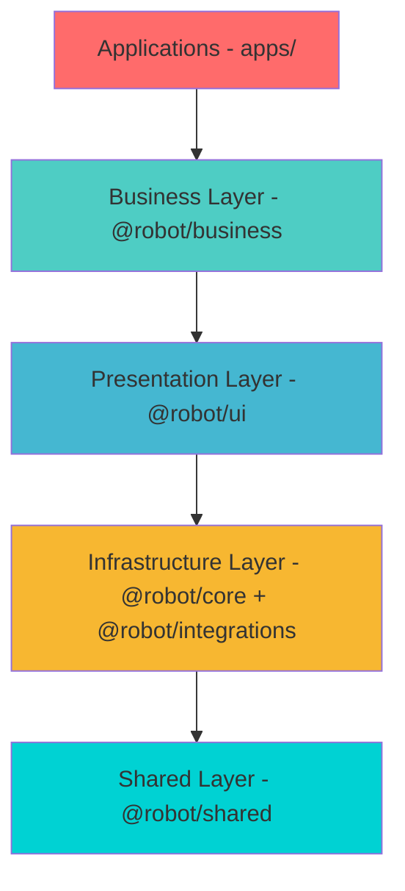

# Robot Admin Monorepo 完整指南

> **📦 企业级 Monorepo 架构实践** - 基于 Bun Workspaces 的多应用管理平台完全手册

---

## 📚 目录

### 第一部分：架构与配置
- [项目概述](#项目概述)
- [架构设计](#架构设计)
- [核心包详解](#核心包详解)
- [目录结构](#目录结构)
- [工程化配置](#工程化配置)

### 第二部分：开发指南
- [环境准备](#环境准备)
- [快速上手](#快速上手)
- [日常开发](#日常开发)
- [创建页面与组件](#创建页面与组件)
- [使用 Composables](#使用-composables)
- [状态管理与 API](#状态管理与-api)
- [调试技巧](#调试技巧)

### 第三部分：构建与部署
- [构建命令](#构建命令)
- [部署方式](#部署方式)
- [环境变量管理](#环境变量管理)

### 第四部分：扩展与维护
- [扩展新应用](#扩展新应用)
- [扩展新共享包](#扩展新共享包)
- [最佳实践](#最佳实践)
- [常见问题](#常见问题)
- [参考资料](#参考资料)

---

# 第一部分：架构与配置

## 项目概述

Robot Admin Monorepo 是一个基于 Bun Workspaces 的企业级多应用管理平台，采用 Monorepo 架构统一管理多个前端应用和共享包。

### 核心特性

- 🎯 **多应用管理**：支持 Internal 版和 SaaS 版两个独立应用
- 📦 **代码共享**：5 个共享包统一管理公共代码
- 🚀 **独立部署**：每个应用可独立构建和部署
- 🔧 **统一工具链**：ESLint、Prettier、TypeScript、Commitizen 全局配置
- ⚡️ **高效开发**：Bun + Vite 提供极速开发体验
- 🔄 **HMR 热更新**：修改共享包代码，应用自动刷新

### 技术栈

<div class="tech-stack-table">

| 技术       | 版本   | 用途             |
| ---------- | ------ | ---------------- |
| Bun        | 1.3.4+ | 包管理器和运行时 |
| Vue        | 3.5.13 | 前端框架         |
| TypeScript | 5.8.0  | 类型系统         |
| Vite       | 7.0.6  | 构建工具         |
| Naive UI   | 2.41.0 | UI 组件库        |
| UnoCSS     | 0.65+  | 原子化 CSS       |

</div>

### 为什么选择 Monorepo？

<div class="comparison-table">

| 对比维度     | Monorepo                           | 多仓库 (Multirepo)           |
| ------------ | ---------------------------------- | ---------------------------- |
| **代码复用** | ⭐⭐⭐⭐⭐ 即时引用，类型提示完美 | ⭐⭐ 需要发布 NPM，版本管理复杂 |
| **开发体验** | ⭐⭐⭐⭐⭐ 统一工具链，一键启动   | ⭐⭐⭐ 需要切换仓库，配置分散   |
| **版本管理** | ⭐⭐⭐⭐ 统一升级，依赖一致       | ⭐⭐ 版本碎片化，兼容性问题多   |
| **CI/CD**    | ⭐⭐⭐⭐ 增量构建，影响范围可控   | ⭐⭐⭐ 每个仓库独立配置         |
| **团队协作** | ⭐⭐⭐⭐⭐ 代码评审集中，知识共享 | ⭐⭐ 跨仓库协作困难             |
| **适用场景** | 中小团队，共享代码多               | 大团队，独立产品线           |

</div>

---

## 架构设计

### 📐 整体架构图

```
robot-admin-monorepo (v2.0.0)
│
├── 📦 packages/              # 共享包（业务无关）
│   ├── @robot/shared         # 通用工具、类型、常量
│   ├── @robot/core           # 核心基础设施（路由、Store、请求）
│   ├── @robot/ui             # UI 组件库（基于 Naive UI）
│   ├── @robot/business       # 业务逻辑包（Hooks、Utils）
│   └── @robot/integrations   # 第三方集成
│
├── 🚀 apps/                  # 应用层（独立部署）
│   ├── robot-admin-internal  # 内部版（端口 1988）
│   └── robot-admin-saas      # SaaS 版（端口 1989）
│
└── 🛠️ 工程化
    ├── bun.lock              # 依赖锁定
    ├── package.json          # Workspace 配置
    ├── eslint.config.ts      # ESLint 配置
    ├── tsconfig.json         # TypeScript 配置
    └── scripts/              # 自动化脚本
```

### 🎯 职责分层原则



**依赖规则：**

- ✅ 上层可以依赖下层
- ❌ 下层不能依赖上层
- ❌ 同层包之间禁止循环依赖

### 🔗 包依赖关系

```mermaid
graph TD
    A[apps/robot-admin-internal] --> B[@robot/business]
    A --> C[@robot/ui]
    A --> D[@robot/core]
    A --> E[@robot/integrations]
    A --> F[@robot/shared]

    B --> D
    C --> D
    E --> D

    D --> F

    style A fill:#ff6b6b
    style B fill:#4ecdc4
    style C fill:#45b7d1
    style D fill:#f7b731
    style E fill:#5f27cd
    style F fill:#00d2d3
```

---

## 核心包详解

### 1. @robot/shared - 共享基础层

**职责定位：** 纯函数工具、通用类型、常量定义

::: code-group

```typescript [目录结构]
packages/shared/
├── src/
│   ├── utils/              # 工具函数
│   │   ├── index.ts
│   │   ├── classnames.ts   # cn() 函数
│   │   ├── date.ts         # 日期处理
│   │   └── string.ts       # 字符串处理
│   ├── types/              # 类型定义
│   │   ├── index.ts
│   │   ├── common.ts       # 通用类型
│   │   └── helpers.ts      # 类型工具
│   ├── constants/          # 常量
│   │   ├── index.ts
│   │   └── status.ts
│   └── index.ts            # 包入口
├── package.json
├── tsconfig.json
└── README.md
```

```typescript [使用示例]
import { cn, type ObjectValues } from '@robot/shared'

// cn 函数：classnames 合并
const className = cn('btn', isActive && 'active', 'btn-primary')
// 输出: "btn active btn-primary"

// ObjectValues 类型工具
const STATUS = {
  PENDING: 'pending',
  SUCCESS: 'success',
  FAILED: 'failed',
} as const

type Status = ObjectValues<typeof STATUS>
// type Status = "pending" | "success" | "failed"
```

:::

**设计原则：**

- ✅ 零外部依赖（仅 clsx）
- ✅ 纯函数，无副作用
- ✅ 可在 Node.js 和浏览器环境运行
- ✅ 完善的 TypeScript 类型

---

### 2. @robot/core - 核心基础设施

**职责定位：** 路由系统、状态管理、请求封装、指令系统

::: code-group

```typescript [包含模块]
packages/core/
├── src/
│   ├── router/             # 路由系统
│   │   ├── index.ts        # 导出
│   │   ├── dynamicRouter.ts # 动态路由
│   │   └── guards.ts       # 路由守卫
│   ├── stores/             # Pinia Store
│   │   ├── index.ts
│   │   ├── user/          # 用户模块
│   │   ├── theme/         # 主题模块
│   │   └── permission/    # 权限模块
│   ├── axios/              # 请求封装
│   │   ├── index.ts
│   │   ├── request.ts     # 实例配置
│   │   └── interceptors.ts # 拦截器
│   ├── directives/         # 自定义指令
│   │   ├── index.ts
│   │   └── modules/       # 指令模块
│   │       ├── permission.ts
│   │       └── debounce.ts
│   └── utils/              # 核心工具
│       └── storage.ts
└── package.json
```

```typescript [使用示例 - 应用入口]
// apps/robot-admin-internal/src/main.ts
import { createApp } from 'vue'
import { setupRouter, setupStore } from '@robot/core'
import App from './App.vue'

const app = createApp(App)

// 配置核心基础设施
setupStore(app)    // 注册 Pinia Store
setupRouter(app)   // 配置路由系统

app.mount('#app')
```

```typescript [使用示例 - 请求封装]
// 在应用中使用封装好的请求
import { http } from '@robot/core'

// GET 请求
const getUserList = () => http.get('/api/users')

// POST 请求（自动处理 token、错误提示）
const createUser = (data) => http.post('/api/users', data)

// 自动功能：
// ✅ Token 自动携带
// ✅ 错误统一处理
// ✅ Loading 状态管理
// ✅ 请求/响应拦截
```

:::

**关键功能：**

<div class="features-table">

| 模块       | 说明                        | 关键文件                  |
| ---------- | --------------------------- | ------------------------- |
| Router     | 动态路由、权限路由          | `router/dynamicRouter.ts` |
| Stores     | 用户、主题、权限 Store      | `stores/user/index.ts`    |
| Axios      | 请求拦截、错误处理          | `axios/request.ts`        |
| Directives | v-permission、v-debounce 等 | `directives/modules/`     |

</div>

---

### 3. @robot/ui - UI 组件库

**职责定位：** 基于 Naive UI 的业务组件封装

::: code-group

```typescript [组件结构]
packages/ui/
├── src/
│   ├── components/         # 业务组件
│   │   ├── Table/         # 高级表格
│   │   │   ├── index.vue
│   │   │   ├── types.ts
│   │   │   └── hooks.ts
│   │   ├── Form/          # 表单组件
│   │   ├── Modal/         # 弹窗组件
│   │   └── index.ts       # 组件导出
│   ├── composables/        # UI Composables
│   │   ├── useTable.ts
│   │   ├── useForm.ts
│   │   └── index.ts
│   └── index.ts
└── package.json
```

```vue [使用示例]
<script setup lang="ts">
import { AdvancedTable } from '@robot/ui'

const columns = [
  { key: 'name', title: '姓名' },
  { key: 'age', title: '年龄' },
]

const data = [
  { name: '张三', age: 25 },
  { name: '李四', age: 30 },
]
</script>

<template>
  <AdvancedTable
    :columns="columns"
    :data="data"
    :loading="loading"
    @refresh="handleRefresh"
  />
</template>
```

:::

**设计原则：**

- ✅ 基于 Naive UI 二次封装
- ✅ 高内聚，组件功能完整
- ✅ 低耦合，独立可复用
- ❌ 不包含 API 调用逻辑

---

### 4. @robot/business - 业务逻辑层

**职责定位：** 业务 Hooks、工具函数、API 服务

::: code-group

```typescript [包结构]
packages/business/
├── src/
│   ├── hooks/              # 业务 Hooks
│   │   ├── index.ts
│   │   ├── useUserPermissions.ts
│   │   └── useDataExport.ts
│   ├── utils/              # 业务工具
│   │   ├── index.ts
│   │   └── validators.ts
│   └── index.ts
└── package.json
```

```typescript [Hooks 示例]
// packages/business/src/hooks/useUserPermissions.ts
import { computed } from 'vue'
import { useUserStore } from '@robot/core'

export function useUserPermissions() {
  const userStore = useUserStore()

  const hasPermission = (permission: string) => {
    return userStore.permissions.includes(permission)
  }

  const hasAnyPermission = (permissions: string[]) => {
    return permissions.some(p => hasPermission(p))
  }

  return {
    hasPermission,
    hasAnyPermission,
  }
}
```

```vue [使用示例]
<script setup lang="ts">
import { useUserPermissions } from '@robot/business'

const { hasPermission } = useUserPermissions()

const canEdit = computed(() => hasPermission('user:edit'))
</script>

<template>
  <NButton v-if="canEdit" @click="handleEdit">
    编辑
  </NButton>
</template>
```

:::

---

### 5. @robot/integrations - 第三方集成

**职责定位：** 封装第三方库（AntV、FullCalendar 等）

::: code-group

```typescript [包结构]
packages/integrations/
├── src/
│   ├── antv/               # AntV 图表封装
│   │   ├── index.ts
│   │   └── LineChart.vue
│   ├── calendar/           # FullCalendar 封装
│   │   ├── index.ts
│   │   └── Calendar.vue
│   └── index.ts
└── package.json
```

```vue [使用示例]
<script setup lang="ts">
import { LineChart } from '@robot/integrations/antv'

const data = [
  { month: '1月', value: 100 },
  { month: '2月', value: 150 },
]
</script>

<template>
  <LineChart :data="data" />
</template>
```

:::

---

## 目录结构

### 根目录结构

::: code-group

```bash [完整结构]
Robot_Admin/
├── apps/                       # 应用目录
│   ├── robot-admin-internal/  # 内部版
│   └── robot-admin-saas/      # SaaS 版
├── packages/                   # 共享包目录
│   ├── shared/                # @robot/shared
│   ├── core/                  # @robot/core
│   ├── ui/                    # @robot/ui
│   ├── business/              # @robot/business
│   └── integrations/          # @robot/integrations
├── docs/                       # 文档目录
│   ├── GUIDE.md               # 完整指南
│   └── ARCHITECTURE.md        # 架构文档
├── scripts/                    # 通用工具脚本
│   └── phase3-create-app.sh   # 创建新应用脚本
├── .cz-config.cjs             # Commitizen 配置
├── .prettierrc.json           # Prettier 配置
├── .gitattributes             # Git 属性配置
├── .gitignore                 # Git 忽略配置
├── commitlint.config.js       # Commitlint 配置
├── eslint.config.ts           # ESLint 配置
├── tsconfig.json              # TypeScript 基础配置
├── package.json               # Monorepo 根配置
└── bun.lock                   # 依赖锁文件
```

```bash [应用目录]
apps/robot-admin-internal/
├── src/
│   ├── api/                   # API 接口
│   ├── assets/                # 静态资源
│   ├── components/            # 本地组件
│   ├── composables/           # 组合式函数
│   ├── config/                # 配置文件
│   ├── router/                # 路由配置
│   ├── stores/                # 状态管理
│   ├── styles/                # 样式文件
│   ├── utils/                 # 工具函数
│   ├── views/                 # 页面视图
│   ├── App.vue                # 根组件
│   └── main.ts                # 入口文件
├── public/                    # 公共资源
├── scripts/                   # 应用特定脚本
├── lang/                      # 国际化文件
├── envs/                      # 环境配置模板
├── .env                       # 当前环境
├── dist/                      # 构建产物
├── package.json               # 应用依赖
├── vite.config.ts             # Vite 配置
├── unocss.config.ts           # UnoCSS 配置
└── tsconfig.json              # TS 配置
```

```bash [共享包目录]
packages/ui/
├── src/
│   ├── components/            # 组件源码
│   │   ├── Button/
│   │   ├── Table/
│   │   └── index.ts
│   ├── composables/           # 组合式函数
│   │   ├── useTable.ts
│   │   └── index.ts
│   ├── types/                 # 类型定义
│   │   └── index.ts
│   └── index.ts               # 导出入口
├── package.json
└── tsconfig.json
```

:::

---

## 工程化配置

### 🔧 TypeScript 配置

::: code-group

```json [根目录配置]
// tsconfig.json
{
  "compilerOptions": {
    "target": "ES2022",
    "module": "ESNext",
    "moduleResolution": "Bundler",
    "strict": true,
    "jsx": "preserve",
    "paths": {
      "@robot/*": ["./packages/*/src"]
    }
  }
}
```

```json [应用级配置]
// apps/robot-admin-internal/tsconfig.json
{
  "extends": "../../tsconfig.json",
  "compilerOptions": {
    "baseUrl": ".",
    "paths": {
      "@/*": ["./src/*"],
      "@robot/*": ["../../packages/*/src"]
    }
  },
  "include": ["src/**/*"]
}
```

:::

---

### 📦 Bun Workspaces 配置

::: code-group

```json [package.json 根配置]
{
  "workspaces": ["apps/*", "packages/*"]
}
```

```bash [过滤器命令]
# 仅在某个包运行命令
bun --filter @robot/ui build

# 在所有应用运行命令
bun --filter './apps/*' dev

# 在所有包运行命令
bun --filter './packages/*' type-check
```

:::

**Workspace 特性：**

- ✅ 自动链接本地包（无需 npm link）
- ✅ 统一依赖管理（去重）
- ✅ 支持 `workspace:*` 协议
- ✅ 过滤器执行命令（--filter）

**依赖声明：**

```json
// apps/robot-admin-internal/package.json
{
  "dependencies": {
    "@robot/shared": "workspace:*",
    "@robot/core": "workspace:*",
    "@robot/ui": "workspace:*",
    "@robot/business": "workspace:*"
  }
}
```

::: tip 工作原理
- **开发时**：Bun 自动链接到本地包目录，修改共享包代码自动 HMR
- **构建时**：Vite 自动打包共享代码到 bundle
- **部署时**：无需额外配置，dist 产物完全独立
:::

---

### 🎨 ESLint 配置

::: code-group

```typescript [根目录配置]
// eslint.config.ts
import { defineConfig } from 'eslint-define-config'

export default defineConfig({
  root: true,
  extends: [
    '@vue/typescript/recommended',
    'plugin:vue/vue3-recommended'
  ],
  rules: {
    'no-console': 'warn',
    '@typescript-eslint/no-explicit-any': 'off'
  }
})
```

```typescript [应用级覆盖]
// apps/robot-admin-internal/eslint.config.ts
export default {
  extends: '../../eslint.config.ts',
  rules: {
    'no-console': 'off' // 内部版允许 console
  }
}
```

:::

---

### 🚀 Vite 配置

::: code-group

```typescript [应用级配置]
// apps/robot-admin-internal/vite.config.ts
import { defineConfig } from 'vite'
import vue from '@vitejs/plugin-vue'
import { resolve } from 'path'

export default defineConfig({
  plugins: [vue()],
  resolve: {
    alias: {
      '@': resolve(__dirname, 'src'),
      '@robot/shared': resolve(__dirname, '../../packages/shared/src'),
      '@robot/core': resolve(__dirname, '../../packages/core/src'),
      '@robot/ui': resolve(__dirname, '../../packages/ui/src')
    }
  },
  server: {
    port: 1988,
    watch: {
      // 监听 packages 变化
      ignored: ['!**/node_modules/@robot/**']
    }
  },
  optimizeDeps: {
    // 排除共享包，启用热更新
    exclude: ['@robot/shared', '@robot/core', '@robot/ui']
  }
})
```

:::

**关键配置：**

- `resolve.alias`：路径别名（必须配置 @robot/\* 指向 packages）
- `server.watch.ignored`：监听共享包变化
- `optimizeDeps.exclude`：排除共享包，启用热更新

---

# 第二部分：开发指南

## 环境准备

### 📋 前置要求

<div class="requirements-table">

| 工具    | 最低版本 | 推荐版本 | 说明              |
| ------- | -------- | -------- | ----------------- |
| Bun     | 1.3.4+   | 最新版   | 包管理器和运行时 |
| Node.js | 20.19.0+ | 20.x LTS | 备用运行时        |
| Git     | 2.x+     | 最新版   | 版本控制          |

</div>

### 推荐工具

**IDE**: VS Code

**必装插件**:
- Vue - Official (Volar)
- ESLint
- Prettier - Code formatter
- UnoCSS

**推荐插件**:
- Error Lens
- GitLens
- Import Cost
- Better Comments

**浏览器扩展**:
- Vue DevTools (Chrome/Edge)

---

## 快速上手

### ⚡ 5 分钟启动

::: code-group

```bash [1️⃣ 克隆项目]
git clone https://github.com/ChenyCHENYU/Robot_Admin.git
cd Robot_Admin
```

```bash [2️⃣ 安装依赖]
# Bun Workspaces 自动链接所有包
bun install

# 验证安装
bun --version  # 应输出 1.3.4 或更高
```

```bash [3️⃣ 启动应用]
# 启动内部版（端口 1988）
bun run dev:internal

# 或启动 SaaS 版（端口 1989）
bun run dev:saas

# 同时启动多个应用
bun run dev:internal & bun run dev:saas
```

:::

**启动成功标志：**

::: tip 启动成功
```bash
✓ Built in 1234ms
➜  Local:   http://localhost:1988/
➜  Network: http://192.168.1.100:1988/
➜  press h + enter to show help
```
:::

**访问地址：**

- Internal: http://localhost:1988
- SaaS: http://localhost:1989

---

## 日常开发

### 📝 开发命令速查

<div class="commands-table">

| 命令                     | 说明                     | 使用场景       |
| ------------------------ | ------------------------ | -------------- |
| `bun run dev`            | 启动默认应用（internal） | 日常开发       |
| `bun run dev:internal`   | 启动内部版               | 开发内部版功能 |
| `bun run dev:saas`       | 启动 SaaS 版             | 开发 SaaS 功能 |
| `bun run build`          | 构建所有包+应用          | 生产发布前     |
| `bun run build:internal` | 仅构建内部版             | 部署内部版     |
| `bun run build:saas`     | 仅构建 SaaS 版           | 部署 SaaS 版   |
| `bun run lint`           | 代码检查                 | 提交前         |
| `bun run lint:fix`       | 自动修复代码问题         | 批量修复       |
| `bun run type-check`     | 类型检查                 | CI 流程        |
| `bun run clean`          | 清理构建产物             | 重新构建前     |
| `bun run fresh`          | 清理+重装依赖            | 依赖问题排查   |

</div>

### 依赖管理

::: code-group

```bash [安装依赖]
# 安装所有依赖（根目录 + 所有子包）
bun install

# 为特定应用安装依赖
bun --filter @robot/admin-internal add lodash-es

# 为所有应用安装依赖
bun --filter './apps/*' add date-fns

# 为特定共享包安装依赖
bun --filter @robot/ui add @vueuse/core

# 安装开发依赖
bun --filter @robot/admin-internal add -d @types/lodash-es
```

```bash [升级依赖]
# 升级所有依赖
bun update

# 升级特定包
bun update vue vite

# 检查过期依赖
bun outdated
```

:::

---

## 创建页面与组件

### 创建新页面

::: tip 步骤概览
1. 创建页面文件
2. 编写页面组件
3. 配置路由
4. 添加菜单
:::

#### 1. 创建页面文件

```bash
# 在应用中创建页面
mkdir -p apps/robot-admin-internal/src/views/product
touch apps/robot-admin-internal/src/views/product/index.vue
```

#### 2. 编写页面组件

::: code-group

```vue [页面组件]
<!-- apps/robot-admin-internal/src/views/product/index.vue -->
<template>
  <div class="product-page p-4">
    <PageHeader title="产品管理" />
    <ProductTable 
      :data="productList" 
      :loading="loading"
      @refresh="loadProducts"
    />
  </div>
</template>

<script setup lang="ts">
import { ref, onMounted } from 'vue'
import { ProductTable } from '@robot/business'
import { PageHeader } from '@robot/ui'
import type { Product } from '@robot/shared'
import { productApi } from '@/api/product'

const productList = ref<Product[]>([])
const loading = ref(false)

async function loadProducts() {
  loading.value = true
  try {
    const res = await productApi.getList({ page: 1, size: 10 })
    productList.value = res.data
  } finally {
    loading.value = false
  }
}

onMounted(() => {
  loadProducts()
})
</script>
```

:::

#### 3. 配置路由

```typescript
// apps/robot-admin-internal/src/router/index.ts
const routes = [
  {
    path: '/product',
    name: 'Product',
    component: () => import('@/views/product/index.vue'),
    meta: {
      title: '产品管理',
      requireAuth: true,
      icon: 'i-ri-product-hunt-line',
    },
  },
]
```

#### 4. 添加菜单

```typescript
// apps/robot-admin-internal/src/config/menu.ts
export const menuConfig = [
  {
    label: '产品管理',
    key: 'product',
    icon: 'i-ri-product-hunt-line',
    path: '/product',
  },
]
```

---

### 创建组件

#### 在应用内创建（本地组件）

适用于**仅当前应用使用**的组件：

::: code-group

```bash [创建文件]
mkdir -p apps/robot-admin-internal/src/components/ProductCard
```

```vue [组件代码]
<!-- apps/robot-admin-internal/src/components/ProductCard/index.vue -->
<template>
  <n-card class="product-card hover:shadow-lg transition-shadow">
    <template #header>
      <div class="flex justify-between items-center">
        <h3 class="text-lg font-bold">{{ product.name }}</h3>
        <n-tag :type="statusType">{{ product.status }}</n-tag>
      </div>
    </template>
    
    <p class="text-2xl font-bold text-blue-600">¥{{ product.price }}</p>
    <p class="text-gray-600 mt-2">{{ product.description }}</p>
    
    <template #footer>
      <n-space>
        <n-button type="primary" @click="handleBuy">
          购买
        </n-button>
        <n-button @click="handleDetail">
          详情
        </n-button>
      </n-space>
    </template>
  </n-card>
</template>

<script setup lang="ts">
import { computed } from 'vue'
import type { Product } from '@robot/shared'

const props = defineProps<{
  product: Product
}>()

const emit = defineEmits<{
  buy: [product: Product]
  detail: [product: Product]
}>()

const statusType = computed(() => {
  return props.product.status === 'active' ? 'success' : 'warning'
})

function handleBuy() {
  emit('buy', props.product)
}

function handleDetail() {
  emit('detail', props.product)
}
</script>
```

:::

#### 在共享包中创建（UI 组件）

适用于**多个应用共用**的组件：

::: tip 步骤概览
1. 创建组件文件
2. 导出组件
3. 在应用中使用
:::

::: code-group

```bash [1. 创建组件]
mkdir -p packages/ui/src/components/ProductCard
```

```vue [2. 组件代码]
<!-- packages/ui/src/components/ProductCard/index.vue -->
<template>
  <n-card 
    class="product-card" 
    hoverable
    @click="handleClick"
  >
    <template #header>
      <div class="flex justify-between items-center">
        <h3 class="text-lg font-bold">{{ product.name }}</h3>
        <n-tag :type="statusType">{{ product.status }}</n-tag>
      </div>
    </template>
    
    <div class="space-y-2">
      <p class="text-2xl font-bold text-blue-600">¥{{ product.price }}</p>
      <p class="text-gray-600">{{ product.description }}</p>
    </div>
    
    <template #footer>
      <n-space>
        <n-button type="primary" @click.stop="handleBuy">
          购买
        </n-button>
        <n-button @click.stop="$emit('detail', product)">
          详情
        </n-button>
      </n-space>
    </template>
  </n-card>
</template>

<script setup lang="ts">
import { computed } from 'vue'
import type { Product } from '@robot/shared'

const props = defineProps<{
  product: Product
}>()

const emit = defineEmits<{
  buy: [product: Product]
  detail: [product: Product]
  click: [product: Product]
}>()

const statusType = computed(() => {
  return props.product.status === 'active' ? 'success' : 'warning'
})

function handleBuy() {
  emit('buy', props.product)
}

function handleClick() {
  emit('click', props.product)
}
</script>
```

```typescript [3. 导出组件]
// packages/ui/src/components/index.ts
export { default as ProductCard } from './ProductCard'

// packages/ui/src/index.ts
export * from './components'
```

```vue [4. 在应用中使用]
<template>
  <div class="grid grid-cols-3 gap-4">
    <ProductCard
      v-for="product in products"
      :key="product.id"
      :product="product"
      @buy="handleBuy"
      @detail="handleDetail"
    />
  </div>
</template>

<script setup lang="ts">
import { ref } from 'vue'
import { ProductCard } from '@robot/ui'
import type { Product } from '@robot/shared'

const products = ref<Product[]>([...])

function handleBuy(product: Product) {
  console.log('购买', product)
}

function handleDetail(product: Product) {
  console.log('查看详情', product)
}
</script>
```

:::

---

## 使用 Composables

### 创建 Composable

::: code-group

```typescript [useTable Hook]
// packages/ui/src/composables/useTable.ts
import { ref, computed } from 'vue'

export function useTable<T>(initialData: T[] = []) {
  const data = ref<T[]>(initialData)
  const currentPage = ref(1)
  const pageSize = ref(10)
  const loading = ref(false)

  const paginatedData = computed(() => {
    const start = (currentPage.value - 1) * pageSize.value
    const end = start + pageSize.value
    return data.value.slice(start, end)
  })

  const totalPages = computed(() => {
    return Math.ceil(data.value.length / pageSize.value)
  })

  function goToPage(page: number) {
    if (page >= 1 && page <= totalPages.value) {
      currentPage.value = page
    }
  }

  function setData(newData: T[]) {
    data.value = newData
    currentPage.value = 1
  }

  function refresh() {
    // 刷新逻辑
  }

  return {
    data,
    currentPage,
    pageSize,
    loading,
    paginatedData,
    totalPages,
    goToPage,
    setData,
    refresh,
  }
}
```

```typescript [导出]
// packages/ui/src/composables/index.ts
export { useTable } from './useTable'
export { useForm } from './useForm'
export { useModal } from './useModal'

// packages/ui/src/index.ts
export * from './composables'
```

:::

### 使用 Composable

::: code-group

```vue [完整示例]
<template>
  <div class="p-4">
    <n-space class="mb-4">
      <n-button @click="refresh">刷新</n-button>
      <n-button @click="handleAdd">新增</n-button>
    </n-space>

    <n-spin :show="loading">
      <div class="grid grid-cols-1 gap-4">
        <ProductCard
          v-for="product in paginatedData"
          :key="product.id"
          :product="product"
          @buy="handleBuy"
        />
      </div>
    </n-spin>

    <n-pagination
      v-model:page="currentPage"
      :page-count="totalPages"
      class="mt-4 justify-center"
      @update:page="goToPage"
    />
  </div>
</template>

<script setup lang="ts">
import { onMounted } from 'vue'
import { useTable } from '@robot/ui'
import { ProductCard } from '@robot/ui'
import type { Product } from '@robot/shared'
import { productApi } from '@/api/product'

const {
  paginatedData,
  currentPage,
  totalPages,
  loading,
  goToPage,
  setData,
  refresh
} = useTable<Product>()

async function loadProducts() {
  loading.value = true
  try {
    const res = await productApi.getList()
    setData(res.data)
  } finally {
    loading.value = false
  }
}

function handleBuy(product: Product) {
  console.log('购买', product)
}

function handleAdd() {
  console.log('新增产品')
}

onMounted(() => {
  loadProducts()
})

function refresh() {
  loadProducts()
}
</script>
```

:::

---

## 状态管理与 API

### 状态管理

::: code-group

```typescript [Store 定义]
// apps/robot-admin-internal/src/stores/user/index.ts
import { defineStore } from 'pinia'
import type { User } from '@robot/shared'
import { userApi } from '@/api/user'

export const useUserStore = defineStore('user', () => {
  const user = ref<User | null>(null)
  const token = ref<string>('')

  const isLogin = computed(() => !!token.value)

  async function login(username: string, password: string) {
    const res = await userApi.login({ username, password })
    user.value = res.user
    token.value = res.token
    localStorage.setItem('token', res.token)
  }

  function logout() {
    user.value = null
    token.value = ''
    localStorage.removeItem('token')
  }

  function initUser() {
    const savedToken = localStorage.getItem('token')
    if (savedToken) {
      token.value = savedToken
      fetchUserInfo()
    }
  }

  async function fetchUserInfo() {
    try {
      const res = await userApi.getUserInfo()
      user.value = res
    } catch (error) {
      logout()
    }
  }

  return {
    user,
    token,
    isLogin,
    login,
    logout,
    initUser,
  }
})
```

```vue [使用 Store]
<script setup lang="ts">
import { useUserStore } from '@/stores/user'

const userStore = useUserStore()

async function handleLogin() {
  await userStore.login('admin', 'password')
  router.push('/')
}

function handleLogout() {
  userStore.logout()
  router.push('/login')
}
</script>

<template>
  <div v-if="userStore.isLogin">
    <p>欢迎，{{ userStore.user?.name }}</p>
    <n-button @click="handleLogout">退出</n-button>
  </div>
</template>
```

:::

### API 接口

::: code-group

```typescript [API 定义]
// apps/robot-admin-internal/src/api/product.ts
import { request } from '@/axios/request'
import type { Product, ApiResponse } from '@robot/shared'

export const productApi = {
  // 获取产品列表
  getList(params: { page: number; size: number }) {
    return request.get<ApiResponse<Product[]>>('/api/products', { params })
  },

  // 获取产品详情
  getDetail(id: string) {
    return request.get<ApiResponse<Product>>(`/api/products/${id}`)
  },

  // 创建产品
  create(data: Partial<Product>) {
    return request.post<ApiResponse<Product>>('/api/products', data)
  },

  // 更新产品
  update(id: string, data: Partial<Product>) {
    return request.put<ApiResponse<Product>>(`/api/products/${id}`, data)
  },

  // 删除产品
  delete(id: string) {
    return request.delete<ApiResponse<void>>(`/api/products/${id}`)
  },
}
```

```typescript [请求封装]
// apps/robot-admin-internal/src/axios/request.ts
import axios from 'axios'

const instance = axios.create({
  baseURL: import.meta.env.VITE_API_BASE_URL,
  timeout: 10000,
})

// 请求拦截器
instance.interceptors.request.use(
  config => {
    console.log('🚀 请求:', config.method?.toUpperCase(), config.url)
    const token = localStorage.getItem('token')
    if (token) {
      config.headers.Authorization = `Bearer ${token}`
    }
    return config
  },
  error => {
    console.error('❌ 请求错误:', error)
    return Promise.reject(error)
  }
)

// 响应拦截器
instance.interceptors.response.use(
  response => {
    console.log('✅ 响应:', response.config.url, response.data)
    return response.data
  },
  error => {
    console.error('❌ 响应错误:', error.response?.status, error.message)
    if (error.response?.status === 401) {
      window.location.href = '/login'
    }
    return Promise.reject(error)
  }
)

export const request = instance
```

:::

---

## 调试技巧

### 浏览器调试

::: code-group

```typescript [Console 调试]
// 1. 基础 console
console.log('用户数据:', user)
console.table(products) // 表格形式显示数组
console.time('API 请求')
await fetchData()
console.timeEnd('API 请求') // 输出耗时

// 2. 使用 debugger
function handleSubmit() {
  debugger // 断点会在这里停止
  // ...
}

// 3. 条件断点
if (user.id === '123') {
  debugger // 只在特定条件下触发
}
```

```typescript [性能分析]
// 构建分析
ANALYZE=true bun run build:internal

// 会自动打开浏览器显示 bundle 分析报告
```

:::

### Vue DevTools

安装 Vue DevTools 浏览器扩展后：

1. **Components 面板**：查看组件树、props、data
2. **Timeline 面板**：追踪性能和事件
3. **Pinia 面板**：查看状态管理
4. **Router 面板**：查看路由状态
5. **Performance 面板**：性能分析

### 热更新调试

修改共享包代码时，应用会自动热更新：

```bash
# 1. 启动应用
bun run dev:internal

# 2. 修改共享包代码
vim packages/ui/src/components/Button/index.vue

# 3. 保存后，浏览器自动刷新
# 无需重启开发服务器！
```

::: tip HMR 不工作？
检查 vite.config.ts 配置：
```typescript
server: {
  watch: {
    ignored: ['!**/node_modules/@robot/**']
  }
},
optimizeDeps: {
  exclude: ['@robot/shared', '@robot/core', '@robot/ui']
}
```
:::

---

# 第三部分：构建与部署

## 构建命令

### 开发环境

```bash
# 启动开发服务器
bun run dev                # Internal（默认）
bun run dev:internal       # Internal
bun run dev:saas          # SaaS
```

### 生产环境

```bash
# 构建所有应用
bun run build

# 构建特定应用
bun run build:internal    # Internal 版本
bun run build:saas        # SaaS 版本

# 构建并分析包大小
ANALYZE=true bun run build:internal
```

### 预览构建产物

```bash
# 预览构建后的应用
bun run preview:internal
bun run preview:saas
```

---

## 部署方式

### 构建产物说明

构建后的产物在 `apps/*/dist/` 目录：

```
apps/robot-admin-internal/dist/
├── index.html
├── assets/
│   ├── index-[hash].js        # 主 bundle（包含所有共享包代码）
│   ├── index-[hash].css
│   └── vendor-[hash].js       # 第三方库
├── images/
└── favicon.ico
```

::: tip 关键特性
- ✅ 所有 `@robot/*` 包的代码已打包进 `dist/`
- ✅ `dist/` 可以直接部署到任何静态服务器
- ✅ 无需在生产环境安装依赖
:::

---

### 1. Docker 部署（推荐）

::: code-group

```dockerfile [Dockerfile]
# apps/robot-admin-internal/Dockerfile
FROM nginx:alpine

# 复制构建产物
COPY dist /usr/share/nginx/html

# 复制 nginx 配置
COPY nginx.conf /etc/nginx/conf.d/default.conf

EXPOSE 80

CMD ["nginx", "-g", "daemon off;"]
```

```nginx [nginx.conf]
server {
    listen 80;
    server_name _;
    root /usr/share/nginx/html;
    index index.html;

    # 支持 Vue Router history 模式
    location / {
        try_files $uri $uri/ /index.html;
    }

    # 静态资源缓存
    location /assets/ {
        expires 1y;
        add_header Cache-Control "public, immutable";
    }

    # API 代理
    location /api/ {
        proxy_pass http://backend-server:3000;
        proxy_set_header Host $host;
        proxy_set_header X-Real-IP $remote_addr;
    }

    # Gzip 压缩
    gzip on;
    gzip_types text/css application/javascript application/json;
    gzip_min_length 1000;
}
```

```bash [部署命令]
# 1. 构建应用
bun run build:internal

# 2. 构建 Docker 镜像
cd apps/robot-admin-internal
docker build -t robot-admin-internal:latest .

# 3. 运行容器
docker run -d -p 80:80 robot-admin-internal:latest
```

```yaml [docker-compose.yml]
version: '3'
services:
  admin-internal:
    build: ./apps/robot-admin-internal
    ports:
      - "80:80"
    restart: unless-stopped
```

:::

---

### 2. Vercel 部署

::: code-group

```json [vercel.json]
// apps/robot-admin-internal/vercel.json
{
  "buildCommand": "cd ../.. && bun run build:internal",
  "outputDirectory": "dist",
  "rewrites": [{ "source": "/(.*)", "destination": "/" }],
  "headers": [
    {
      "source": "/assets/(.*)",
      "headers": [
        {
          "key": "Cache-Control",
          "value": "public, max-age=31536000, immutable"
        }
      ]
    }
  ]
}
```

```bash [部署命令]
cd apps/robot-admin-internal

# 首次部署
vercel

# 生产环境部署
vercel --prod
```

:::

---

### 3. Nginx 静态部署

```bash
# 1. 构建
bun run build:internal

# 2. 上传到服务器
scp -r apps/robot-admin-internal/dist/* user@server:/var/www/internal/

# 3. 配置 Nginx
sudo vim /etc/nginx/sites-available/internal

# 使用上面的 nginx.conf 配置

# 4. 启用站点
sudo ln -s /etc/nginx/sites-available/internal /etc/nginx/sites-enabled/

# 5. 测试配置
sudo nginx -t

# 6. 重新加载
sudo systemctl reload nginx
```

---

## 环境变量管理

### 环境文件结构

```
apps/robot-admin-internal/
├── .env                      # 当前环境（自动生成，不提交）
└── envs/                     # 环境模板（提交到 Git）
    ├── .env                  # 基础配置
    ├── .env.development      # 开发环境
    ├── .env.production       # 生产环境
    ├── .env.test             # 测试环境
    └── .env.staging          # 预发环境
```

### 环境变量示例

::: code-group

```env [开发环境]
# apps/robot-admin-internal/envs/.env.development
VITE_APP_ENV = development
VITE_API_BASE = /api
VITE_APP_TITLE = Robot Admin Internal (Dev)
VITE_ENABLE_MOCK = true
VITE_ENABLE_ANALYTICS = false
```

```env [生产环境]
# apps/robot-admin-internal/envs/.env.production
VITE_APP_ENV = production
VITE_API_BASE = https://api.example.com
VITE_APP_TITLE = Robot Admin Internal
VITE_ENABLE_MOCK = false
VITE_ENABLE_ANALYTICS = true
VITE_SENTRY_DSN = https://xxx@sentry.io/xxx
```

:::

### 使用环境变量

::: code-group

```typescript [在代码中使用]
// 直接使用
const apiBase = import.meta.env.VITE_API_BASE
const appTitle = import.meta.env.VITE_APP_TITLE

// 类型安全
// src/types/env.d.ts
interface ImportMetaEnv {
  readonly VITE_APP_ENV: 'development' | 'production' | 'test' | 'staging'
  readonly VITE_API_BASE: string
  readonly VITE_APP_TITLE: string
  readonly VITE_ENABLE_MOCK: string
  readonly VITE_ENABLE_ANALYTICS: string
}
```

```bash [切换环境]
# 开发环境（自动）
bun run dev

# 生产环境（自动）
bun run build

# 测试环境
bun run build:test

# 预发环境
bun run build:staging
```

:::

---

# 第四部分：扩展与维护

## 扩展新应用

### 使用脚本创建（推荐）

```bash
# 使用创建脚本
bash scripts/phase3-create-app.sh mobile

# 脚本会自动：
# 1. 创建目录结构
# 2. 生成 package.json
# 3. 创建基础配置文件
# 4. 更新根 package.json
```

### 手动创建步骤

::: tip 步骤概览
1. 复制现有应用作为模板
2. 修改 package.json
3. 修改 vite.config.ts（端口等）
4. 更新根 package.json
5. 安装依赖并启动
:::

::: code-group

```bash [1. 复制应用]
# 复制 Internal 作为模板
cp -r apps/robot-admin-internal apps/robot-admin-mobile
cd apps/robot-admin-mobile
```

```json [2. 修改 package.json]
{
  "name": "@robot/admin-mobile",
  "version": "1.0.0",
  "description": "Robot Admin 移动端应用",
  "scripts": {
    "dev": "vite --port 1990",
    "build": "env-manager prod && vite build",
    "preview": "bun run build && vite preview"
  },
  "dependencies": {
    "@robot/shared": "workspace:*",
    "@robot/core": "workspace:*",
    "@robot/ui": "workspace:*"
  }
}
```

```typescript [3. 修改 vite.config.ts]
// apps/robot-admin-mobile/vite.config.ts
const MOBILE_PORT = 1990

export default defineConfig(({ mode }) => {
  return {
    server: {
      ...serverConfig,
      port: MOBILE_PORT, // 修改端口
    },
  }
})
```

```json [4. 更新根 package.json]
// package.json (根目录)
{
  "scripts": {
    "dev:mobile": "bun --filter @robot/admin-mobile dev",
    "build:mobile": "bun --filter @robot/admin-mobile build"
  }
}
```

```bash [5. 安装依赖并启动]
# 回到根目录
cd ../..

# 安装依赖
bun install

# 启动新应用
bun run dev:mobile
```

:::

---

## 扩展新共享包

::: tip 步骤概览
1. 创建包目录
2. 初始化 package.json
3. 创建源码
4. 在应用中使用
5. 重新安装依赖
:::

::: code-group

```bash [1. 创建目录]
mkdir -p packages/analytics
cd packages/analytics
```

```json [2. package.json]
{
  "name": "@robot/analytics",
  "version": "1.0.0",
  "private": true,
  "main": "./src/index.ts",
  "types": "./src/index.ts",
  "exports": {
    ".": "./src/index.ts"
  },
  "dependencies": {
    "@robot/shared": "workspace:*"
  }
}
```

```typescript [3. 创建源码]
// src/index.ts
export const trackEvent = (event: string, data?: any) => {
  console.log('Track:', event, data)
}

export const trackPageView = (path: string) => {
  console.log('Page View:', path)
}
```

```json [4. 应用引用]
// apps/robot-admin-internal/package.json
{
  "dependencies": {
    "@robot/analytics": "workspace:*"
  }
}
```

```bash [5. 安装依赖]
bun install
```

:::

---

## 最佳实践

### ✅ 包职责划分

<div class="responsibility-table">

| 包名                  | 包含内容               | 不应包含               |
| --------------------- | ---------------------- | ---------------------- |
| @robot/shared         | 纯函数、类型、常量     | Vue 组件、Store、路由  |
| @robot/core           | 路由、Store、请求封装  | 业务逻辑、UI 组件      |
| @robot/ui             | UI 组件、Composables   | 业务 Hooks、API 调用   |
| @robot/business       | 业务 Hooks、Utils      | UI 组件                |
| @robot/integrations   | 第三方库封装           | 业务逻辑               |

</div>

**示例：时间格式化放哪？**

- ✅ `@robot/shared/utils/date.ts` - 纯函数
- ❌ `@robot/business` - 不是业务逻辑
- ❌ `@robot/ui` - 不是 UI 相关

---

### 🔄 避免循环依赖

::: danger 错误示例
```typescript
// packages/ui/src/components/UserCard.vue
import { useUserData } from '@robot/business' // ❌ ui 依赖 business

// packages/business/src/hooks/useUserModal.ts
import { Modal } from '@robot/ui' // ❌ business 依赖 ui

// 形成循环：ui ↔ business
```
:::

::: tip 正确做法
```typescript
// 方案 1：提升到 core 层
// packages/core/src/composables/useUserData.ts
export function useUserData() { /* ... */ }

// packages/ui 和 business 都依赖 core（单向）

// 方案 2：通过 props 传递
// packages/ui/src/components/UserCard.vue
defineProps<{ userData: UserData }>() // 不直接调用 Hook

// apps/robot-admin-internal/src/views/User.vue
const { userData } = useUserData()
```
:::

---

### 📂 文件组织规范

::: code-group

```bash [packages 目录结构]
packages/shared/
├── src/
│   ├── utils/          # 工具函数
│   │   ├── index.ts    # 导出所有工具
│   │   ├── date.ts
│   │   └── string.ts
│   ├── types/          # 类型定义
│   │   ├── index.ts
│   │   └── common.ts
│   ├── constants/      # 常量
│   │   ├── index.ts
│   │   └── status.ts
│   └── index.ts        # 包入口（导出一切）
├── package.json
├── tsconfig.json
└── README.md
```

```typescript [入口文件规范]
// ✅ 推荐：统一从 index.ts 导出
export * from './utils'
export * from './types'
export * from './constants'

// ❌ 不推荐：直接导出具体文件
export { formatDate } from './utils/date'
export { cn } from './utils/classnames'
```

:::

---

### 🎯 依赖管理策略

**原则：**

::: code-group

```json [1. 共享依赖提升到根目录]
// package.json (根目录)
{
  "dependencies": {
    "date-fns": "^3.6.0" // 所有包都用同一版本
  }
}
```

```json [2. 包特有依赖放在包内]
// packages/ui/package.json
{
  "dependencies": {
    "naive-ui": "^2.41.0" // 仅 ui 包需要
  }
}
```

```json [3. 使用 workspace: 协议]
// apps/robot-admin-internal/package.json
{
  "dependencies": {
    "@robot/shared": "workspace:*", // ✅ 始终使用最新本地版本
    "@robot/core": "workspace:*"
  }
}
```

:::

---

### 🔍 类型共享策略

**方案 1：共享类型放 @robot/shared**

```typescript
// packages/shared/src/types/user.ts
export interface User {
  id: string
  name: string
  email: string
  role: 'admin' | 'user'
}

// packages/business/src/hooks/useUser.ts
import type { User } from '@robot/shared'
```

**方案 2：特定领域类型放对应包**

```typescript
// packages/ui/src/components/Table/types.ts
export interface TableColumn {
  key: string
  title: string
  width?: number
}

// 仅在 ui 包内使用，不对外导出
```

---

### 🚀 Git 提交规范

**使用 Conventional Commits：**

```bash
# 功能开发
git commit -m "feat(admin-internal): 添加用户管理页面"

# Bug 修复
git commit -m "fix(ui): 修复 Table 排序问题"

# 文档更新
git commit -m "docs: 更新 Monorepo 指南"

# 共享包更新
git commit -m "feat(shared): 新增日期格式化工具"

# 性能优化
git commit -m "perf(admin-saas): 优化首屏加载速度"

# 重构
git commit -m "refactor(core): 重构权限管理模块"
```

**使用 Commitizen 交互式提交：**

```bash
# 在根目录执行
git add .
git cz  # 或 bun run commit

# 按提示选择：
# 1. 提交类型（feat/fix/docs...）
# 2. 影响范围（admin-internal/ui...）
# 3. 简短描述
# 4. 详细描述（可选）
```

---

### 🧪 测试策略

**单元测试：包级别**

```bash
packages/shared/
├── src/
│   └── utils/
│       ├── date.ts
│       └── date.test.ts  # 测试文件与源码同目录
└── package.json
```

**集成测试：应用级别**

```bash
apps/robot-admin-internal/
├── src/
└── tests/
    ├── unit/       # 单元测试
    └── e2e/        # 端到端测试
```

---

### 📈 性能优化

#### 代码分割

```typescript
// 路由懒加载
const routes = [
  {
    path: '/user',
    component: () => import('@/views/user/index.vue'),
  },
]

// 组件懒加载
const HeavyComponent = defineAsyncComponent(() =>
  import('@robot/business').then(m => m.HeavyComponent)
)
```

#### 按需导入

```typescript
// ✅ 推荐：按需导入
import { formatDate, debounce } from '@robot/shared'

// ❌ 不推荐：全量导入
import * as shared from '@robot/shared'
const { formatDate, debounce } = shared
```

---

## 常见问题

### Q1: 修改共享包后，应用没有热更新？

**A**: Vite 默认不监听 node_modules，需要配置：

```typescript
// apps/robot-admin-internal/vite.config.ts
export default defineConfig({
  server: {
    watch: {
      ignored: ['!**/node_modules/@robot/**']
    }
  },
  optimizeDeps: {
    exclude: ['@robot/shared', '@robot/core', '@robot/ui']
  }
})
```

---

### Q2: 如何调试共享包代码？

**方案 1：Source Map**

```typescript
// packages/shared/tsconfig.json
{
  "compilerOptions": {
    "sourceMap": true
  }
}
```

**方案 2：直接修改 packages/ 源码**

- Bun Workspaces 自动链接，修改立即生效
- 无需 `npm link` 或重新构建

---

### Q3: 端口被占用怎么办？

```bash
# Windows
netstat -ano | findstr :1988
taskkill /PID <PID> /F

# macOS/Linux
lsof -i :1988
kill -9 <PID>

# 或者修改端口
# apps/robot-admin-internal/vite.config.ts
server: {
  port: 1999
}
```

---

### Q4: 依赖安装失败？

```bash
# 清理缓存
rm -rf node_modules
rm bun.lock

# 重新安装
bun install

# 如果还是失败
bun install --force
```

---

### Q5: 类型错误？

```bash
# 重新生成类型
bun run type-check

# 重启 IDE 的 TypeScript 服务
# VS Code: Cmd/Ctrl + Shift + P -> TypeScript: Restart TS Server
```

---

### Q6: 构建失败？

```bash
# 查看详细日志
bun run build:internal 2>&1 | tee build.log

# 常见问题：
# 1. 类型错误 -> 运行 bun run type-check
# 2. 内存不足 -> 增加内存
NODE_OPTIONS=--max-old-space-size=4096 bun run build:internal
```

---

### Q7: Git 提交失败？

```bash
# Commitlint 错误
# 确保提交信息符合规范：
# <type>(<scope>): <subject>

# ESLint 错误
bun run lint:fix

# Prettier 错误
bun --filter @robot/admin-internal run format
```

---

### Q8: Monorepo vs 微前端，如何选择？

<div class="comparison-table">

| 场景         | Monorepo            | 微前端（MicroApp）        |
| ------------ | ------------------- | ------------------------- |
| **团队规模** | 小型团队（< 20 人） | 大型团队（多团队协作）    |
| **应用关系** | 共享大量代码        | 独立部署、松耦合          |
| **技术栈**   | 统一技术栈          | 可跨技术栈（Vue + React） |
| **构建方式** | 统一构建            | 独立构建                  |
| **部署方式** | 整体部署            | 独立部署                  |
| **开发体验** | 类型提示完美        | 需要额外通信机制          |

</div>

**推荐策略：**

- 内部管理系统：Monorepo（共享 UI 组件、业务逻辑）
- 多产品线：微前端（logistics、CRM、OA 独立部署）
- 混合方案：Monorepo 内多应用 + 部分微前端

---

### Q9: 如何优化构建速度？

::: code-group

```json [1. 增量构建]
{
  "scripts": {
    "build": "bun run build:packages && bun run build:apps"
  }
}
```

```bash [2. 并行构建]
bun --filter './packages/*' build --parallel
```

```typescript [3. 缓存优化]
// vite.config.ts
export default defineConfig({
  cacheDir: 'node_modules/.vite'
})
```

```bash [4. 按需构建]
# 仅构建变更的包
bun --filter @robot/ui build
```

:::

---

## 参考资料

### 📚 官方文档

- [Bun Workspaces](https://bun.sh/docs/cli/workspaces) - 包管理器
- [Vue 3 文档](https://cn.vuejs.org/) - 前端框架
- [Vite 文档](https://cn.vitejs.dev/) - 构建工具
- [Naive UI 文档](https://www.naiveui.com/) - UI 组件库
- [TypeScript 文档](https://www.typescriptlang.org/) - 类型系统

### 🌟 最佳实践

- [Google Monorepo 实践](https://research.google/pubs/pub45424/)
- [Vue 3 Monorepo 架构](https://github.com/vuejs/core)
- [Vite 插件 Monorepo](https://github.com/vitejs/vite-plugin-vue)

### 🛠️ 推荐工具

<div class="tools-table">

| 工具       | 说明           | 链接                                             |
| ---------- | -------------- | ------------------------------------------------ |
| Turborepo  | 高性能构建系统 | [链接](https://turbo.build)                      |
| Changesets | 版本管理       | [链接](https://github.com/changesets/changesets) |
| Manypkg    | 包管理工具     | [链接](https://github.com/Thinkmill/manypkg)     |
| Syncpack   | 依赖同步       | [链接](https://github.com/JamieMason/syncpack)   |

</div>

---

## 📈 扩展方向

### 阶段 1: 功能完善（当前）

- ✅ 基础 Monorepo 架构
- ✅ 5 个共享包（shared, core, ui, business, integrations）
- ✅ 2 个应用（internal, saas）
- ✅ Bun Workspaces 管理
- 🔄 类型安全完善

### 阶段 2: 工程化增强（下一步）

- ⏳ Turborepo 引入（加速构建）
- ⏳ Changesets 集成（版本管理）
- ⏳ Vitest（单元测试）

### 阶段 3: 规模化（未来）

- ⏳ 微前端集成（Monorepo + MicroApp 混合架构）
- ⏳ 独立包发布到 NPM
- ⏳ CI/CD 流水线优化
- ⏳ Monorepo 可视化分析

---

<!-- GitHub徽章组件 -->
<GitHubBadges />

<style scoped>
.comparison-table table,
.commands-table table,
.responsibility-table table,
.tools-table table,
.requirements-table table,
.tech-stack-table table,
.features-table table {
  background: rgba(255, 255, 255, 0.05);
  border-radius: 8px;
  backdrop-filter: blur(10px);
}

.comparison-table table th,
.commands-table table th,
.responsibility-table table th,
.tools-table table th,
.requirements-table table th,
.tech-stack-table table th,
.features-table table th {
  background: rgba(64, 158, 255, 0.1);
  font-weight: 600;
}

.comparison-table table td:nth-child(2) {
  color: #67c23a;
}

.comparison-table table td:nth-child(3) {
  color: #e6a23c;
}
</style>