# 架构与文件组织

---
title: "架构与文件组织"
outline: "deep"
description: "技术栈与架构、文件组织规范"
---

## 🔧 技术栈与架构

### 核心技术栈

| 工具                    | 版本    | 作用                            | 官方文档                                  |
| ----------------------- | ------- | ------------------------------- | ----------------------------------------- |
| **Vue 3**               | 3.5.30  | 渐进式 JavaScript 框架         | [文档](https://vuejs.org/)                |
| **TypeScript**          | 5.8.3   | JavaScript 的超集，提供类型系统 | [文档](https://www.typescriptlang.org/)   |
| **Vite**                | 7.3.1   | 下一代前端构建工具              | [文档](https://vitejs.dev/)              |
| **Naive UI**            | 2.44.1  | Vue 3 组件库                    | [文档](https://www.naiveui.com/)          |
| **UnoCSS**              | 66.6.6  | 原子化 CSS 引擎                 | [文档](https://uno.antfu.me/)            |
| **Pinia**               | 3.0.4   | Vue 状态管理库                  | [文档](https://pinia.vuejs.org/)          |
| **ESLint**              | 10.0.3  | JavaScript 代码检查工具        | [文档](https://eslint.org/)              |
| **Oxlint**              | 1.52.0  | 高性能 JavaScript/TypeScript 检查 | [文档](https://oxc.rs/)                  |

### 架构设计

```mermaid
graph TB
    A[开发规范] --> B[文件组织规范]
    A --> C[命名约定]
    A --> D[代码风格规范]
    A --> E[组件开发规范]
    A --> F[样式开发规范]
    A --> G[TypeScript 规范]
    A --> H[构建与配置]
    A --> I[Git 工作流]
    A --> J[性能优化]
    
    B --> K[三文件模式]
    B --> L[组件库组织]
    B --> M[类型模块化]
    
    C --> N[文件命名]
    C --> O[组件命名]
    C --> P[变量命名]
    
    D --> Q[编码规范]
    D --> R[函数定义]
    D --> S[条件语句]
    
    E --> T[组件结构]
    E --> U[Props/Emits]
    E --> V[组件通信]
    
    F --> W[SCSS 结构]
    F --> X[UnoCSS 配置]
    F --> Y[主题系统]
    
    G --> Z[类型定义]
    G --> AA[类型守卫]
    G --> BB[组件类型]
    
    H --> CC[Vite 配置]
    H --> DD[自动导入]
    H --> EE[构建优化]
    
    I --> FF[提交规范]
    I --> GG[代码检查]
    I --> HH[工作流程]
    
    J --> II[懒加载]
    J --> JJ[预加载]
    J --> KK[请求优化]
```



### 目录结构

```bash
Robot_Admin/
├── 📁 public/                    # 静态资源
├── 📁 src/                       # 源代码
│   ├── 📁 api/                   # API 接口层
│   │   ├── 📁 generated/         # 🤖 自动生成目录
│   │   ├── auth.ts               # 认证相关接口
│   │   └── permission-manage.ts  # 权限管理接口
│   ├── 📁 assets/                 # 静态资源
│   ├── 📁 axios/                 # Axios 封装 + 插件体系
│   ├── 📁 components/            # 组件库
│   │   ├── 📁 global/           # 全局组件 (C_ 前缀)
│   │   │   ├── 📁 C_Form/       # 表单组件体系
│   │   │   ├── 📁 C_Table/      # 表格组件体系
│   │   │   └── 📁 ...
│   │   └── 📁 local/            # 局部组件 (c_ 前缀)
│   ├── 📁 config/                # 配置文件
│   │   └── 📁 vite/            # Vite 配置模块化
│   ├── 📁 constant/              # 常量定义
│   ├── 📁 hooks/                 # 组合式函数
│   ├── 📁 lang/                  # 国际化文件
│   ├── 📁 lib/                   # 工具库
│   ├── 📁 plugins/               # 插件配置
│   ├── 📁 router/                # 路由配置
│   ├── 📁 stores/                # 状态管理
│   ├── 📁 styles/                # 样式文件
│   ├── 📁 types/                 # 类型定义
│   │   └── 📁 modules/          # 模块化类型定义
│   ├── 📁 utils/                 # 工具函数
│   └── 📁 views/                 # 页面组件
│       ├── 📁 demo/              # 演示页面 (01-34 编号)
│       └── 📁 ...
├── 📁 scripts/                   # 脚本文件
├── 📁 tsconfig/                  # TypeScript 配置
└── 配置文件...
```

::: tip 目录说明

- **components/global/** - 全局组件，使用 C_ 前缀命名
- **components/local/** - 局部组件，使用 c_ 前缀命名
- **config/vite/** - 模块化的 Vite 配置
- **types/modules/** - 模块化的类型定义
- **views/demo/** - 演示页面，按数字编号组织
  :::

## 📦 文件组织规范

### 页面组件三文件模式

每个功能页面遵循 **三文件组织模式**：

::: code-group

```bash [目录结构]
views/feature-name/
├── 📄 index.vue          # 主组件文件
├── 📄 index.scss         # 样式文件
└── 📄 data.ts           # 数据配置文件
```

```typescript [data.ts - 数据配置层]
// views/demo/07-form/data.ts
export const layoutOptions = [
  { label: '默认布局', value: 'default' as const },
  { label: '行内布局', value: 'inline' as const },
  { label: '网格布局', value: 'grid' as const },
  { label: '卡片布局', value: 'card' as const },
  { label: '标签页布局', value: 'tabs' as const },
  { label: '步骤布局', value: 'steps' as const },
] as const

export type LayoutType = typeof layoutOptions[number]['value']

export const testDataConfig = {
  getTestData(layoutType: LayoutType): Record<string, any> {
    // 测试数据生成逻辑
    return {
      layout: layoutType,
      items: generateFormItems(layoutType),
    }
  },
}

function generateFormItems(layoutType: LayoutType) {
  // 根据布局类型生成表单项
  switch (layoutType) {
    case 'default':
      return [
        { prop: 'name', label: '姓名', type: 'input' },
        { prop: 'email', label: '邮箱', type: 'input' },
      ]
    // ... 其他布局
  }
}
```

```scss [index.scss - 样式层]
/* views/demo/07-form/index.scss */
.form-demo {
  padding: 20px;

  .control-panel {
    margin-bottom: 20px;
    padding: 16px;
    background: var(--app-bg-card);
    border-radius: 8px;
    box-shadow: 0 2px 8px rgba(0, 0, 0, 0.1);
  }

  .form-container {
    background: var(--app-bg-body);
    border-radius: 8px;
    padding: 24px;
    
    .form-item {
      margin-bottom: 16px;
    }
  }
}
```

```vue [index.vue - 组件层]
<!-- views/demo/07-form/index.vue -->
<template>
  <div class="form-demo">
    <div class="control-panel">
      <NRadioGroup v-model:value="currentLayout">
        <NRadioButton
          v-for="option in layoutOptions"
          :key="option.value"
          :value="option.value"
        >
          {{ option.label }}
        </NRadioButton>
      </NRadioGroup>
    </div>

    <div class="form-container">
      <C_Form
        :layout="currentLayout"
        :data="testData"
        @submit="handleSubmit"
      />
    </div>
  </div>
</template>

<script setup lang="ts">
  import { layoutOptions, testDataConfig, type LayoutType } from './data'
  import './index.scss'

  // 响应式状态
  const currentLayout = ref<LayoutType>('default')
  
  // 计算属性
  const testData = computed(() => 
    testDataConfig.getTestData(currentLayout.value)
  )
  
  // 事件处理
  const handleSubmit = (formData: Record<string, any>) => {
    console.log('表单提交:', formData)
    window.$message?.success('提交成功')
  }
</script>
```

:::

### 组件库组织模式

#### 全局组件 (C\_ 前缀)

::: code-group

```bash [目录结构]
components/global/C_组件名/
├── 📄 index.vue          # 主组件
├── 📁 layouts/          # 布局变体 (如 C_Form)
│   ├── 📁 Default/
│   ├── 📁 Grid/
│   └── 📁 ...
└── 📁 components/       # 子组件 (可选)
```

```bash [C_Form 组件体系示例]
C_Form/
├── 📄 index.vue              # 主入口
├── 📁 layouts/               # 布局组件
│   ├── 📄 Default/index.vue
│   ├── 📄 Grid/index.vue
│   ├── 📄 Tabs/index.vue
│   └── 📄 Steps/index.vue
└── 📁 components/           # 子组件
    ├── 📄 FormItem/index.vue
    └── 📄 FormAction/index.vue
```

```vue [全局组件示例]
<!-- components/global/C_Form/index.vue -->
<template>
  <div class="c-form">
    <component
      :is="layoutComponent"
      :data="data"
      :config="config"
      @submit="$emit('submit', $event)"
    />
  </div>
</template>

<script setup lang="ts">
  import { computed } from 'vue'
  import Default from './layouts/Default/index.vue'
  import Grid from './layouts/Grid/index.vue'
  import Tabs from './layouts/Tabs/index.vue'
  import Steps from './layouts/Steps/index.vue'

  interface Props {
    layout: 'default' | 'grid' | 'tabs' | 'steps'
    data: Record<string, any>
    config?: Record<string, any>
  }

  const props = withDefaults(defineProps<Props>(), {
    config: () => ({}),
  })

  defineEmits<{
    submit: [data: Record<string, any>]
  }>()

  const layoutComponent = computed(() => {
    const layoutMap = {
      default: Default,
      grid: Grid,
      tabs: Tabs,
      steps: Steps,
    }
    return layoutMap[props.layout]
  })
</script>

<style scoped lang="scss">
  .c-form {
    width: 100%;
  }
</style>
```

:::

#### 局部组件 (c\_ 前缀)

::: code-group

```bash [目录结构]
components/local/c_组件名/
├── 📄 index.vue          # 主组件
├── 📄 index.scss         # 样式文件
└── 📄 data.ts           # 数据文件 (可选)
```

```vue [局部组件示例]
<!-- components/local/c_UserCard/index.vue -->
<template>
  <div class="c-user-card">
    <div class="user-avatar">
      <NAvatar :src="user.avatar" :size="48" />
    </div>
    <div class="user-info">
      <div class="user-name">{{ user.name }}</div>
      <div class="user-email">{{ user.email }}</div>
      <div class="user-role">
        <NTag :type="roleTagType" size="small">
          {{ user.role }}
        </NTag>
      </div>
    </div>
    <div class="user-actions">
      <NSpace>
        <NButton size="small" @click="$emit('edit', user)">
          编辑
        </NButton>
        <NButton size="small" type="error" @click="$emit('delete', user)">
          删除
        </NButton>
      </NSpace>
    </div>
  </div>
</template>

<script setup lang="ts">
  import { computed } from 'vue'
  import './index.scss'

  interface User {
    id: string
    name: string
    email: string
    role: string
    avatar?: string
  }

  interface Props {
    user: User
  }

  const props = defineProps<Props>()

  defineEmits<{
    edit: [user: User]
    delete: [user: User]
  }>()

  const roleTagType = computed(() => {
    const roleTypeMap: Record<string, 'default' | 'info' | 'success' | 'warning' | 'error'> = {
      admin: 'error',
      manager: 'warning',
      user: 'info',
      guest: 'default',
    }
    return roleTypeMap[props.user.role] || 'default'
  })
</script>
```

```scss [样式文件]
/* components/local/c_UserCard/index.scss */
.c-user-card {
  display: flex;
  align-items: center;
  padding: 16px;
  background: var(--app-bg-card);
  border-radius: 8px;
  box-shadow: 0 2px 8px rgba(0, 0, 0, 0.1);
  transition: all 0.3s ease;

  &:hover {
    box-shadow: 0 4px 16px rgba(0, 0, 0, 0.15);
    transform: translateY(-2px);
  }

  .user-avatar {
    margin-right: 16px;
  }

  .user-info {
    flex: 1;
    
    .user-name {
      font-size: 16px;
      font-weight: 600;
      color: var(--app-text-primary);
      margin-bottom: 4px;
    }

    .user-email {
      font-size: 14px;
      color: var(--app-text-secondary);
      margin-bottom: 8px;
    }

    .user-role {
      display: inline-block;
    }
  }

  .user-actions {
    margin-left: 16px;
  }
}
```

:::

### 类型定义模块化

::: code-group

```bash [目录结构]
types/modules/
├── 📄 form.d.ts          # 表单相关类型
├── 📄 table.d.ts         # 表格相关类型
├── 📄 work-flow.d.ts     # 工作流类型
└── 📄 ...
```

```typescript [form.d.ts - 表单类型定义]
// types/modules/form.d.ts
export type LayoutType =
  | 'default'
  | 'inline'
  | 'grid'
  | 'card'
  | 'tabs'
  | 'steps'
  | 'dynamic'
  | 'custom'

export type ComponentType =
  | 'input'
  | 'textarea'
  | 'select'
  | 'checkbox'
  | 'radio'
  | 'switch'
  | 'upload'
  | 'editor'
  | 'date-picker'
  | 'time-picker'
  | 'slider'
  | 'rate'

export interface FormOption {
  id?: string
  type: ComponentType | string
  prop: string
  label?: string
  value?: any
  placeholder?: string
  rules?: FieldRule[]
  layout?: ItemLayoutConfig
  options?: Array<{ label: string; value: any }>
  props?: Record<string, any>
  slots?: string[]
  span?: number
  offset?: number
}

export interface ItemLayoutConfig {
  span?: number
  offset?: number
  xs?: number
  sm?: number
  md?: number
  lg?: number
  xl?: number
  xxl?: number
}

export interface FieldRule {
  required?: boolean
  message?: string
  trigger?: 'blur' | 'change' | ['blur', 'change']
  min?: number
  max?: number
  len?: number
  pattern?: RegExp
  validator?: (rule: FieldRule, value: any) => boolean | string | Promise<boolean | string>
  type?: 'string' | 'number' | 'boolean' | 'method' | 'regexp' | 'integer' | 'float' | 'array' | 'object' | 'date' | 'url' | 'hex' | 'email'
}
```

```typescript [table.d.ts - 表格类型定义]
// types/modules/table.d.ts
export interface TableColumn {
  key: string
  title?: string
  width?: number | string
  minWidth?: number
  maxWidth?: number
  align?: 'left' | 'center' | 'right'
  fixed?: 'left' | 'right'
  type?: 'selection' | 'expand' | 'index'
  sorter?: boolean | 'default'
  filter?: boolean | FilterOption
  filterMultiple?: boolean
  filterOptionValue?: string | number | Array<string | number>
  render?: (value: any, record: Record<string, any>, index: number) => VNode
  ellipsis?: boolean | { tooltip?: boolean | string }
  children?: TableColumn[]
  resizable?: boolean
  className?: string
  titleColSpan?: number
}

export interface FilterOption {
  options: Array<{
    label: string
    value: string | number
  }>
}

export interface PaginationConfig {
  enabled: boolean
  page: number
  pageSize: number
  pageCount?: number
  itemCount?: number
  showSizePicker?: boolean
  pageSizes?: number[]
  showQuickJumper?: boolean
}

export interface TableAction<T = Record<string, any>> {
  key: string
  label: string
  icon?: string
  type?: 'default' | 'primary' | 'info' | 'success' | 'warning' | 'error'
  disabled?: boolean | ((record: T) => boolean)
  onClick: (record: T) => void | Promise<void>
}
```

:::
