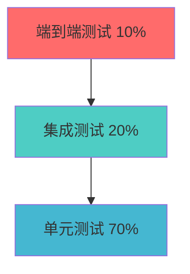
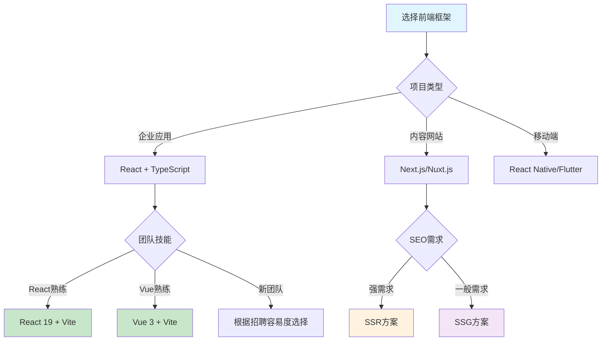

# 前端工程化架构设计与实践指南

<Badge type="tip" text="2025年版" />
<Badge type="info" text="v1.0.0" />

::: info 指南简介
一份面向2025年的现代化前端工程化实践手册，涵盖从项目初始化到生产部署的完整工程化体系。
:::

## 🎯 核心目标

<div class="feature-grid">

::: details ⚡ 提高开发效率
通过自动化工具和标准化流程减少重复工作，让开发者专注于业务逻辑实现。
:::

::: details 📈 保证代码质量
建立完善的代码检查和测试体系，确保代码的可维护性和稳定性。
:::

::: details 🤝 促进团队协作
统一开发规范和工作流程，提升团队协作效率和代码一致性。
:::

::: details 🔧 降低维护成本
构建可维护、可扩展的代码架构，减少长期维护成本。
:::

</div>

## 🚀 快速开始

### 环境要求

::: code-group

```bash [Node.js版本]
# 推荐使用最新LTS版本
node --version  # >= 20.0.0
```

```bash [包管理器]
# 推荐使用bun，性能最佳
bun --version   # >= 1.2.0

# 备选方案
pnpm --version  # >= 8.0.0
npm --version   # >= 9.0.0
```

```bash [版本控制]
git --version   # >= 2.30.0
```

:::

### 技术栈推荐 2025

<div class="tech-stack-table">

| 分类 | 🏆 推荐选择 | 🔄 备选方案 | 📝 说明 |
|------|------------|------------|---------|
| **前端框架** | React 19+ / Vue 3.6+ | Angular 17+ / Svelte 5+ | 选择团队熟悉的生态 |
| **开发语言** | TypeScript 5.8+ | JavaScript ES2024+ | 强烈推荐TypeScript |
| **构建工具** | Vite 7+ | Webpack 5+ / Rollup 4+ | Vite开发体验最佳 |
| **包管理器** | bun | pnpm / npm / yarn | bun性能和功能最全 |
| **CSS方案** | UnoCSS | Tailwind CSS / Styled-components | 原子CSS性能最佳 |
| **状态管理** | Zustand / Pinia | Redux Toolkit / Vuex | 轻量级状态管理 |

</div>

## 📖 核心体系

### 1. 项目初始化与脚手架

#### 脚手架选择策略

::: tip 选择建议
根据项目规模和团队技能选择合适的脚手架工具：
- **小型项目**：官方脚手架（create-vue、create-react-app）
- **中大型项目**：社区脚手架（Vite模板、Next.js、Nuxt.js）
- **企业级项目**：定制脚手架（基于Command、Plop）
:::

#### 标准项目结构

```
项目根目录/
├── .github/          # GitHub Actions 配置
│   ├── workflows/    # CI/CD 工作流
│   └── ISSUE_TEMPLATE/ # Issue 模板
├── .vscode/          # VS Code 配置
│   ├── settings.json # 编辑器设置
│   ├── extensions.json # 推荐插件
│   └── launch.json   # 调试配置
├── docs/             # 项目文档
├── public/           # 静态资源
├── src/              # 源代码
│   ├── api/          # API 接口层
│   ├── assets/       # 项目资源（图片、字体等）
│   ├── components/   # 可复用组件
│   │   ├── ui/       # 基础UI组件
│   │   └── business/ # 业务组件
│   ├── hooks/        # 自定义Hooks（React）
│   ├── composables/  # 组合式函数（Vue）
│   ├── pages/        # 页面组件
│   ├── router/       # 路由配置
│   ├── store/        # 状态管理
│   ├── types/        # TypeScript类型定义
│   ├── utils/        # 工具函数
│   ├── styles/       # 全局样式
│   └── App.tsx       # 应用入口
├── tests/            # 测试文件
│   ├── unit/         # 单元测试
│   ├── integration/  # 集成测试
│   └── e2e/          # 端到端测试
├── tools/            # 构建工具配置
└── 配置文件们...
```

::: details 目录设计原则
- **按功能分层**：API、组件、页面等功能明确分离
- **就近原则**：相关文件尽量放在同一目录
- **扁平化**：避免过深的嵌套层级（建议不超过3层）
- **可扩展性**：结构设计考虑未来扩展需求
:::

#### 环境变量管理

::: code-group

```bash [.env.example]
# 应用配置
VITE_APP_TITLE=前端工程化项目
VITE_APP_VERSION=1.0.0
VITE_APP_DESCRIPTION=现代化前端工程化实践

# API 配置
VITE_API_BASE_URL=https://api.example.com
VITE_API_TIMEOUT=10000

# 功能开关
VITE_ENABLE_MOCK=false
VITE_ENABLE_DEBUG=false

# 第三方服务
VITE_SERVICE_KEY=your_service_key
```

```bash [.env.development]
# 开发环境配置
VITE_API_BASE_URL=http://localhost:3000/api
VITE_ENABLE_MOCK=true
VITE_ENABLE_DEBUG=true
```

```bash [.env.production]
# 生产环境配置
VITE_API_BASE_URL=https://api.production.com
VITE_ENABLE_MOCK=false
VITE_ENABLE_DEBUG=false
```

:::

### 2. 开发环境配置

#### VS Code 团队配置

::: code-group

```json [.vscode/settings.json]
{
  "editor.formatOnSave": true,
  "editor.defaultFormatter": "esbenp.prettier-vscode",
  "editor.codeActionsOnSave": {
    "source.fixAll.eslint": true,
    "source.organizeImports": true
  },
  "typescript.preferences.importModuleSpecifier": "relative",
  "files.eol": "\n",
  "files.insertFinalNewline": true,
  "files.trimTrailingWhitespace": true
}
```

```json [.vscode/extensions.json]
{
  "recommendations": [
    "esbenp.prettier-vscode",
    "dbaeumer.vscode-eslint",
    "bradlc.vscode-tailwindcss",
    "antfu.unocss",
    "ms-vscode.vscode-typescript-next",
    "usernamehw.errorlens",
    "eamodio.gitlens",
    "rangav.vscode-thunder-client"
  ]
}
```

```json [.vscode/launch.json]
{
  "version": "0.2.0",
  "configurations": [
    {
      "name": "Launch Chrome",
      "type": "chrome",
      "request": "launch",
      "url": "http://localhost:5173",
      "webRoot": "${workspaceFolder}/src"
    }
  ]
}
```

:::

#### Vite 配置最佳实践

::: code-group

```typescript [vite.config.ts]
import { defineConfig } from 'vite'
import react from '@vitejs/plugin-react'
import { resolve } from 'path'

export default defineConfig({
  plugins: [react()],
  
  // 路径别名
  resolve: {
    alias: {
      '@': resolve(__dirname, 'src'),
      '@/components': resolve(__dirname, 'src/components'),
      '@/utils': resolve(__dirname, 'src/utils'),
      '@/types': resolve(__dirname, 'src/types')
    }
  },
  
  // 开发服务器配置
  server: {
    port: 5173,
    open: true,
    cors: true,
    proxy: {
      '/api': {
        target: 'http://localhost:3000',
        changeOrigin: true,
        rewrite: (path) => path.replace(/^\/api/, '')
      }
    }
  },
  
  // 构建配置
  build: {
    target: 'es2020',
    outDir: 'dist',
    rollupOptions: {
      output: {
        chunkFileNames: 'js/[name]-[hash].js',
        entryFileNames: 'js/[name]-[hash].js',
        assetFileNames: '[ext]/[name]-[hash].[ext]'
      }
    }
  }
})
```

:::

### 3. 代码质量与规范化

#### ESLint 配置

::: code-group

```javascript [eslint.config.js]
import js from '@eslint/js'
import globals from 'globals'
import reactHooks from 'eslint-plugin-react-hooks'
import reactRefresh from 'eslint-plugin-react-refresh'
import tseslint from 'typescript-eslint'

export default tseslint.config(
  { ignores: ['dist'] },
  {
    extends: [js.configs.recommended, ...tseslint.configs.recommended],
    files: ['**/*.{ts,tsx}'],
    languageOptions: {
      ecmaVersion: 2020,
      globals: globals.browser,
    },
    plugins: {
      'react-hooks': reactHooks,
      'react-refresh': reactRefresh,
    },
    rules: {
      ...reactHooks.configs.recommended.rules,
      'react-refresh/only-export-components': [
        'warn',
        { allowConstantExport: true },
      ],
      '@typescript-eslint/no-unused-vars': ['error', { 
        argsIgnorePattern: '^_' 
      }],
      'prefer-const': 'error',
      'no-var': 'error'
    },
  },
)
```

```json [.prettierrc]
{
  "semi": false,
  "singleQuote": true,
  "tabWidth": 2,
  "trailingComma": "es5",
  "printWidth": 80,
  "bracketSpacing": true,
  "arrowParens": "avoid"
}
```

:::

#### Git 提交规范

::: tip Conventional Commits
使用约定式提交格式：`type(scope): description`

**常用类型：**
- `feat` - 新功能
- `fix` - 修复Bug
- `docs` - 文档更新
- `style` - 代码格式化（不影响功能）
- `refactor` - 代码重构
- `test` - 测试相关
- `chore` - 构建工具、依赖更新
:::

::: code-group

```json [package.json - commitizen配置]
{
  "scripts": {
    "commit": "git-cz"
  },
  "config": {
    "commitizen": {
      "path": "cz-conventional-changelog"
    }
  }
}
```

```javascript [commitlint.config.js]
export default {
  extends: ['@commitlint/config-conventional'],
  rules: {
    'type-enum': [
      2,
      'always',
      [
        'feat',
        'fix',
        'docs',
        'style',
        'refactor',
        'test',
        'chore',
        'perf',
        'ci',
        'build',
        'revert'
      ]
    ],
    'subject-max-length': [2, 'always', 50],
    'body-max-line-length': [2, 'always', 72]
  }
}
```

:::

### 4. 构建与打包优化

#### 现代构建工具对比

<div class="build-tools-comparison">

| 工具 | 启动速度 | 构建速度 | 配置难度 | 生态成熟度 | 适用场景 |
|------|:--------:|:--------:|:--------:|:----------:|----------|
| **Vite** | 🟢🟢🟢🟢🟢 | 🟢🟢🟢🟢🟢 | 🟡🟡 | 🟢🟢🟢🟢🟢 | 现代项目首选 |
| **Nuxt** | 🟢🟢🟢🟢 | 🟢🟢🟢🟢 | 🟡🟡 | 🟢🟢🟢🟢🟢 | Vue全栈开发 |
| **tsup** | 🟢🟢🟢🟢🟢 | 🟢🟢🟢🟢🟢 | 🟢 | 🟢🟢🟢🟢 | TS库打包 |
| **Turbo** | 🟢🟢🟢🟢🟢 | 🟢🟢🟢🟢🟢 | 🟡🟡 | 🟢🟢🟢 | Monorepo构建 |
| **Webpack** | 🟡🟡 | 🟢🟢🟢 | 🔴🔴🔴🔴🔴 | 🟢🟢🟢🟢🟢 | 复杂企业项目 |

</div>

::: warning 配置难度说明
- 🟢 = 简单易用
- 🟡 = 中等复杂度  
- 🔴 = 配置复杂
:::

#### 性能优化策略

::: details 代码分割最佳实践

```typescript
// 路由级别的代码分割
const HomePage = lazy(() => import('@/pages/Home'))
const AboutPage = lazy(() => import('@/pages/About'))

// 组件级别的代码分割
const HeavyComponent = lazy(() => import('@/components/HeavyComponent'))

// 第三方库分割
const routes = [
  {
    path: '/',
    component: HomePage
  },
  {
    path: '/about', 
    component: AboutPage
  }
]
```

:::

::: details 资源优化配置

```typescript
// vite.config.ts - 构建优化
export default defineConfig({
  build: {
    rollupOptions: {
      output: {
        manualChunks: {
          vendor: ['react', 'react-dom'],
          router: ['react-router-dom'],
          ui: ['antd', '@ant-design/icons']
        }
      }
    },
    chunkSizeWarningLimit: 1000
  }
})
```

:::

### 5. 测试体系

#### 测试策略金字塔



#### 单元测试配置

::: code-group

```typescript [vitest.config.ts]
import { defineConfig } from 'vitest/config'
import react from '@vitejs/plugin-react'

export default defineConfig({
  plugins: [react()],
  test: {
    globals: true,
    environment: 'jsdom',
    setupFiles: ['./src/test/setup.ts'],
    coverage: {
      provider: 'v8',
      reporter: ['text', 'json', 'html'],
      exclude: [
        'node_modules/',
        'src/test/',
        '**/*.d.ts',
        '**/*.config.*'
      ]
    }
  }
})
```

```typescript [src/test/setup.ts]
import '@testing-library/jest-dom'
import { cleanup } from '@testing-library/react'
import { afterEach } from 'vitest'

// 每个测试后清理
afterEach(() => {
  cleanup()
})
```

:::

#### 组件测试示例

::: code-group

```typescript [Button.test.tsx]
import { render, screen, fireEvent } from '@testing-library/react'
import { describe, it, expect, vi } from 'vitest'
import Button from './Button'

describe('Button Component', () => {
  it('renders button with correct text', () => {
    render(<Button>Click me</Button>)
    expect(screen.getByText('Click me')).toBeInTheDocument()
  })

  it('calls onClick handler when clicked', () => {
    const handleClick = vi.fn()
    render(<Button onClick={handleClick}>Click me</Button>)
    
    fireEvent.click(screen.getByText('Click me'))
    expect(handleClick).toHaveBeenCalledOnce()
  })

  it('applies correct CSS classes', () => {
    render(<Button variant="primary">Primary Button</Button>)
    expect(screen.getByText('Primary Button')).toHaveClass('btn-primary')
  })
})
```

:::

### 6. CI/CD与自动化部署

#### GitHub Actions 工作流

::: code-group

```yaml [.github/workflows/ci.yml]
name: CI/CD Pipeline

on:
  push:
    branches: [ main, develop ]
  pull_request:
    branches: [ main ]

jobs:
  test:
    runs-on: ubuntu-latest
    
    steps:
    - name: Checkout code
      uses: actions/checkout@v4
      
    - name: Setup Bun
      uses: oven-sh/setup-bun@v1
      with:
        bun-version: latest
        
    - name: Install dependencies
      run: bun install
      
    - name: Run linting
      run: bun run lint
      
    - name: Run tests
      run: bun run test:coverage
      
    - name: Upload coverage reports
      uses: codecov/codecov-action@v3
      with:
        file: ./coverage/coverage-final.json

  build:
    needs: test
    runs-on: ubuntu-latest
    
    steps:
    - name: Checkout code
      uses: actions/checkout@v4
      
    - name: Setup Bun
      uses: oven-sh/setup-bun@v1
      
    - name: Install dependencies
      run: bun install
      
    - name: Build project
      run: bun run build
      
    - name: Upload build artifacts
      uses: actions/upload-artifact@v3
      with:
        name: dist
        path: dist/

  deploy:
    needs: build
    runs-on: ubuntu-latest
    if: github.ref == 'refs/heads/main'
    
    steps:
    - name: Download artifacts
      uses: actions/download-artifact@v3
      with:
        name: dist
        path: dist/
        
    - name: Deploy to Vercel
      uses: amondnet/vercel-action@v25
      with:
        vercel-token: ${{ secrets.VERCEL_TOKEN }}
        vercel-org-id: ${{ secrets.ORG_ID }}
        vercel-project-id: ${{ secrets.PROJECT_ID }}
        working-directory: ./
```

:::

#### 部署策略对比

| 策略 | 停机时间 | 复杂度 | 回滚速度 | 适用场景 |
|------|:--------:|:------:|:--------:|----------|
| **蓝绿部署** | ❌ 无 | 🟡 中等 | ⚡ 极快 | 生产环境 |
| **滚动部署** | ⚠️ 极短 | 🟢 简单 | 🟡 中等 | 中小型应用 |
| **金丝雀部署** | ❌ 无 | 🔴 复杂 | ⚡ 快 | 大型应用 |
| **A/B测试** | ❌ 无 | 🔴 复杂 | 🟡 中等 | 功能验证 |

### 7. 监控与运维

#### 前端监控体系

::: info Core Web Vitals 监控
重点关注Google定义的用户体验核心指标：
- **LCP (Largest Contentful Paint)** - 最大内容绘制 < 2.5s
- **FID (First Input Delay)** - 首次输入延迟 < 100ms  
- **CLS (Cumulative Layout Shift)** - 累积布局偏移 < 0.1
:::

#### 监控工具选择

<div class="monitoring-tools">

| 工具 | 错误监控 | 性能监控 | 用户行为 | 价格 | 推荐场景 |
|------|:--------:|:--------:|:--------:|:----:|----------|
| **Sentry** | 🟢🟢🟢🟢🟢 | 🟢🟢🟢 | 🟡🟡 | 💰💰 | 错误监控首选 |
| **DataDog** | 🟢🟢🟢🟢 | 🟢🟢🟢🟢🟢 | 🟢🟢🟢🟢 | 💰💰💰💰 | 企业级APM |
| **Google Analytics** | ❌ | 🟡🟡 | 🟢🟢🟢🟢🟢 | 🆓 | 用户行为分析 |
| **Vercel Analytics** | 🟡🟡 | 🟢🟢🟢🟢 | 🟢🟢🟢 | 💰 | Vercel生态 |

</div>

### 8. 性能优化

#### 加载性能优化清单

::: tip 关键渲染路径优化
- [ ] 压缩和优化首屏关键CSS
- [ ] 预加载关键字体文件
- [ ] 图片懒加载和WebP格式
- [ ] 代码分割和路由懒加载
- [ ] Service Worker缓存策略
:::

::: warning 常见性能陷阱
- 🚫 过大的bundle包体积
- 🚫 未优化的图片资源
- 🚫 阻塞渲染的同步脚本
- 🚫 过多的重排重绘操作
- 🚫 内存泄漏和未清理的监听器
:::

#### 性能预算配置

```javascript
// webpack-bundle-analyzer 配置
const BundleAnalyzerPlugin = require('webpack-bundle-analyzer').BundleAnalyzerPlugin

module.exports = {
  plugins: [
    new BundleAnalyzerPlugin({
      analyzerMode: 'static',
      reportFilename: 'bundle-report.html'
    })
  ],
  performance: {
    maxAssetSize: 250000,
    maxEntrypointSize: 250000,
    hints: 'warning'
  }
}
```

### 9. 新兴技术趋势

#### AI 辅助开发工具

::: details GitHub Copilot 最佳实践
```typescript
// 💡 编写清晰的注释，帮助AI理解意图
/**
 * 计算购物车商品总价，包含折扣和税费
 * @param items 购物车商品列表
 * @param discount 折扣比例 (0-1)
 * @param taxRate 税率 (0-1)
 * @returns 最终总价
 */
function calculateCartTotal(
  items: CartItem[], 
  discount: number, 
  taxRate: number
): number {
  // AI会根据注释生成合理的实现
}
```
:::

#### Web3.0 技术集成

::: code-group

```typescript [钱包连接]
import { ethers } from 'ethers'

async function connectWallet() {
  if (typeof window.ethereum !== 'undefined') {
    try {
      const provider = new ethers.BrowserProvider(window.ethereum)
      const accounts = await provider.send("eth_requestAccounts", [])
      return accounts[0]
    } catch (error) {
      console.error('连接钱包失败:', error)
    }
  }
}
```

```typescript [智能合约调用]
async function callContract() {
  const provider = new ethers.BrowserProvider(window.ethereum)
  const signer = await provider.getSigner()
  
  const contract = new ethers.Contract(
    contractAddress,
    contractABI,
    signer
  )
  
  const result = await contract.someMethod()
  return result
}
```

:::

## 🛠 工具选择指南

### 包管理器性能对比

<div class="package-managers">

| 特性 | bun | pnpm | yarn | npm |
|------|:---:|:----:|:----:|:---:|
| **安装速度** | 🏆 最快 | 🥈 很快 | 🥉 快 | 🐌 中等 |
| **磁盘空间** | 🏆 最小 | 🥈 很小 | 📦 大 | 📦 大 |
| **Monorepo** | 🏆 最佳 | 🏆 最佳 | 🥈 良好 | 🥉 基础 |
| **生态兼容** | 🥈 良好 | 🥈 良好 | 🏆 最佳 | 🏆 最佳 |
| **额外功能** | ⭐ 运行时+打包 | ⭐ 工作空间 | ⭐ 工作空间 | 📦 基础 |

</div>

::: tip 选择建议
- **新项目**：优先选择 `bun`，性能最佳且功能全面
- **企业项目**：`pnpm` 最稳妥，性能和兼容性均衡
- **现有项目**：渐进式迁移 `npm` → `pnpm` → `bun`
:::

### 框架选择决策树



## 📚 最佳实践总结

### 团队协作规范

::: details 开发流程标准
1. **需求分析** - 明确功能边界和验收标准
2. **技术方案** - 架构设计和技术选型评审  
3. **开发实现** - 遵循编码规范，及时提交
4. **代码审查** - 强制Code Review，确保质量
5. **测试验证** - 完整的测试流程覆盖
6. **部署发布** - 自动化部署和监控
7. **线上反馈** - 监控数据分析和优化
:::

### 代码质量管理

::: tip 质量门禁标准
- ✅ 代码覆盖率 ≥ 80%
- ✅ 新增代码覆盖率 ≥ 90%  
- ✅ 重复代码率 ≤ 5%
- ✅ 安全漏洞修复率 = 100%
- ✅ 构建时间 ≤ 5分钟
- ✅ 包体积增长 ≤ 10%
:::

### 性能优化策略

::: details 性能优化清单
**加载性能：**
- [ ] 首屏渲染时间 < 1.5s
- [ ] 资源压缩和CDN加速
- [ ] 关键路径CSS内联
- [ ] 图片懒加载和现代格式

**运行性能：**
- [ ] 交互响应时间 < 100ms
- [ ] 虚拟滚动处理长列表
- [ ] 防抖节流优化高频操作
- [ ] Web Worker处理计算密集任务

**用户体验：**
- [ ] 加载状态和骨架屏
- [ ] 错误边界和降级处理
- [ ] 无障碍访问支持
- [ ] 渐进式Web应用(PWA)
:::

## 🏗 架构设计模式

### 应用架构选择

<div class="architecture-comparison">

| 架构模式 | 适用场景 | 优势 | 劣势 | 技术选型 |
|----------|----------|------|------|----------|
| **SPA** | 管理后台、复杂交互 | 用户体验好、前后端分离 | 首屏慢、SEO弱 | React/Vue + Router |
| **SSR** | 内容网站、电商 | SEO友好、首屏快 | 服务端复杂、开发成本高 | Next.js/Nuxt.js |
| **SSG** | 文档、博客、营销页 | 性能极佳、安全性高 | 动态内容有限 | VitePress/Astro |
| **MPA** | 传统网站、简单应用 | 稳定性好、页面独立 | 体验差、状态难共享 | 服务端渲染 |

</div>

### 微前端架构实践

::: warning 微前端适用场景
微前端不是银弹，适合以下场景：
- 🏢 大型团队，多个业务线并行开发
- 🔄 渐进式技术栈升级需求
- 📦 复杂应用的模块化拆分
- 🚀 独立部署和发布需求
:::

#### 微前端方案对比

| 方案 | 隔离性 | 性能 | 学习成本 | 适用场景 |
|------|:------:|:----:|:--------:|----------|
| **qiankun** | 🟢🟢🟢🟢 | 🟢🟢🟢 | 🟡🟡🟡 | 阿里系、成熟项目 |
| **MicroApp** | 🟢🟢🟢🟢🟢 | 🟢🟢🟢🟢 | 🟢🟢 | 零侵入、轻量级 |
| **Module Federation** | 🟢🟢🟢 | 🟢🟢🟢🟢🟢 | 🟡🟡🟡🟡 | Webpack生态 |
| **iframe** | 🟢🟢🟢🟢🟢 | 🟡🟡 | 🟢 | 完全隔离需求 |

### 设计模式在前端的应用

::: details 观察者模式实现
```typescript
// EventEmitter 实现
class EventEmitter {
  private events: Map<string, Function[]> = new Map()

  on(event: string, callback: Function) {
    if (!this.events.has(event)) {
      this.events.set(event, [])
    }
    this.events.get(event)!.push(callback)
  }

  emit(event: string, ...args: any[]) {
    const callbacks = this.events.get(event)
    if (callbacks) {
      callbacks.forEach(callback => callback(...args))
    }
  }

  off(event: string, callback: Function) {
    const callbacks = this.events.get(event)
    if (callbacks) {
      const index = callbacks.indexOf(callback)
      if (index > -1) {
        callbacks.splice(index, 1)
      }
    }
  }
}

// 使用示例
const emitter = new EventEmitter()
emitter.on('dataUpdate', (data) => {
  console.log('数据更新:', data)
})
```
:::

::: details 策略模式实现
```typescript
// 表单验证策略
interface ValidationStrategy {
  validate(value: string): boolean
}

class EmailStrategy implements ValidationStrategy {
  validate(value: string): boolean {
    return /^[^\s@]+@[^\s@]+\.[^\s@]+$/.test(value)
  }
}

class PhoneStrategy implements ValidationStrategy {
  validate(value: string): boolean {
    return /^1[3-9]\d{9}$/.test(value)
  }
}

class Validator {
  private strategy: ValidationStrategy

  constructor(strategy: ValidationStrategy) {
    this.strategy = strategy
  }

  setStrategy(strategy: ValidationStrategy) {
    this.strategy = strategy
  }

  validate(value: string): boolean {
    return this.strategy.validate(value)
  }
}

// 使用示例
const validator = new Validator(new EmailStrategy())
console.log(validator.validate('test@example.com')) // true
```
:::

## 📝 文档与知识管理

### 技术文档体系

::: info 文档分层结构
- **📋 API文档** - 接口规范、参数说明、示例代码
- **🧩 组件文档** - 组件库、使用指南、设计规范  
- **🏗 架构文档** - 系统设计、技术选型、部署方案
- **📖 开发指南** - 编码规范、工作流程、最佳实践
- **👤 用户手册** - 功能说明、操作指南、常见问题
:::

### 文档工具选择

<div class="docs-tools">

| 工具 | 类型 | 优势 | 适用场景 |
|------|------|------|----------|
| **VitePress** | 静态站点 | 性能好、主题美观、Vue生态 | 技术文档、API文档 |
| **Storybook** | 组件展示 | 组件隔离、交互测试 | 组件库文档 |
| **语雀** | 在线协作 | 中文友好、团队协作 | 团队知识库 |
| **Notion** | 多媒体文档 | 功能丰富、模板多样 | 项目管理+文档 |
| **GitBook** | 知识库 | 版本控制、多人协作 | 产品文档、教程 |

</div>

### 组件文档标准

::: code-group

```typescript [Button组件文档]
/**
 * Button 按钮组件
 * 
 * @description 通用按钮组件，支持多种样式和尺寸
 * @author 前端团队
 * @version 1.2.0
 * @since 1.0.0
 */

interface ButtonProps {
  /** 按钮类型 */
  variant?: 'primary' | 'secondary' | 'danger' | 'ghost'
  /** 按钮尺寸 */
  size?: 'small' | 'medium' | 'large'
  /** 是否禁用 */
  disabled?: boolean
  /** 是否加载中 */
  loading?: boolean
  /** 点击事件处理器 */
  onClick?: (event: MouseEvent) => void
  /** 按钮内容 */
  children: React.ReactNode
}

/**
 * @example
 * // 基础用法
 * <Button variant="primary">主要按钮</Button>
 * 
 * // 加载状态
 * <Button loading>加载中...</Button>
 * 
 * // 禁用状态  
 * <Button disabled>禁用按钮</Button>
 */
export default function Button(props: ButtonProps) {
  // 组件实现...
}
```

```markdown [README模板]
# Button 按钮组件

## 概述
通用按钮组件，提供多种预设样式和交互状态。

## 安装
\`\`\`bash
npm install @company/ui-button
\`\`\`

## 基础用法
\`\`\`tsx
import { Button } from '@company/ui-button'

function App() {
  return (
    <Button variant="primary" onClick={() => alert('clicked')}>
      点击我
    </Button>
  )
}
\`\`\`

## API 参考

### Props

| 属性 | 类型 | 默认值 | 说明 |
|------|------|--------|------|
| variant | string | 'primary' | 按钮类型 |
| size | string | 'medium' | 按钮尺寸 |
| disabled | boolean | false | 是否禁用 |
| loading | boolean | false | 是否加载中 |

### 事件

| 事件名 | 说明 | 参数 |
|--------|------|------|
| onClick | 点击事件 | (event: MouseEvent) => void |

## 更新日志

### v1.2.0
- 新增 loading 状态支持
- 优化无障碍访问

### v1.1.0  
- 新增 ghost 类型按钮
- 修复样式兼容性问题
```

:::

## 🔮 未来发展趋势

### AI 驱动的开发变革

::: tip AI工具集成建议
- **代码生成**：GitHub Copilot、Cursor、Tabnine
- **代码审查**：AI辅助发现代码问题和安全漏洞
- **测试生成**：基于代码自动生成测试用例
- **文档生成**：从代码注释自动生成API文档
- **性能优化**：AI分析性能瓶颈并提供优化建议
:::

### 云原生前端架构

::: details Serverless 前端架构
```typescript
// Vercel Edge Functions 示例
export default async function handler(request: Request) {
  const { searchParams } = new URL(request.url)
  const userId = searchParams.get('userId')
  
  // 边缘计算处理用户数据
  const userData = await fetchUserData(userId)
  
  return new Response(JSON.stringify(userData), {
    headers: { 'content-type': 'application/json' }
  })
}

// 静态站点 + 动态API的混合架构
export async function getStaticProps() {
  // 构建时预渲染静态内容
  const staticData = await fetchStaticData()
  
  return {
    props: { staticData },
    revalidate: 3600 // ISR: 1小时后重新生成
  }
}
```
:::

### Web3.0 技术整合

::: details DApp 开发最佳实践
```typescript
// Web3 React Hook
import { useWeb3 } from '@web3-react/core'
import { ethers } from 'ethers'

function useContract(address: string, abi: any[]) {
  const { library, account } = useWeb3()
  
  return useMemo(() => {
    if (!library || !account) return null
    return new ethers.Contract(address, abi, library.getSigner())
  }, [library, account, address, abi])
}

// 使用示例
function NFTMarketplace() {
  const contract = useContract(CONTRACT_ADDRESS, CONTRACT_ABI)
  
  const buyNFT = async (tokenId: string) => {
    try {
      const tx = await contract.buyToken(tokenId, {
        value: ethers.parseEther('0.1')
      })
      await tx.wait()
      // 处理成功逻辑
    } catch (error) {
      // 错误处理
    }
  }
  
  return (
    <div>
      {/* NFT展示界面 */}
    </div>
  )
}
```
:::

## 🎯 实施路线图

### 阶段一：基础设施建设 (1-2个月)

::: details 核心任务
- [ ] **环境统一**：VS Code配置、Node.js版本、包管理器
- [ ] **代码规范**：ESLint、Prettier、提交规范
- [ ] **版本控制**：Git工作流、分支策略
- [ ] **构建工具**：Vite配置、环境变量管理
- [ ] **基础组件**：UI组件库、工具函数库
:::

### 阶段二：质量体系完善 (2-3个月)

::: details 核心任务  
- [ ] **测试体系**：单元测试、集成测试、E2E测试
- [ ] **CI/CD**：自动化构建、测试、部署
- [ ] **代码质量**：覆盖率要求、质量门禁
- [ ] **监控告警**：错误监控、性能监控
- [ ] **文档规范**：API文档、组件文档、操作手册
:::

### 阶段三：性能与体验优化 (3-4个月)

::: details 核心任务
- [ ] **性能优化**：加载优化、运行优化、监控体系
- [ ] **用户体验**：无障碍访问、PWA功能、错误处理
- [ ] **架构升级**：微前端、组件库、设计系统
- [ ] **自动化提升**：智能化工具、AI辅助开发
- [ ] **团队能力**：培训体系、知识管理、技术分享
:::

### 阶段四：创新与领先 (持续进行)

::: details 核心任务
- [ ] **新技术探索**：AI工具集成、Web3.0、边缘计算
- [ ] **开源贡献**：参与开源项目、发布内部工具
- [ ] **技术影响力**：技术文章、会议分享、行业交流
- [ ] **持续改进**：根据反馈优化工程化体系
- [ ] **创新实践**：探索前沿技术在业务中的应用
:::

## 📊 效果评估指标

### 开发效率指标

| 指标 | 基准值 | 目标值 | 说明 |
|------|:------:|:------:|------|
| **功能开发周期** | 2周 | 1周 | 从需求到上线的平均时间 |
| **Bug修复时间** | 2天 | 4小时 | 发现到修复完成的时间 |
| **代码审查时间** | 1天 | 2小时 | PR提交到合并的时间 |
| **构建部署时间** | 20分钟 | 5分钟 | 从提交到部署完成 |

### 质量保障指标

| 指标 | 基准值 | 目标值 | 说明 |
|------|:------:|:------:|------|
| **代码覆盖率** | 60% | 80% | 单元测试覆盖率 |
| **生产Bug率** | 5个/月 | 1个/月 | 线上Bug数量 |
| **安全漏洞** | 3个/季度 | 0个/季度 | 安全扫描发现的漏洞 |
| **性能达标率** | 70% | 95% | Core Web Vitals达标 |

### 团队协作指标

| 指标 | 基准值 | 目标值 | 说明 |
|------|:------:|:------:|------|
| **知识分享频率** | 1次/月 | 1次/周 | 团队技术分享次数 |
| **文档完整度** | 60% | 90% | 项目文档覆盖率 |
| **新人上手时间** | 2周 | 3天 | 新成员独立开发时间 |
| **技术债务比例** | 30% | 10% | 需要重构的代码比例 |

## 💡 常见问题解答

::: details Q: 如何选择适合团队的技术栈？
**A:** 技术栈选择应该综合考虑以下因素：
- **团队技能**：选择团队熟悉或容易学习的技术
- **项目需求**：根据业务特点选择合适的架构
- **生态成熟度**：优先选择生态完善的技术
- **长期维护**：考虑技术的发展趋势和社区活跃度
- **招聘难度**：考虑人才市场的供应情况
:::

::: details Q: 微前端什么时候引入比较合适？
**A:** 微前端适合以下场景，但不是必需的：
- **团队规模**：多个团队并行开发时
- **技术栈多样**：需要渐进式技术升级
- **业务复杂**：应用足够大，模块间相对独立
- **部署独立**：需要独立发布和回滚
建议先从模块化做起，待团队和业务成熟后再考虑微前端
:::

::: details Q: 如何平衡工程化投入和业务开发？
**A:** 建议采用渐进式策略：
- **优先级排序**：先解决最痛的问题
- **小步快跑**：每次只改进一个方面
- **投入产出比**：重点投入高价值、低成本的改进
- **团队接受度**：避免一次性引入太多变化
- **持续改进**：建立长期优化机制
:::

::: details Q: 代码质量如何量化和提升？
**A:** 建立多维度的质量评估体系：
- **静态分析**：ESLint、TypeScript检查
- **测试覆盖**：单元测试、集成测试覆盖率
- **代码复杂度**：圈复杂度、认知复杂度
- **重复率检测**：代码重复度分析
- **安全扫描**：依赖漏洞、代码安全检查
结合质量门禁和团队培训，持续提升代码质量
:::

## 🔗 扩展资源

### 官方文档精选

<div class="resource-grid">

::: info 前端框架
- [React 官方文档](https://react.dev) - 现代React开发指南
- [Vue.js 官方文档](https://vuejs.org) - Vue.js完整文档  
- [Angular 官方文档](https://angular.io) - Angular框架文档
- [Svelte 官方文档](https://svelte.dev) - Svelte框架指南
:::

::: info 构建工具
- [Vite 官方文档](https://vitejs.dev) - 现代化构建工具
- [Nuxt 官方文档](https://nuxt.com) - Vue全栈框架
- [Next.js 官方文档](https://nextjs.org) - React全栈框架
- [Turbo 官方文档](https://turbo.build) - Monorepo构建系统
:::

::: info 开发工具
- [TypeScript 官方文档](https://www.typescriptlang.org) - 类型化JavaScript
- [ESLint 配置指南](https://eslint.org/docs/user-guide/configuring) - 代码质量工具
- [Prettier 配置选项](https://prettier.io/docs/en/options.html) - 代码格式化
- [Vitest 测试框架](https://vitest.dev) - 现代化测试工具
:::

</div>

### 社区资源

::: tip 学习平台
- **[JavaScript.info](https://javascript.info)** - 现代JavaScript教程
- **[MDN Web Docs](https://developer.mozilla.org)** - Web技术权威参考
- **[Can I Use](https://caniuse.com)** - 浏览器兼容性查询
- **[Bundlephobia](https://bundlephobia.com)** - npm包大小分析
:::

::: tip 技术社区
- **[Dev.to](https://dev.to)** - 国际开发者社区
- **[掘金](https://juejin.cn)** - 中文技术社区
- **[Stack Overflow](https://stackoverflow.com)** - 技术问答平台
- **[GitHub](https://github.com)** - 代码托管和开源社区
:::

### 实践项目

::: details 推荐练手项目
- **[React Projects](https://github.com/john-smilga/react-projects)** - React实践项目集合
- **[Vue.js Examples](https://github.com/vuejs/awesome-vue)** - Vue.js示例项目
- **[30 Days of JavaScript](https://github.com/Asabeneh/30-Days-Of-JavaScript)** - JavaScript学习项目
- **[Frontend Mentor](https://www.frontendmentor.io)** - 前端挑战项目
:::

## 🎉 结语

前端工程化是一个持续演进的过程，没有标准答案，只有最适合的解决方案。成功的工程化实施需要：

### 核心原则

::: tip 工程化三原则
1. **以人为本** - 工程化服务于开发者，提升开发体验
2. **业务驱动** - 技术选择服务于业务目标，创造实际价值  
3. **持续改进** - 建立反馈机制，持续优化工程化体系
:::

### 实施建议

::: warning 避免常见陷阱
- 🚫 过度工程化 - 避免为了技术而技术
- 🚫 一刀切方案 - 不同项目需要不同策略
- 🚫 忽视团队接受度 - 考虑团队学习成本
- 🚫 缺乏持续维护 - 工程化体系需要持续投入
:::

### 发展展望

在快速变化的技术环境中，前端工程化将朝着更加**智能化、自动化、标准化**的方向发展：

- **AI深度集成** - AI将成为开发过程的重要助手
- **云原生架构** - Serverless和边缘计算改变部署模式
- **开发体验极致化** - 零配置、即时反馈的开发环境
- **全栈能力融合** - 前端工程师技能边界不断扩展

**愿每一位前端工程师都能在工程化的实践中，既提升技术能力，又创造业务价值，共同推动前端技术的发展和进步。**

---

<div class="footer-info">

**文档信息**
- 📅 最后更新：2025年8月
- 🏷️ 版本：v1.0.0  
- 👥 维护团队：前端架构组
- 📧 反馈邮箱：frontend-team@company.com

**贡献指南**
欢迎通过以下方式参与文档建设：
- 🐛 [提交Issue](https://github.com/company/frontend-guide/issues) 反馈问题
- 🔀 [提交PR](https://github.com/company/frontend-guide/pulls) 贡献内容  
- 💬 参与评论区讨论分享经验
- ⭐ 给项目点Star支持

</div>

<style>
.feature-grid {
  display: grid;
  grid-template-columns: repeat(auto-fit, minmax(250px, 1fr));
  gap: 1rem;
  margin: 1rem 0;
}

.tech-stack-table table {
  font-size: 0.9rem;
}

.tech-stack-table th,
.tech-stack-table td {
  text-align: center;
  padding: 0.75rem 0.5rem;
}

.build-tools-comparison {
  overflow-x: auto;
}

.build-tools-comparison table {
  min-width: 800px;
  font-size: 0.85rem;
}

.package-managers table {
  text-align: center;
}

.architecture-comparison table {
  font-size: 0.9rem;
}

.monitoring-tools table {
  font-size: 0.85rem;
}

.docs-tools table {
  font-size: 0.9rem;
}

.resource-grid {
  display: grid;
  grid-template-columns: repeat(auto-fit, minmax(250px, 1fr));
  gap: 1rem;
  margin: 1rem 0;
}

.footer-info {
  background: var(--vp-c-bg-soft);
  border: 1px solid var(--vp-c-border);
  border-radius: 8px;
  padding: 1.5rem;
  margin-top: 2rem;
  font-size: 0.9rem;
}

.footer-info h4 {
  margin-top: 0;
  color: var(--vp-c-brand);
}
</style>